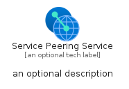
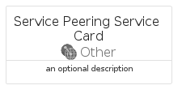
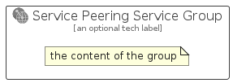

# ServicePeeringService


```text
azure-19/Item/Other/ServicePeeringService
```

```text
include('azure-19/Item/Other/ServicePeeringService')
```


| Illustration | ServicePeeringService | ServicePeeringServiceCard | ServicePeeringServiceGroup |
| :---: | :---: | :---: | :---: |
|  |  |  |  |


## Sprites
The item provides the following sriptes:

- `<$ServicePeeringServiceXs>`
- `<$ServicePeeringServiceSm>`
- `<$ServicePeeringServiceMd>`
- `<$ServicePeeringServiceLg>`


## ServicePeeringService

### Load remotely
```plantuml
@startuml
' configures the library
!global $LIB_BASE_LOCATION="https://raw.githubusercontent.com/tmorin/plantuml-libs/master/distribution"

' loads the library's bootstrap
!include $LIB_BASE_LOCATION/bootstrap.puml

' loads the package bootstrap
include('azure-19/bootstrap')

' loads the Item which embeds the element ServicePeeringService
include('azure-19/Item/Other/ServicePeeringService')

' renders the element
ServicePeeringService('ServicePeeringService', 'Service Peering Service', 'an optional tech label', 'an optional description')
@enduml
```

### Load locally
```plantuml
@startuml
' configures the library
!global $INCLUSION_MODE="local"
!global $LIB_BASE_LOCATION="../../.."

' loads the library's bootstrap
!include $LIB_BASE_LOCATION/bootstrap.puml

' loads the package bootstrap
include('azure-19/bootstrap')

' loads the Item which embeds the element ServicePeeringService
include('azure-19/Item/Other/ServicePeeringService')

' renders the element
ServicePeeringService('ServicePeeringService', 'Service Peering Service', 'an optional tech label', 'an optional description')
@enduml
```

## ServicePeeringServiceCard

### Load remotely
```plantuml
@startuml
' configures the library
!global $LIB_BASE_LOCATION="https://raw.githubusercontent.com/tmorin/plantuml-libs/master/distribution"

' loads the library's bootstrap
!include $LIB_BASE_LOCATION/bootstrap.puml

' loads the package bootstrap
include('azure-19/bootstrap')

' loads the Item which embeds the element ServicePeeringServiceCard
include('azure-19/Item/Other/ServicePeeringService')

' renders the element
ServicePeeringServiceCard('ServicePeeringServiceCard', 'Service Peering Service Card', 'an optional description')
@enduml
```

### Load locally
```plantuml
@startuml
' configures the library
!global $INCLUSION_MODE="local"
!global $LIB_BASE_LOCATION="../../.."

' loads the library's bootstrap
!include $LIB_BASE_LOCATION/bootstrap.puml

' loads the package bootstrap
include('azure-19/bootstrap')

' loads the Item which embeds the element ServicePeeringServiceCard
include('azure-19/Item/Other/ServicePeeringService')

' renders the element
ServicePeeringServiceCard('ServicePeeringServiceCard', 'Service Peering Service Card', 'an optional description')
@enduml
```

## ServicePeeringServiceGroup

### Load remotely
```plantuml
@startuml
' configures the library
!global $LIB_BASE_LOCATION="https://raw.githubusercontent.com/tmorin/plantuml-libs/master/distribution"

' loads the library's bootstrap
!include $LIB_BASE_LOCATION/bootstrap.puml

' loads the package bootstrap
include('azure-19/bootstrap')

' loads the Item which embeds the element ServicePeeringServiceGroup
include('azure-19/Item/Other/ServicePeeringService')

' renders the element
ServicePeeringServiceGroup('ServicePeeringServiceGroup', 'Service Peering Service Group', 'an optional tech label') {
    note as note
        the content of the group
    end note
}
@enduml
```

### Load locally
```plantuml
@startuml
' configures the library
!global $INCLUSION_MODE="local"
!global $LIB_BASE_LOCATION="../../.."

' loads the library's bootstrap
!include $LIB_BASE_LOCATION/bootstrap.puml

' loads the package bootstrap
include('azure-19/bootstrap')

' loads the Item which embeds the element ServicePeeringServiceGroup
include('azure-19/Item/Other/ServicePeeringService')

' renders the element
ServicePeeringServiceGroup('ServicePeeringServiceGroup', 'Service Peering Service Group', 'an optional tech label') {
    note as note
        the content of the group
    end note
}
@enduml
```

