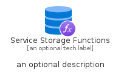

# ServiceStorageFunctions


```text
azure-19/Item/Other/ServiceStorageFunctions
```

```text
include('azure-19/Item/Other/ServiceStorageFunctions')
```


| Illustration | ServiceStorageFunctions | ServiceStorageFunctionsCard | ServiceStorageFunctionsGroup |
| :---: | :---: | :---: | :---: |
|  |  |  |  |


## Sprites
The item provides the following sriptes:

- `<$ServiceStorageFunctionsXs>`
- `<$ServiceStorageFunctionsSm>`
- `<$ServiceStorageFunctionsMd>`
- `<$ServiceStorageFunctionsLg>`


## ServiceStorageFunctions

### Load remotely
```plantuml
@startuml
' configures the library
!global $LIB_BASE_LOCATION="https://raw.githubusercontent.com/tmorin/plantuml-libs/master/distribution"

' loads the library's bootstrap
!include $LIB_BASE_LOCATION/bootstrap.puml

' loads the package bootstrap
include('azure-19/bootstrap')

' loads the Item which embeds the element ServiceStorageFunctions
include('azure-19/Item/Other/ServiceStorageFunctions')

' renders the element
ServiceStorageFunctions('ServiceStorageFunctions', 'Service Storage Functions', 'an optional tech label', 'an optional description')
@enduml
```

### Load locally
```plantuml
@startuml
' configures the library
!global $INCLUSION_MODE="local"
!global $LIB_BASE_LOCATION="../../.."

' loads the library's bootstrap
!include $LIB_BASE_LOCATION/bootstrap.puml

' loads the package bootstrap
include('azure-19/bootstrap')

' loads the Item which embeds the element ServiceStorageFunctions
include('azure-19/Item/Other/ServiceStorageFunctions')

' renders the element
ServiceStorageFunctions('ServiceStorageFunctions', 'Service Storage Functions', 'an optional tech label', 'an optional description')
@enduml
```

## ServiceStorageFunctionsCard

### Load remotely
```plantuml
@startuml
' configures the library
!global $LIB_BASE_LOCATION="https://raw.githubusercontent.com/tmorin/plantuml-libs/master/distribution"

' loads the library's bootstrap
!include $LIB_BASE_LOCATION/bootstrap.puml

' loads the package bootstrap
include('azure-19/bootstrap')

' loads the Item which embeds the element ServiceStorageFunctionsCard
include('azure-19/Item/Other/ServiceStorageFunctions')

' renders the element
ServiceStorageFunctionsCard('ServiceStorageFunctionsCard', 'Service Storage Functions Card', 'an optional description')
@enduml
```

### Load locally
```plantuml
@startuml
' configures the library
!global $INCLUSION_MODE="local"
!global $LIB_BASE_LOCATION="../../.."

' loads the library's bootstrap
!include $LIB_BASE_LOCATION/bootstrap.puml

' loads the package bootstrap
include('azure-19/bootstrap')

' loads the Item which embeds the element ServiceStorageFunctionsCard
include('azure-19/Item/Other/ServiceStorageFunctions')

' renders the element
ServiceStorageFunctionsCard('ServiceStorageFunctionsCard', 'Service Storage Functions Card', 'an optional description')
@enduml
```

## ServiceStorageFunctionsGroup

### Load remotely
```plantuml
@startuml
' configures the library
!global $LIB_BASE_LOCATION="https://raw.githubusercontent.com/tmorin/plantuml-libs/master/distribution"

' loads the library's bootstrap
!include $LIB_BASE_LOCATION/bootstrap.puml

' loads the package bootstrap
include('azure-19/bootstrap')

' loads the Item which embeds the element ServiceStorageFunctionsGroup
include('azure-19/Item/Other/ServiceStorageFunctions')

' renders the element
ServiceStorageFunctionsGroup('ServiceStorageFunctionsGroup', 'Service Storage Functions Group', 'an optional tech label') {
    note as note
        the content of the group
    end note
}
@enduml
```

### Load locally
```plantuml
@startuml
' configures the library
!global $INCLUSION_MODE="local"
!global $LIB_BASE_LOCATION="../../.."

' loads the library's bootstrap
!include $LIB_BASE_LOCATION/bootstrap.puml

' loads the package bootstrap
include('azure-19/bootstrap')

' loads the Item which embeds the element ServiceStorageFunctionsGroup
include('azure-19/Item/Other/ServiceStorageFunctions')

' renders the element
ServiceStorageFunctionsGroup('ServiceStorageFunctionsGroup', 'Service Storage Functions Group', 'an optional tech label') {
    note as note
        the content of the group
    end note
}
@enduml
```

