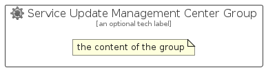

# ServiceUpdateManagementCenter


```text
azure-19/Item/Other/ServiceUpdateManagementCenter
```

```text
include('azure-19/Item/Other/ServiceUpdateManagementCenter')
```


| Illustration | ServiceUpdateManagementCenter | ServiceUpdateManagementCenterCard | ServiceUpdateManagementCenterGroup |
| :---: | :---: | :---: | :---: |
|  |  |  |  |


## Sprites
The item provides the following sriptes:

- `<$ServiceUpdateManagementCenterXs>`
- `<$ServiceUpdateManagementCenterSm>`
- `<$ServiceUpdateManagementCenterMd>`
- `<$ServiceUpdateManagementCenterLg>`


## ServiceUpdateManagementCenter

### Load remotely
```plantuml
@startuml
' configures the library
!global $LIB_BASE_LOCATION="https://raw.githubusercontent.com/tmorin/plantuml-libs/master/distribution"

' loads the library's bootstrap
!include $LIB_BASE_LOCATION/bootstrap.puml

' loads the package bootstrap
include('azure-19/bootstrap')

' loads the Item which embeds the element ServiceUpdateManagementCenter
include('azure-19/Item/Other/ServiceUpdateManagementCenter')

' renders the element
ServiceUpdateManagementCenter('ServiceUpdateManagementCenter', 'Service Update Management Center', 'an optional tech label', 'an optional description')
@enduml
```

### Load locally
```plantuml
@startuml
' configures the library
!global $INCLUSION_MODE="local"
!global $LIB_BASE_LOCATION="../../.."

' loads the library's bootstrap
!include $LIB_BASE_LOCATION/bootstrap.puml

' loads the package bootstrap
include('azure-19/bootstrap')

' loads the Item which embeds the element ServiceUpdateManagementCenter
include('azure-19/Item/Other/ServiceUpdateManagementCenter')

' renders the element
ServiceUpdateManagementCenter('ServiceUpdateManagementCenter', 'Service Update Management Center', 'an optional tech label', 'an optional description')
@enduml
```

## ServiceUpdateManagementCenterCard

### Load remotely
```plantuml
@startuml
' configures the library
!global $LIB_BASE_LOCATION="https://raw.githubusercontent.com/tmorin/plantuml-libs/master/distribution"

' loads the library's bootstrap
!include $LIB_BASE_LOCATION/bootstrap.puml

' loads the package bootstrap
include('azure-19/bootstrap')

' loads the Item which embeds the element ServiceUpdateManagementCenterCard
include('azure-19/Item/Other/ServiceUpdateManagementCenter')

' renders the element
ServiceUpdateManagementCenterCard('ServiceUpdateManagementCenterCard', 'Service Update Management Center Card', 'an optional description')
@enduml
```

### Load locally
```plantuml
@startuml
' configures the library
!global $INCLUSION_MODE="local"
!global $LIB_BASE_LOCATION="../../.."

' loads the library's bootstrap
!include $LIB_BASE_LOCATION/bootstrap.puml

' loads the package bootstrap
include('azure-19/bootstrap')

' loads the Item which embeds the element ServiceUpdateManagementCenterCard
include('azure-19/Item/Other/ServiceUpdateManagementCenter')

' renders the element
ServiceUpdateManagementCenterCard('ServiceUpdateManagementCenterCard', 'Service Update Management Center Card', 'an optional description')
@enduml
```

## ServiceUpdateManagementCenterGroup

### Load remotely
```plantuml
@startuml
' configures the library
!global $LIB_BASE_LOCATION="https://raw.githubusercontent.com/tmorin/plantuml-libs/master/distribution"

' loads the library's bootstrap
!include $LIB_BASE_LOCATION/bootstrap.puml

' loads the package bootstrap
include('azure-19/bootstrap')

' loads the Item which embeds the element ServiceUpdateManagementCenterGroup
include('azure-19/Item/Other/ServiceUpdateManagementCenter')

' renders the element
ServiceUpdateManagementCenterGroup('ServiceUpdateManagementCenterGroup', 'Service Update Management Center Group', 'an optional tech label') {
    note as note
        the content of the group
    end note
}
@enduml
```

### Load locally
```plantuml
@startuml
' configures the library
!global $INCLUSION_MODE="local"
!global $LIB_BASE_LOCATION="../../.."

' loads the library's bootstrap
!include $LIB_BASE_LOCATION/bootstrap.puml

' loads the package bootstrap
include('azure-19/bootstrap')

' loads the Item which embeds the element ServiceUpdateManagementCenterGroup
include('azure-19/Item/Other/ServiceUpdateManagementCenter')

' renders the element
ServiceUpdateManagementCenterGroup('ServiceUpdateManagementCenterGroup', 'Service Update Management Center Group', 'an optional tech label') {
    note as note
        the content of the group
    end note
}
@enduml
```

