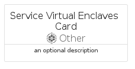

# ServiceVirtualEnclaves


```text
azure-19/Item/Other/ServiceVirtualEnclaves
```

```text
include('azure-19/Item/Other/ServiceVirtualEnclaves')
```


| Illustration | ServiceVirtualEnclaves | ServiceVirtualEnclavesCard | ServiceVirtualEnclavesGroup |
| :---: | :---: | :---: | :---: |
|  |  |  |  |


## Sprites
The item provides the following sriptes:

- `<$ServiceVirtualEnclavesXs>`
- `<$ServiceVirtualEnclavesSm>`
- `<$ServiceVirtualEnclavesMd>`
- `<$ServiceVirtualEnclavesLg>`


## ServiceVirtualEnclaves

### Load remotely
```plantuml
@startuml
' configures the library
!global $LIB_BASE_LOCATION="https://raw.githubusercontent.com/tmorin/plantuml-libs/master/distribution"

' loads the library's bootstrap
!include $LIB_BASE_LOCATION/bootstrap.puml

' loads the package bootstrap
include('azure-19/bootstrap')

' loads the Item which embeds the element ServiceVirtualEnclaves
include('azure-19/Item/Other/ServiceVirtualEnclaves')

' renders the element
ServiceVirtualEnclaves('ServiceVirtualEnclaves', 'Service Virtual Enclaves', 'an optional tech label', 'an optional description')
@enduml
```

### Load locally
```plantuml
@startuml
' configures the library
!global $INCLUSION_MODE="local"
!global $LIB_BASE_LOCATION="../../.."

' loads the library's bootstrap
!include $LIB_BASE_LOCATION/bootstrap.puml

' loads the package bootstrap
include('azure-19/bootstrap')

' loads the Item which embeds the element ServiceVirtualEnclaves
include('azure-19/Item/Other/ServiceVirtualEnclaves')

' renders the element
ServiceVirtualEnclaves('ServiceVirtualEnclaves', 'Service Virtual Enclaves', 'an optional tech label', 'an optional description')
@enduml
```

## ServiceVirtualEnclavesCard

### Load remotely
```plantuml
@startuml
' configures the library
!global $LIB_BASE_LOCATION="https://raw.githubusercontent.com/tmorin/plantuml-libs/master/distribution"

' loads the library's bootstrap
!include $LIB_BASE_LOCATION/bootstrap.puml

' loads the package bootstrap
include('azure-19/bootstrap')

' loads the Item which embeds the element ServiceVirtualEnclavesCard
include('azure-19/Item/Other/ServiceVirtualEnclaves')

' renders the element
ServiceVirtualEnclavesCard('ServiceVirtualEnclavesCard', 'Service Virtual Enclaves Card', 'an optional description')
@enduml
```

### Load locally
```plantuml
@startuml
' configures the library
!global $INCLUSION_MODE="local"
!global $LIB_BASE_LOCATION="../../.."

' loads the library's bootstrap
!include $LIB_BASE_LOCATION/bootstrap.puml

' loads the package bootstrap
include('azure-19/bootstrap')

' loads the Item which embeds the element ServiceVirtualEnclavesCard
include('azure-19/Item/Other/ServiceVirtualEnclaves')

' renders the element
ServiceVirtualEnclavesCard('ServiceVirtualEnclavesCard', 'Service Virtual Enclaves Card', 'an optional description')
@enduml
```

## ServiceVirtualEnclavesGroup

### Load remotely
```plantuml
@startuml
' configures the library
!global $LIB_BASE_LOCATION="https://raw.githubusercontent.com/tmorin/plantuml-libs/master/distribution"

' loads the library's bootstrap
!include $LIB_BASE_LOCATION/bootstrap.puml

' loads the package bootstrap
include('azure-19/bootstrap')

' loads the Item which embeds the element ServiceVirtualEnclavesGroup
include('azure-19/Item/Other/ServiceVirtualEnclaves')

' renders the element
ServiceVirtualEnclavesGroup('ServiceVirtualEnclavesGroup', 'Service Virtual Enclaves Group', 'an optional tech label') {
    note as note
        the content of the group
    end note
}
@enduml
```

### Load locally
```plantuml
@startuml
' configures the library
!global $INCLUSION_MODE="local"
!global $LIB_BASE_LOCATION="../../.."

' loads the library's bootstrap
!include $LIB_BASE_LOCATION/bootstrap.puml

' loads the package bootstrap
include('azure-19/bootstrap')

' loads the Item which embeds the element ServiceVirtualEnclavesGroup
include('azure-19/Item/Other/ServiceVirtualEnclaves')

' renders the element
ServiceVirtualEnclavesGroup('ServiceVirtualEnclavesGroup', 'Service Virtual Enclaves Group', 'an optional tech label') {
    note as note
        the content of the group
    end note
}
@enduml
```

