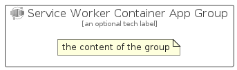

# ServiceWorkerContainerApp


```text
azure-19/Item/Other/ServiceWorkerContainerApp
```

```text
include('azure-19/Item/Other/ServiceWorkerContainerApp')
```


| Illustration | ServiceWorkerContainerApp | ServiceWorkerContainerAppCard | ServiceWorkerContainerAppGroup |
| :---: | :---: | :---: | :---: |
|  |  |  |  |


## Sprites
The item provides the following sriptes:

- `<$ServiceWorkerContainerAppXs>`
- `<$ServiceWorkerContainerAppSm>`
- `<$ServiceWorkerContainerAppMd>`
- `<$ServiceWorkerContainerAppLg>`


## ServiceWorkerContainerApp

### Load remotely
```plantuml
@startuml
' configures the library
!global $LIB_BASE_LOCATION="https://raw.githubusercontent.com/tmorin/plantuml-libs/master/distribution"

' loads the library's bootstrap
!include $LIB_BASE_LOCATION/bootstrap.puml

' loads the package bootstrap
include('azure-19/bootstrap')

' loads the Item which embeds the element ServiceWorkerContainerApp
include('azure-19/Item/Other/ServiceWorkerContainerApp')

' renders the element
ServiceWorkerContainerApp('ServiceWorkerContainerApp', 'Service Worker Container App', 'an optional tech label', 'an optional description')
@enduml
```

### Load locally
```plantuml
@startuml
' configures the library
!global $INCLUSION_MODE="local"
!global $LIB_BASE_LOCATION="../../.."

' loads the library's bootstrap
!include $LIB_BASE_LOCATION/bootstrap.puml

' loads the package bootstrap
include('azure-19/bootstrap')

' loads the Item which embeds the element ServiceWorkerContainerApp
include('azure-19/Item/Other/ServiceWorkerContainerApp')

' renders the element
ServiceWorkerContainerApp('ServiceWorkerContainerApp', 'Service Worker Container App', 'an optional tech label', 'an optional description')
@enduml
```

## ServiceWorkerContainerAppCard

### Load remotely
```plantuml
@startuml
' configures the library
!global $LIB_BASE_LOCATION="https://raw.githubusercontent.com/tmorin/plantuml-libs/master/distribution"

' loads the library's bootstrap
!include $LIB_BASE_LOCATION/bootstrap.puml

' loads the package bootstrap
include('azure-19/bootstrap')

' loads the Item which embeds the element ServiceWorkerContainerAppCard
include('azure-19/Item/Other/ServiceWorkerContainerApp')

' renders the element
ServiceWorkerContainerAppCard('ServiceWorkerContainerAppCard', 'Service Worker Container App Card', 'an optional description')
@enduml
```

### Load locally
```plantuml
@startuml
' configures the library
!global $INCLUSION_MODE="local"
!global $LIB_BASE_LOCATION="../../.."

' loads the library's bootstrap
!include $LIB_BASE_LOCATION/bootstrap.puml

' loads the package bootstrap
include('azure-19/bootstrap')

' loads the Item which embeds the element ServiceWorkerContainerAppCard
include('azure-19/Item/Other/ServiceWorkerContainerApp')

' renders the element
ServiceWorkerContainerAppCard('ServiceWorkerContainerAppCard', 'Service Worker Container App Card', 'an optional description')
@enduml
```

## ServiceWorkerContainerAppGroup

### Load remotely
```plantuml
@startuml
' configures the library
!global $LIB_BASE_LOCATION="https://raw.githubusercontent.com/tmorin/plantuml-libs/master/distribution"

' loads the library's bootstrap
!include $LIB_BASE_LOCATION/bootstrap.puml

' loads the package bootstrap
include('azure-19/bootstrap')

' loads the Item which embeds the element ServiceWorkerContainerAppGroup
include('azure-19/Item/Other/ServiceWorkerContainerApp')

' renders the element
ServiceWorkerContainerAppGroup('ServiceWorkerContainerAppGroup', 'Service Worker Container App Group', 'an optional tech label') {
    note as note
        the content of the group
    end note
}
@enduml
```

### Load locally
```plantuml
@startuml
' configures the library
!global $INCLUSION_MODE="local"
!global $LIB_BASE_LOCATION="../../.."

' loads the library's bootstrap
!include $LIB_BASE_LOCATION/bootstrap.puml

' loads the package bootstrap
include('azure-19/bootstrap')

' loads the Item which embeds the element ServiceWorkerContainerAppGroup
include('azure-19/Item/Other/ServiceWorkerContainerApp')

' renders the element
ServiceWorkerContainerAppGroup('ServiceWorkerContainerAppGroup', 'Service Worker Container App Group', 'an optional tech label') {
    note as note
        the content of the group
    end note
}
@enduml
```

