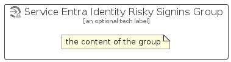

# ServiceEntraIdentityRiskySignins


```text
azure-19/Item/Security/ServiceEntraIdentityRiskySignins
```

```text
include('azure-19/Item/Security/ServiceEntraIdentityRiskySignins')
```


| Illustration | ServiceEntraIdentityRiskySignins | ServiceEntraIdentityRiskySigninsCard | ServiceEntraIdentityRiskySigninsGroup |
| :---: | :---: | :---: | :---: |
|  |  |  |  |


## Sprites
The item provides the following sriptes:

- `<$ServiceEntraIdentityRiskySigninsXs>`
- `<$ServiceEntraIdentityRiskySigninsSm>`
- `<$ServiceEntraIdentityRiskySigninsMd>`
- `<$ServiceEntraIdentityRiskySigninsLg>`


## ServiceEntraIdentityRiskySignins

### Load remotely
```plantuml
@startuml
' configures the library
!global $LIB_BASE_LOCATION="https://raw.githubusercontent.com/tmorin/plantuml-libs/master/distribution"

' loads the library's bootstrap
!include $LIB_BASE_LOCATION/bootstrap.puml

' loads the package bootstrap
include('azure-19/bootstrap')

' loads the Item which embeds the element ServiceEntraIdentityRiskySignins
include('azure-19/Item/Security/ServiceEntraIdentityRiskySignins')

' renders the element
ServiceEntraIdentityRiskySignins('ServiceEntraIdentityRiskySignins', 'Service Entra Identity Risky Signins', 'an optional tech label', 'an optional description')
@enduml
```

### Load locally
```plantuml
@startuml
' configures the library
!global $INCLUSION_MODE="local"
!global $LIB_BASE_LOCATION="../../.."

' loads the library's bootstrap
!include $LIB_BASE_LOCATION/bootstrap.puml

' loads the package bootstrap
include('azure-19/bootstrap')

' loads the Item which embeds the element ServiceEntraIdentityRiskySignins
include('azure-19/Item/Security/ServiceEntraIdentityRiskySignins')

' renders the element
ServiceEntraIdentityRiskySignins('ServiceEntraIdentityRiskySignins', 'Service Entra Identity Risky Signins', 'an optional tech label', 'an optional description')
@enduml
```

## ServiceEntraIdentityRiskySigninsCard

### Load remotely
```plantuml
@startuml
' configures the library
!global $LIB_BASE_LOCATION="https://raw.githubusercontent.com/tmorin/plantuml-libs/master/distribution"

' loads the library's bootstrap
!include $LIB_BASE_LOCATION/bootstrap.puml

' loads the package bootstrap
include('azure-19/bootstrap')

' loads the Item which embeds the element ServiceEntraIdentityRiskySigninsCard
include('azure-19/Item/Security/ServiceEntraIdentityRiskySignins')

' renders the element
ServiceEntraIdentityRiskySigninsCard('ServiceEntraIdentityRiskySigninsCard', 'Service Entra Identity Risky Signins Card', 'an optional description')
@enduml
```

### Load locally
```plantuml
@startuml
' configures the library
!global $INCLUSION_MODE="local"
!global $LIB_BASE_LOCATION="../../.."

' loads the library's bootstrap
!include $LIB_BASE_LOCATION/bootstrap.puml

' loads the package bootstrap
include('azure-19/bootstrap')

' loads the Item which embeds the element ServiceEntraIdentityRiskySigninsCard
include('azure-19/Item/Security/ServiceEntraIdentityRiskySignins')

' renders the element
ServiceEntraIdentityRiskySigninsCard('ServiceEntraIdentityRiskySigninsCard', 'Service Entra Identity Risky Signins Card', 'an optional description')
@enduml
```

## ServiceEntraIdentityRiskySigninsGroup

### Load remotely
```plantuml
@startuml
' configures the library
!global $LIB_BASE_LOCATION="https://raw.githubusercontent.com/tmorin/plantuml-libs/master/distribution"

' loads the library's bootstrap
!include $LIB_BASE_LOCATION/bootstrap.puml

' loads the package bootstrap
include('azure-19/bootstrap')

' loads the Item which embeds the element ServiceEntraIdentityRiskySigninsGroup
include('azure-19/Item/Security/ServiceEntraIdentityRiskySignins')

' renders the element
ServiceEntraIdentityRiskySigninsGroup('ServiceEntraIdentityRiskySigninsGroup', 'Service Entra Identity Risky Signins Group', 'an optional tech label') {
    note as note
        the content of the group
    end note
}
@enduml
```

### Load locally
```plantuml
@startuml
' configures the library
!global $INCLUSION_MODE="local"
!global $LIB_BASE_LOCATION="../../.."

' loads the library's bootstrap
!include $LIB_BASE_LOCATION/bootstrap.puml

' loads the package bootstrap
include('azure-19/bootstrap')

' loads the Item which embeds the element ServiceEntraIdentityRiskySigninsGroup
include('azure-19/Item/Security/ServiceEntraIdentityRiskySignins')

' renders the element
ServiceEntraIdentityRiskySigninsGroup('ServiceEntraIdentityRiskySigninsGroup', 'Service Entra Identity Risky Signins Group', 'an optional tech label') {
    note as note
        the content of the group
    end note
}
@enduml
```

