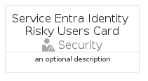
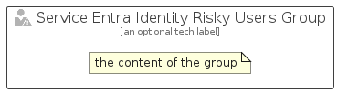

# ServiceEntraIdentityRiskyUsers


```text
azure-19/Item/Security/ServiceEntraIdentityRiskyUsers
```

```text
include('azure-19/Item/Security/ServiceEntraIdentityRiskyUsers')
```


| Illustration | ServiceEntraIdentityRiskyUsers | ServiceEntraIdentityRiskyUsersCard | ServiceEntraIdentityRiskyUsersGroup |
| :---: | :---: | :---: | :---: |
|  |  |  |  |


## Sprites
The item provides the following sriptes:

- `<$ServiceEntraIdentityRiskyUsersXs>`
- `<$ServiceEntraIdentityRiskyUsersSm>`
- `<$ServiceEntraIdentityRiskyUsersMd>`
- `<$ServiceEntraIdentityRiskyUsersLg>`


## ServiceEntraIdentityRiskyUsers

### Load remotely
```plantuml
@startuml
' configures the library
!global $LIB_BASE_LOCATION="https://raw.githubusercontent.com/tmorin/plantuml-libs/master/distribution"

' loads the library's bootstrap
!include $LIB_BASE_LOCATION/bootstrap.puml

' loads the package bootstrap
include('azure-19/bootstrap')

' loads the Item which embeds the element ServiceEntraIdentityRiskyUsers
include('azure-19/Item/Security/ServiceEntraIdentityRiskyUsers')

' renders the element
ServiceEntraIdentityRiskyUsers('ServiceEntraIdentityRiskyUsers', 'Service Entra Identity Risky Users', 'an optional tech label', 'an optional description')
@enduml
```

### Load locally
```plantuml
@startuml
' configures the library
!global $INCLUSION_MODE="local"
!global $LIB_BASE_LOCATION="../../.."

' loads the library's bootstrap
!include $LIB_BASE_LOCATION/bootstrap.puml

' loads the package bootstrap
include('azure-19/bootstrap')

' loads the Item which embeds the element ServiceEntraIdentityRiskyUsers
include('azure-19/Item/Security/ServiceEntraIdentityRiskyUsers')

' renders the element
ServiceEntraIdentityRiskyUsers('ServiceEntraIdentityRiskyUsers', 'Service Entra Identity Risky Users', 'an optional tech label', 'an optional description')
@enduml
```

## ServiceEntraIdentityRiskyUsersCard

### Load remotely
```plantuml
@startuml
' configures the library
!global $LIB_BASE_LOCATION="https://raw.githubusercontent.com/tmorin/plantuml-libs/master/distribution"

' loads the library's bootstrap
!include $LIB_BASE_LOCATION/bootstrap.puml

' loads the package bootstrap
include('azure-19/bootstrap')

' loads the Item which embeds the element ServiceEntraIdentityRiskyUsersCard
include('azure-19/Item/Security/ServiceEntraIdentityRiskyUsers')

' renders the element
ServiceEntraIdentityRiskyUsersCard('ServiceEntraIdentityRiskyUsersCard', 'Service Entra Identity Risky Users Card', 'an optional description')
@enduml
```

### Load locally
```plantuml
@startuml
' configures the library
!global $INCLUSION_MODE="local"
!global $LIB_BASE_LOCATION="../../.."

' loads the library's bootstrap
!include $LIB_BASE_LOCATION/bootstrap.puml

' loads the package bootstrap
include('azure-19/bootstrap')

' loads the Item which embeds the element ServiceEntraIdentityRiskyUsersCard
include('azure-19/Item/Security/ServiceEntraIdentityRiskyUsers')

' renders the element
ServiceEntraIdentityRiskyUsersCard('ServiceEntraIdentityRiskyUsersCard', 'Service Entra Identity Risky Users Card', 'an optional description')
@enduml
```

## ServiceEntraIdentityRiskyUsersGroup

### Load remotely
```plantuml
@startuml
' configures the library
!global $LIB_BASE_LOCATION="https://raw.githubusercontent.com/tmorin/plantuml-libs/master/distribution"

' loads the library's bootstrap
!include $LIB_BASE_LOCATION/bootstrap.puml

' loads the package bootstrap
include('azure-19/bootstrap')

' loads the Item which embeds the element ServiceEntraIdentityRiskyUsersGroup
include('azure-19/Item/Security/ServiceEntraIdentityRiskyUsers')

' renders the element
ServiceEntraIdentityRiskyUsersGroup('ServiceEntraIdentityRiskyUsersGroup', 'Service Entra Identity Risky Users Group', 'an optional tech label') {
    note as note
        the content of the group
    end note
}
@enduml
```

### Load locally
```plantuml
@startuml
' configures the library
!global $INCLUSION_MODE="local"
!global $LIB_BASE_LOCATION="../../.."

' loads the library's bootstrap
!include $LIB_BASE_LOCATION/bootstrap.puml

' loads the package bootstrap
include('azure-19/bootstrap')

' loads the Item which embeds the element ServiceEntraIdentityRiskyUsersGroup
include('azure-19/Item/Security/ServiceEntraIdentityRiskyUsers')

' renders the element
ServiceEntraIdentityRiskyUsersGroup('ServiceEntraIdentityRiskyUsersGroup', 'Service Entra Identity Risky Users Group', 'an optional tech label') {
    note as note
        the content of the group
    end note
}
@enduml
```

