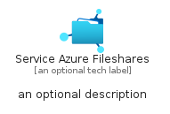
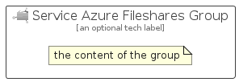

# ServiceAzureFileshares


```text
azure-19/Item/Storage/ServiceAzureFileshares
```

```text
include('azure-19/Item/Storage/ServiceAzureFileshares')
```


| Illustration | ServiceAzureFileshares | ServiceAzureFilesharesCard | ServiceAzureFilesharesGroup |
| :---: | :---: | :---: | :---: |
|  |  |  |  |


## Sprites
The item provides the following sriptes:

- `<$ServiceAzureFilesharesXs>`
- `<$ServiceAzureFilesharesSm>`
- `<$ServiceAzureFilesharesMd>`
- `<$ServiceAzureFilesharesLg>`


## ServiceAzureFileshares

### Load remotely
```plantuml
@startuml
' configures the library
!global $LIB_BASE_LOCATION="https://raw.githubusercontent.com/tmorin/plantuml-libs/master/distribution"

' loads the library's bootstrap
!include $LIB_BASE_LOCATION/bootstrap.puml

' loads the package bootstrap
include('azure-19/bootstrap')

' loads the Item which embeds the element ServiceAzureFileshares
include('azure-19/Item/Storage/ServiceAzureFileshares')

' renders the element
ServiceAzureFileshares('ServiceAzureFileshares', 'Service Azure Fileshares', 'an optional tech label', 'an optional description')
@enduml
```

### Load locally
```plantuml
@startuml
' configures the library
!global $INCLUSION_MODE="local"
!global $LIB_BASE_LOCATION="../../.."

' loads the library's bootstrap
!include $LIB_BASE_LOCATION/bootstrap.puml

' loads the package bootstrap
include('azure-19/bootstrap')

' loads the Item which embeds the element ServiceAzureFileshares
include('azure-19/Item/Storage/ServiceAzureFileshares')

' renders the element
ServiceAzureFileshares('ServiceAzureFileshares', 'Service Azure Fileshares', 'an optional tech label', 'an optional description')
@enduml
```

## ServiceAzureFilesharesCard

### Load remotely
```plantuml
@startuml
' configures the library
!global $LIB_BASE_LOCATION="https://raw.githubusercontent.com/tmorin/plantuml-libs/master/distribution"

' loads the library's bootstrap
!include $LIB_BASE_LOCATION/bootstrap.puml

' loads the package bootstrap
include('azure-19/bootstrap')

' loads the Item which embeds the element ServiceAzureFilesharesCard
include('azure-19/Item/Storage/ServiceAzureFileshares')

' renders the element
ServiceAzureFilesharesCard('ServiceAzureFilesharesCard', 'Service Azure Fileshares Card', 'an optional description')
@enduml
```

### Load locally
```plantuml
@startuml
' configures the library
!global $INCLUSION_MODE="local"
!global $LIB_BASE_LOCATION="../../.."

' loads the library's bootstrap
!include $LIB_BASE_LOCATION/bootstrap.puml

' loads the package bootstrap
include('azure-19/bootstrap')

' loads the Item which embeds the element ServiceAzureFilesharesCard
include('azure-19/Item/Storage/ServiceAzureFileshares')

' renders the element
ServiceAzureFilesharesCard('ServiceAzureFilesharesCard', 'Service Azure Fileshares Card', 'an optional description')
@enduml
```

## ServiceAzureFilesharesGroup

### Load remotely
```plantuml
@startuml
' configures the library
!global $LIB_BASE_LOCATION="https://raw.githubusercontent.com/tmorin/plantuml-libs/master/distribution"

' loads the library's bootstrap
!include $LIB_BASE_LOCATION/bootstrap.puml

' loads the package bootstrap
include('azure-19/bootstrap')

' loads the Item which embeds the element ServiceAzureFilesharesGroup
include('azure-19/Item/Storage/ServiceAzureFileshares')

' renders the element
ServiceAzureFilesharesGroup('ServiceAzureFilesharesGroup', 'Service Azure Fileshares Group', 'an optional tech label') {
    note as note
        the content of the group
    end note
}
@enduml
```

### Load locally
```plantuml
@startuml
' configures the library
!global $INCLUSION_MODE="local"
!global $LIB_BASE_LOCATION="../../.."

' loads the library's bootstrap
!include $LIB_BASE_LOCATION/bootstrap.puml

' loads the package bootstrap
include('azure-19/bootstrap')

' loads the Item which embeds the element ServiceAzureFilesharesGroup
include('azure-19/Item/Storage/ServiceAzureFileshares')

' renders the element
ServiceAzureFilesharesGroup('ServiceAzureFilesharesGroup', 'Service Azure Fileshares Group', 'an optional tech label') {
    note as note
        the content of the group
    end note
}
@enduml
```

