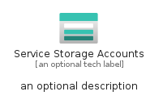
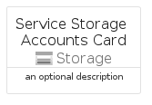
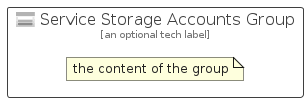

# ServiceStorageAccounts


```text
azure-19/Item/Storage/ServiceStorageAccounts
```

```text
include('azure-19/Item/Storage/ServiceStorageAccounts')
```


| Illustration | ServiceStorageAccounts | ServiceStorageAccountsCard | ServiceStorageAccountsGroup |
| :---: | :---: | :---: | :---: |
|  |  |  |  |


## Sprites
The item provides the following sriptes:

- `<$ServiceStorageAccountsXs>`
- `<$ServiceStorageAccountsSm>`
- `<$ServiceStorageAccountsMd>`
- `<$ServiceStorageAccountsLg>`


## ServiceStorageAccounts

### Load remotely
```plantuml
@startuml
' configures the library
!global $LIB_BASE_LOCATION="https://raw.githubusercontent.com/tmorin/plantuml-libs/master/distribution"

' loads the library's bootstrap
!include $LIB_BASE_LOCATION/bootstrap.puml

' loads the package bootstrap
include('azure-19/bootstrap')

' loads the Item which embeds the element ServiceStorageAccounts
include('azure-19/Item/Storage/ServiceStorageAccounts')

' renders the element
ServiceStorageAccounts('ServiceStorageAccounts', 'Service Storage Accounts', 'an optional tech label', 'an optional description')
@enduml
```

### Load locally
```plantuml
@startuml
' configures the library
!global $INCLUSION_MODE="local"
!global $LIB_BASE_LOCATION="../../.."

' loads the library's bootstrap
!include $LIB_BASE_LOCATION/bootstrap.puml

' loads the package bootstrap
include('azure-19/bootstrap')

' loads the Item which embeds the element ServiceStorageAccounts
include('azure-19/Item/Storage/ServiceStorageAccounts')

' renders the element
ServiceStorageAccounts('ServiceStorageAccounts', 'Service Storage Accounts', 'an optional tech label', 'an optional description')
@enduml
```

## ServiceStorageAccountsCard

### Load remotely
```plantuml
@startuml
' configures the library
!global $LIB_BASE_LOCATION="https://raw.githubusercontent.com/tmorin/plantuml-libs/master/distribution"

' loads the library's bootstrap
!include $LIB_BASE_LOCATION/bootstrap.puml

' loads the package bootstrap
include('azure-19/bootstrap')

' loads the Item which embeds the element ServiceStorageAccountsCard
include('azure-19/Item/Storage/ServiceStorageAccounts')

' renders the element
ServiceStorageAccountsCard('ServiceStorageAccountsCard', 'Service Storage Accounts Card', 'an optional description')
@enduml
```

### Load locally
```plantuml
@startuml
' configures the library
!global $INCLUSION_MODE="local"
!global $LIB_BASE_LOCATION="../../.."

' loads the library's bootstrap
!include $LIB_BASE_LOCATION/bootstrap.puml

' loads the package bootstrap
include('azure-19/bootstrap')

' loads the Item which embeds the element ServiceStorageAccountsCard
include('azure-19/Item/Storage/ServiceStorageAccounts')

' renders the element
ServiceStorageAccountsCard('ServiceStorageAccountsCard', 'Service Storage Accounts Card', 'an optional description')
@enduml
```

## ServiceStorageAccountsGroup

### Load remotely
```plantuml
@startuml
' configures the library
!global $LIB_BASE_LOCATION="https://raw.githubusercontent.com/tmorin/plantuml-libs/master/distribution"

' loads the library's bootstrap
!include $LIB_BASE_LOCATION/bootstrap.puml

' loads the package bootstrap
include('azure-19/bootstrap')

' loads the Item which embeds the element ServiceStorageAccountsGroup
include('azure-19/Item/Storage/ServiceStorageAccounts')

' renders the element
ServiceStorageAccountsGroup('ServiceStorageAccountsGroup', 'Service Storage Accounts Group', 'an optional tech label') {
    note as note
        the content of the group
    end note
}
@enduml
```

### Load locally
```plantuml
@startuml
' configures the library
!global $INCLUSION_MODE="local"
!global $LIB_BASE_LOCATION="../../.."

' loads the library's bootstrap
!include $LIB_BASE_LOCATION/bootstrap.puml

' loads the package bootstrap
include('azure-19/bootstrap')

' loads the Item which embeds the element ServiceStorageAccountsGroup
include('azure-19/Item/Storage/ServiceStorageAccounts')

' renders the element
ServiceStorageAccountsGroup('ServiceStorageAccountsGroup', 'Service Storage Accounts Group', 'an optional tech label') {
    note as note
        the content of the group
    end note
}
@enduml
```

