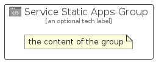

# ServiceStaticApps


```text
azure-19/Item/Web/ServiceStaticApps
```

```text
include('azure-19/Item/Web/ServiceStaticApps')
```


| Illustration | ServiceStaticApps | ServiceStaticAppsCard | ServiceStaticAppsGroup |
| :---: | :---: | :---: | :---: |
|  |  |  |  |


## Sprites
The item provides the following sriptes:

- `<$ServiceStaticAppsXs>`
- `<$ServiceStaticAppsSm>`
- `<$ServiceStaticAppsMd>`
- `<$ServiceStaticAppsLg>`


## ServiceStaticApps

### Load remotely
```plantuml
@startuml
' configures the library
!global $LIB_BASE_LOCATION="https://raw.githubusercontent.com/tmorin/plantuml-libs/master/distribution"

' loads the library's bootstrap
!include $LIB_BASE_LOCATION/bootstrap.puml

' loads the package bootstrap
include('azure-19/bootstrap')

' loads the Item which embeds the element ServiceStaticApps
include('azure-19/Item/Web/ServiceStaticApps')

' renders the element
ServiceStaticApps('ServiceStaticApps', 'Service Static Apps', 'an optional tech label', 'an optional description')
@enduml
```

### Load locally
```plantuml
@startuml
' configures the library
!global $INCLUSION_MODE="local"
!global $LIB_BASE_LOCATION="../../.."

' loads the library's bootstrap
!include $LIB_BASE_LOCATION/bootstrap.puml

' loads the package bootstrap
include('azure-19/bootstrap')

' loads the Item which embeds the element ServiceStaticApps
include('azure-19/Item/Web/ServiceStaticApps')

' renders the element
ServiceStaticApps('ServiceStaticApps', 'Service Static Apps', 'an optional tech label', 'an optional description')
@enduml
```

## ServiceStaticAppsCard

### Load remotely
```plantuml
@startuml
' configures the library
!global $LIB_BASE_LOCATION="https://raw.githubusercontent.com/tmorin/plantuml-libs/master/distribution"

' loads the library's bootstrap
!include $LIB_BASE_LOCATION/bootstrap.puml

' loads the package bootstrap
include('azure-19/bootstrap')

' loads the Item which embeds the element ServiceStaticAppsCard
include('azure-19/Item/Web/ServiceStaticApps')

' renders the element
ServiceStaticAppsCard('ServiceStaticAppsCard', 'Service Static Apps Card', 'an optional description')
@enduml
```

### Load locally
```plantuml
@startuml
' configures the library
!global $INCLUSION_MODE="local"
!global $LIB_BASE_LOCATION="../../.."

' loads the library's bootstrap
!include $LIB_BASE_LOCATION/bootstrap.puml

' loads the package bootstrap
include('azure-19/bootstrap')

' loads the Item which embeds the element ServiceStaticAppsCard
include('azure-19/Item/Web/ServiceStaticApps')

' renders the element
ServiceStaticAppsCard('ServiceStaticAppsCard', 'Service Static Apps Card', 'an optional description')
@enduml
```

## ServiceStaticAppsGroup

### Load remotely
```plantuml
@startuml
' configures the library
!global $LIB_BASE_LOCATION="https://raw.githubusercontent.com/tmorin/plantuml-libs/master/distribution"

' loads the library's bootstrap
!include $LIB_BASE_LOCATION/bootstrap.puml

' loads the package bootstrap
include('azure-19/bootstrap')

' loads the Item which embeds the element ServiceStaticAppsGroup
include('azure-19/Item/Web/ServiceStaticApps')

' renders the element
ServiceStaticAppsGroup('ServiceStaticAppsGroup', 'Service Static Apps Group', 'an optional tech label') {
    note as note
        the content of the group
    end note
}
@enduml
```

### Load locally
```plantuml
@startuml
' configures the library
!global $INCLUSION_MODE="local"
!global $LIB_BASE_LOCATION="../../.."

' loads the library's bootstrap
!include $LIB_BASE_LOCATION/bootstrap.puml

' loads the package bootstrap
include('azure-19/bootstrap')

' loads the Item which embeds the element ServiceStaticAppsGroup
include('azure-19/Item/Web/ServiceStaticApps')

' renders the element
ServiceStaticAppsGroup('ServiceStaticAppsGroup', 'Service Static Apps Group', 'an optional tech label') {
    note as note
        the content of the group
    end note
}
@enduml
```

