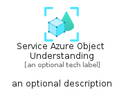
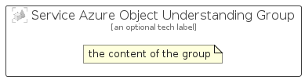

# ServiceAzureObjectUnderstanding


```text
azure-20/Item/AiMachineLearning/ServiceAzureObjectUnderstanding
```

```text
include('azure-20/Item/AiMachineLearning/ServiceAzureObjectUnderstanding')
```


| Illustration | ServiceAzureObjectUnderstanding | ServiceAzureObjectUnderstandingCard | ServiceAzureObjectUnderstandingGroup |
| :---: | :---: | :---: | :---: |
|  |  |  |  |


## Sprites
The item provides the following sriptes:

- `<$ServiceAzureObjectUnderstandingXs>`
- `<$ServiceAzureObjectUnderstandingSm>`
- `<$ServiceAzureObjectUnderstandingMd>`
- `<$ServiceAzureObjectUnderstandingLg>`


## ServiceAzureObjectUnderstanding

### Load remotely
```plantuml
@startuml
' configures the library
!global $LIB_BASE_LOCATION="https://raw.githubusercontent.com/tmorin/plantuml-libs/master/distribution"

' loads the library's bootstrap
!include $LIB_BASE_LOCATION/bootstrap.puml

' loads the package bootstrap
include('azure-20/bootstrap')

' loads the Item which embeds the element ServiceAzureObjectUnderstanding
include('azure-20/Item/AiMachineLearning/ServiceAzureObjectUnderstanding')

' renders the element
ServiceAzureObjectUnderstanding('ServiceAzureObjectUnderstanding', 'Service Azure Object Understanding', 'an optional tech label', 'an optional description')
@enduml
```

### Load locally
```plantuml
@startuml
' configures the library
!global $INCLUSION_MODE="local"
!global $LIB_BASE_LOCATION="../../.."

' loads the library's bootstrap
!include $LIB_BASE_LOCATION/bootstrap.puml

' loads the package bootstrap
include('azure-20/bootstrap')

' loads the Item which embeds the element ServiceAzureObjectUnderstanding
include('azure-20/Item/AiMachineLearning/ServiceAzureObjectUnderstanding')

' renders the element
ServiceAzureObjectUnderstanding('ServiceAzureObjectUnderstanding', 'Service Azure Object Understanding', 'an optional tech label', 'an optional description')
@enduml
```

## ServiceAzureObjectUnderstandingCard

### Load remotely
```plantuml
@startuml
' configures the library
!global $LIB_BASE_LOCATION="https://raw.githubusercontent.com/tmorin/plantuml-libs/master/distribution"

' loads the library's bootstrap
!include $LIB_BASE_LOCATION/bootstrap.puml

' loads the package bootstrap
include('azure-20/bootstrap')

' loads the Item which embeds the element ServiceAzureObjectUnderstandingCard
include('azure-20/Item/AiMachineLearning/ServiceAzureObjectUnderstanding')

' renders the element
ServiceAzureObjectUnderstandingCard('ServiceAzureObjectUnderstandingCard', 'Service Azure Object Understanding Card', 'an optional description')
@enduml
```

### Load locally
```plantuml
@startuml
' configures the library
!global $INCLUSION_MODE="local"
!global $LIB_BASE_LOCATION="../../.."

' loads the library's bootstrap
!include $LIB_BASE_LOCATION/bootstrap.puml

' loads the package bootstrap
include('azure-20/bootstrap')

' loads the Item which embeds the element ServiceAzureObjectUnderstandingCard
include('azure-20/Item/AiMachineLearning/ServiceAzureObjectUnderstanding')

' renders the element
ServiceAzureObjectUnderstandingCard('ServiceAzureObjectUnderstandingCard', 'Service Azure Object Understanding Card', 'an optional description')
@enduml
```

## ServiceAzureObjectUnderstandingGroup

### Load remotely
```plantuml
@startuml
' configures the library
!global $LIB_BASE_LOCATION="https://raw.githubusercontent.com/tmorin/plantuml-libs/master/distribution"

' loads the library's bootstrap
!include $LIB_BASE_LOCATION/bootstrap.puml

' loads the package bootstrap
include('azure-20/bootstrap')

' loads the Item which embeds the element ServiceAzureObjectUnderstandingGroup
include('azure-20/Item/AiMachineLearning/ServiceAzureObjectUnderstanding')

' renders the element
ServiceAzureObjectUnderstandingGroup('ServiceAzureObjectUnderstandingGroup', 'Service Azure Object Understanding Group', 'an optional tech label') {
    note as note
        the content of the group
    end note
}
@enduml
```

### Load locally
```plantuml
@startuml
' configures the library
!global $INCLUSION_MODE="local"
!global $LIB_BASE_LOCATION="../../.."

' loads the library's bootstrap
!include $LIB_BASE_LOCATION/bootstrap.puml

' loads the package bootstrap
include('azure-20/bootstrap')

' loads the Item which embeds the element ServiceAzureObjectUnderstandingGroup
include('azure-20/Item/AiMachineLearning/ServiceAzureObjectUnderstanding')

' renders the element
ServiceAzureObjectUnderstandingGroup('ServiceAzureObjectUnderstandingGroup', 'Service Azure Object Understanding Group', 'an optional tech label') {
    note as note
        the content of the group
    end note
}
@enduml
```

