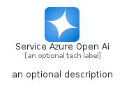
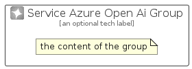

# ServiceAzureOpenAi


```text
azure-20/Item/AiMachineLearning/ServiceAzureOpenAi
```

```text
include('azure-20/Item/AiMachineLearning/ServiceAzureOpenAi')
```


| Illustration | ServiceAzureOpenAi | ServiceAzureOpenAiCard | ServiceAzureOpenAiGroup |
| :---: | :---: | :---: | :---: |
|  |  |  |  |


## Sprites
The item provides the following sriptes:

- `<$ServiceAzureOpenAiXs>`
- `<$ServiceAzureOpenAiSm>`
- `<$ServiceAzureOpenAiMd>`
- `<$ServiceAzureOpenAiLg>`


## ServiceAzureOpenAi

### Load remotely
```plantuml
@startuml
' configures the library
!global $LIB_BASE_LOCATION="https://raw.githubusercontent.com/tmorin/plantuml-libs/master/distribution"

' loads the library's bootstrap
!include $LIB_BASE_LOCATION/bootstrap.puml

' loads the package bootstrap
include('azure-20/bootstrap')

' loads the Item which embeds the element ServiceAzureOpenAi
include('azure-20/Item/AiMachineLearning/ServiceAzureOpenAi')

' renders the element
ServiceAzureOpenAi('ServiceAzureOpenAi', 'Service Azure Open Ai', 'an optional tech label', 'an optional description')
@enduml
```

### Load locally
```plantuml
@startuml
' configures the library
!global $INCLUSION_MODE="local"
!global $LIB_BASE_LOCATION="../../.."

' loads the library's bootstrap
!include $LIB_BASE_LOCATION/bootstrap.puml

' loads the package bootstrap
include('azure-20/bootstrap')

' loads the Item which embeds the element ServiceAzureOpenAi
include('azure-20/Item/AiMachineLearning/ServiceAzureOpenAi')

' renders the element
ServiceAzureOpenAi('ServiceAzureOpenAi', 'Service Azure Open Ai', 'an optional tech label', 'an optional description')
@enduml
```

## ServiceAzureOpenAiCard

### Load remotely
```plantuml
@startuml
' configures the library
!global $LIB_BASE_LOCATION="https://raw.githubusercontent.com/tmorin/plantuml-libs/master/distribution"

' loads the library's bootstrap
!include $LIB_BASE_LOCATION/bootstrap.puml

' loads the package bootstrap
include('azure-20/bootstrap')

' loads the Item which embeds the element ServiceAzureOpenAiCard
include('azure-20/Item/AiMachineLearning/ServiceAzureOpenAi')

' renders the element
ServiceAzureOpenAiCard('ServiceAzureOpenAiCard', 'Service Azure Open Ai Card', 'an optional description')
@enduml
```

### Load locally
```plantuml
@startuml
' configures the library
!global $INCLUSION_MODE="local"
!global $LIB_BASE_LOCATION="../../.."

' loads the library's bootstrap
!include $LIB_BASE_LOCATION/bootstrap.puml

' loads the package bootstrap
include('azure-20/bootstrap')

' loads the Item which embeds the element ServiceAzureOpenAiCard
include('azure-20/Item/AiMachineLearning/ServiceAzureOpenAi')

' renders the element
ServiceAzureOpenAiCard('ServiceAzureOpenAiCard', 'Service Azure Open Ai Card', 'an optional description')
@enduml
```

## ServiceAzureOpenAiGroup

### Load remotely
```plantuml
@startuml
' configures the library
!global $LIB_BASE_LOCATION="https://raw.githubusercontent.com/tmorin/plantuml-libs/master/distribution"

' loads the library's bootstrap
!include $LIB_BASE_LOCATION/bootstrap.puml

' loads the package bootstrap
include('azure-20/bootstrap')

' loads the Item which embeds the element ServiceAzureOpenAiGroup
include('azure-20/Item/AiMachineLearning/ServiceAzureOpenAi')

' renders the element
ServiceAzureOpenAiGroup('ServiceAzureOpenAiGroup', 'Service Azure Open Ai Group', 'an optional tech label') {
    note as note
        the content of the group
    end note
}
@enduml
```

### Load locally
```plantuml
@startuml
' configures the library
!global $INCLUSION_MODE="local"
!global $LIB_BASE_LOCATION="../../.."

' loads the library's bootstrap
!include $LIB_BASE_LOCATION/bootstrap.puml

' loads the package bootstrap
include('azure-20/bootstrap')

' loads the Item which embeds the element ServiceAzureOpenAiGroup
include('azure-20/Item/AiMachineLearning/ServiceAzureOpenAi')

' renders the element
ServiceAzureOpenAiGroup('ServiceAzureOpenAiGroup', 'Service Azure Open Ai Group', 'an optional tech label') {
    note as note
        the content of the group
    end note
}
@enduml
```

