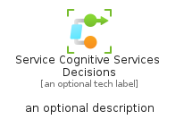

# ServiceCognitiveServicesDecisions


```text
azure-20/Item/AiMachineLearning/ServiceCognitiveServicesDecisions
```

```text
include('azure-20/Item/AiMachineLearning/ServiceCognitiveServicesDecisions')
```


| Illustration | ServiceCognitiveServicesDecisions | ServiceCognitiveServicesDecisionsCard | ServiceCognitiveServicesDecisionsGroup |
| :---: | :---: | :---: | :---: |
|  |  |  |  |


## Sprites
The item provides the following sriptes:

- `<$ServiceCognitiveServicesDecisionsXs>`
- `<$ServiceCognitiveServicesDecisionsSm>`
- `<$ServiceCognitiveServicesDecisionsMd>`
- `<$ServiceCognitiveServicesDecisionsLg>`


## ServiceCognitiveServicesDecisions

### Load remotely
```plantuml
@startuml
' configures the library
!global $LIB_BASE_LOCATION="https://raw.githubusercontent.com/tmorin/plantuml-libs/master/distribution"

' loads the library's bootstrap
!include $LIB_BASE_LOCATION/bootstrap.puml

' loads the package bootstrap
include('azure-20/bootstrap')

' loads the Item which embeds the element ServiceCognitiveServicesDecisions
include('azure-20/Item/AiMachineLearning/ServiceCognitiveServicesDecisions')

' renders the element
ServiceCognitiveServicesDecisions('ServiceCognitiveServicesDecisions', 'Service Cognitive Services Decisions', 'an optional tech label', 'an optional description')
@enduml
```

### Load locally
```plantuml
@startuml
' configures the library
!global $INCLUSION_MODE="local"
!global $LIB_BASE_LOCATION="../../.."

' loads the library's bootstrap
!include $LIB_BASE_LOCATION/bootstrap.puml

' loads the package bootstrap
include('azure-20/bootstrap')

' loads the Item which embeds the element ServiceCognitiveServicesDecisions
include('azure-20/Item/AiMachineLearning/ServiceCognitiveServicesDecisions')

' renders the element
ServiceCognitiveServicesDecisions('ServiceCognitiveServicesDecisions', 'Service Cognitive Services Decisions', 'an optional tech label', 'an optional description')
@enduml
```

## ServiceCognitiveServicesDecisionsCard

### Load remotely
```plantuml
@startuml
' configures the library
!global $LIB_BASE_LOCATION="https://raw.githubusercontent.com/tmorin/plantuml-libs/master/distribution"

' loads the library's bootstrap
!include $LIB_BASE_LOCATION/bootstrap.puml

' loads the package bootstrap
include('azure-20/bootstrap')

' loads the Item which embeds the element ServiceCognitiveServicesDecisionsCard
include('azure-20/Item/AiMachineLearning/ServiceCognitiveServicesDecisions')

' renders the element
ServiceCognitiveServicesDecisionsCard('ServiceCognitiveServicesDecisionsCard', 'Service Cognitive Services Decisions Card', 'an optional description')
@enduml
```

### Load locally
```plantuml
@startuml
' configures the library
!global $INCLUSION_MODE="local"
!global $LIB_BASE_LOCATION="../../.."

' loads the library's bootstrap
!include $LIB_BASE_LOCATION/bootstrap.puml

' loads the package bootstrap
include('azure-20/bootstrap')

' loads the Item which embeds the element ServiceCognitiveServicesDecisionsCard
include('azure-20/Item/AiMachineLearning/ServiceCognitiveServicesDecisions')

' renders the element
ServiceCognitiveServicesDecisionsCard('ServiceCognitiveServicesDecisionsCard', 'Service Cognitive Services Decisions Card', 'an optional description')
@enduml
```

## ServiceCognitiveServicesDecisionsGroup

### Load remotely
```plantuml
@startuml
' configures the library
!global $LIB_BASE_LOCATION="https://raw.githubusercontent.com/tmorin/plantuml-libs/master/distribution"

' loads the library's bootstrap
!include $LIB_BASE_LOCATION/bootstrap.puml

' loads the package bootstrap
include('azure-20/bootstrap')

' loads the Item which embeds the element ServiceCognitiveServicesDecisionsGroup
include('azure-20/Item/AiMachineLearning/ServiceCognitiveServicesDecisions')

' renders the element
ServiceCognitiveServicesDecisionsGroup('ServiceCognitiveServicesDecisionsGroup', 'Service Cognitive Services Decisions Group', 'an optional tech label') {
    note as note
        the content of the group
    end note
}
@enduml
```

### Load locally
```plantuml
@startuml
' configures the library
!global $INCLUSION_MODE="local"
!global $LIB_BASE_LOCATION="../../.."

' loads the library's bootstrap
!include $LIB_BASE_LOCATION/bootstrap.puml

' loads the package bootstrap
include('azure-20/bootstrap')

' loads the Item which embeds the element ServiceCognitiveServicesDecisionsGroup
include('azure-20/Item/AiMachineLearning/ServiceCognitiveServicesDecisions')

' renders the element
ServiceCognitiveServicesDecisionsGroup('ServiceCognitiveServicesDecisionsGroup', 'Service Cognitive Services Decisions Group', 'an optional tech label') {
    note as note
        the content of the group
    end note
}
@enduml
```

