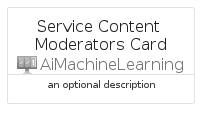
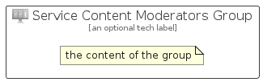

# ServiceContentModerators


```text
azure-20/Item/AiMachineLearning/ServiceContentModerators
```

```text
include('azure-20/Item/AiMachineLearning/ServiceContentModerators')
```


| Illustration | ServiceContentModerators | ServiceContentModeratorsCard | ServiceContentModeratorsGroup |
| :---: | :---: | :---: | :---: |
|  |  |  |  |


## Sprites
The item provides the following sriptes:

- `<$ServiceContentModeratorsXs>`
- `<$ServiceContentModeratorsSm>`
- `<$ServiceContentModeratorsMd>`
- `<$ServiceContentModeratorsLg>`


## ServiceContentModerators

### Load remotely
```plantuml
@startuml
' configures the library
!global $LIB_BASE_LOCATION="https://raw.githubusercontent.com/tmorin/plantuml-libs/master/distribution"

' loads the library's bootstrap
!include $LIB_BASE_LOCATION/bootstrap.puml

' loads the package bootstrap
include('azure-20/bootstrap')

' loads the Item which embeds the element ServiceContentModerators
include('azure-20/Item/AiMachineLearning/ServiceContentModerators')

' renders the element
ServiceContentModerators('ServiceContentModerators', 'Service Content Moderators', 'an optional tech label', 'an optional description')
@enduml
```

### Load locally
```plantuml
@startuml
' configures the library
!global $INCLUSION_MODE="local"
!global $LIB_BASE_LOCATION="../../.."

' loads the library's bootstrap
!include $LIB_BASE_LOCATION/bootstrap.puml

' loads the package bootstrap
include('azure-20/bootstrap')

' loads the Item which embeds the element ServiceContentModerators
include('azure-20/Item/AiMachineLearning/ServiceContentModerators')

' renders the element
ServiceContentModerators('ServiceContentModerators', 'Service Content Moderators', 'an optional tech label', 'an optional description')
@enduml
```

## ServiceContentModeratorsCard

### Load remotely
```plantuml
@startuml
' configures the library
!global $LIB_BASE_LOCATION="https://raw.githubusercontent.com/tmorin/plantuml-libs/master/distribution"

' loads the library's bootstrap
!include $LIB_BASE_LOCATION/bootstrap.puml

' loads the package bootstrap
include('azure-20/bootstrap')

' loads the Item which embeds the element ServiceContentModeratorsCard
include('azure-20/Item/AiMachineLearning/ServiceContentModerators')

' renders the element
ServiceContentModeratorsCard('ServiceContentModeratorsCard', 'Service Content Moderators Card', 'an optional description')
@enduml
```

### Load locally
```plantuml
@startuml
' configures the library
!global $INCLUSION_MODE="local"
!global $LIB_BASE_LOCATION="../../.."

' loads the library's bootstrap
!include $LIB_BASE_LOCATION/bootstrap.puml

' loads the package bootstrap
include('azure-20/bootstrap')

' loads the Item which embeds the element ServiceContentModeratorsCard
include('azure-20/Item/AiMachineLearning/ServiceContentModerators')

' renders the element
ServiceContentModeratorsCard('ServiceContentModeratorsCard', 'Service Content Moderators Card', 'an optional description')
@enduml
```

## ServiceContentModeratorsGroup

### Load remotely
```plantuml
@startuml
' configures the library
!global $LIB_BASE_LOCATION="https://raw.githubusercontent.com/tmorin/plantuml-libs/master/distribution"

' loads the library's bootstrap
!include $LIB_BASE_LOCATION/bootstrap.puml

' loads the package bootstrap
include('azure-20/bootstrap')

' loads the Item which embeds the element ServiceContentModeratorsGroup
include('azure-20/Item/AiMachineLearning/ServiceContentModerators')

' renders the element
ServiceContentModeratorsGroup('ServiceContentModeratorsGroup', 'Service Content Moderators Group', 'an optional tech label') {
    note as note
        the content of the group
    end note
}
@enduml
```

### Load locally
```plantuml
@startuml
' configures the library
!global $INCLUSION_MODE="local"
!global $LIB_BASE_LOCATION="../../.."

' loads the library's bootstrap
!include $LIB_BASE_LOCATION/bootstrap.puml

' loads the package bootstrap
include('azure-20/bootstrap')

' loads the Item which embeds the element ServiceContentModeratorsGroup
include('azure-20/Item/AiMachineLearning/ServiceContentModerators')

' renders the element
ServiceContentModeratorsGroup('ServiceContentModeratorsGroup', 'Service Content Moderators Group', 'an optional tech label') {
    note as note
        the content of the group
    end note
}
@enduml
```

