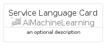

# ServiceLanguage


```text
azure-20/Item/AiMachineLearning/ServiceLanguage
```

```text
include('azure-20/Item/AiMachineLearning/ServiceLanguage')
```


| Illustration | ServiceLanguage | ServiceLanguageCard | ServiceLanguageGroup |
| :---: | :---: | :---: | :---: |
|  |  |  |  |


## Sprites
The item provides the following sriptes:

- `<$ServiceLanguageXs>`
- `<$ServiceLanguageSm>`
- `<$ServiceLanguageMd>`
- `<$ServiceLanguageLg>`


## ServiceLanguage

### Load remotely
```plantuml
@startuml
' configures the library
!global $LIB_BASE_LOCATION="https://raw.githubusercontent.com/tmorin/plantuml-libs/master/distribution"

' loads the library's bootstrap
!include $LIB_BASE_LOCATION/bootstrap.puml

' loads the package bootstrap
include('azure-20/bootstrap')

' loads the Item which embeds the element ServiceLanguage
include('azure-20/Item/AiMachineLearning/ServiceLanguage')

' renders the element
ServiceLanguage('ServiceLanguage', 'Service Language', 'an optional tech label', 'an optional description')
@enduml
```

### Load locally
```plantuml
@startuml
' configures the library
!global $INCLUSION_MODE="local"
!global $LIB_BASE_LOCATION="../../.."

' loads the library's bootstrap
!include $LIB_BASE_LOCATION/bootstrap.puml

' loads the package bootstrap
include('azure-20/bootstrap')

' loads the Item which embeds the element ServiceLanguage
include('azure-20/Item/AiMachineLearning/ServiceLanguage')

' renders the element
ServiceLanguage('ServiceLanguage', 'Service Language', 'an optional tech label', 'an optional description')
@enduml
```

## ServiceLanguageCard

### Load remotely
```plantuml
@startuml
' configures the library
!global $LIB_BASE_LOCATION="https://raw.githubusercontent.com/tmorin/plantuml-libs/master/distribution"

' loads the library's bootstrap
!include $LIB_BASE_LOCATION/bootstrap.puml

' loads the package bootstrap
include('azure-20/bootstrap')

' loads the Item which embeds the element ServiceLanguageCard
include('azure-20/Item/AiMachineLearning/ServiceLanguage')

' renders the element
ServiceLanguageCard('ServiceLanguageCard', 'Service Language Card', 'an optional description')
@enduml
```

### Load locally
```plantuml
@startuml
' configures the library
!global $INCLUSION_MODE="local"
!global $LIB_BASE_LOCATION="../../.."

' loads the library's bootstrap
!include $LIB_BASE_LOCATION/bootstrap.puml

' loads the package bootstrap
include('azure-20/bootstrap')

' loads the Item which embeds the element ServiceLanguageCard
include('azure-20/Item/AiMachineLearning/ServiceLanguage')

' renders the element
ServiceLanguageCard('ServiceLanguageCard', 'Service Language Card', 'an optional description')
@enduml
```

## ServiceLanguageGroup

### Load remotely
```plantuml
@startuml
' configures the library
!global $LIB_BASE_LOCATION="https://raw.githubusercontent.com/tmorin/plantuml-libs/master/distribution"

' loads the library's bootstrap
!include $LIB_BASE_LOCATION/bootstrap.puml

' loads the package bootstrap
include('azure-20/bootstrap')

' loads the Item which embeds the element ServiceLanguageGroup
include('azure-20/Item/AiMachineLearning/ServiceLanguage')

' renders the element
ServiceLanguageGroup('ServiceLanguageGroup', 'Service Language Group', 'an optional tech label') {
    note as note
        the content of the group
    end note
}
@enduml
```

### Load locally
```plantuml
@startuml
' configures the library
!global $INCLUSION_MODE="local"
!global $LIB_BASE_LOCATION="../../.."

' loads the library's bootstrap
!include $LIB_BASE_LOCATION/bootstrap.puml

' loads the package bootstrap
include('azure-20/bootstrap')

' loads the Item which embeds the element ServiceLanguageGroup
include('azure-20/Item/AiMachineLearning/ServiceLanguage')

' renders the element
ServiceLanguageGroup('ServiceLanguageGroup', 'Service Language Group', 'an optional tech label') {
    note as note
        the content of the group
    end note
}
@enduml
```

