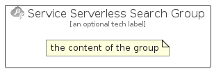

# ServiceServerlessSearch


```text
azure-20/Item/AiMachineLearning/ServiceServerlessSearch
```

```text
include('azure-20/Item/AiMachineLearning/ServiceServerlessSearch')
```


| Illustration | ServiceServerlessSearch | ServiceServerlessSearchCard | ServiceServerlessSearchGroup |
| :---: | :---: | :---: | :---: |
|  |  |  |  |


## Sprites
The item provides the following sriptes:

- `<$ServiceServerlessSearchXs>`
- `<$ServiceServerlessSearchSm>`
- `<$ServiceServerlessSearchMd>`
- `<$ServiceServerlessSearchLg>`


## ServiceServerlessSearch

### Load remotely
```plantuml
@startuml
' configures the library
!global $LIB_BASE_LOCATION="https://raw.githubusercontent.com/tmorin/plantuml-libs/master/distribution"

' loads the library's bootstrap
!include $LIB_BASE_LOCATION/bootstrap.puml

' loads the package bootstrap
include('azure-20/bootstrap')

' loads the Item which embeds the element ServiceServerlessSearch
include('azure-20/Item/AiMachineLearning/ServiceServerlessSearch')

' renders the element
ServiceServerlessSearch('ServiceServerlessSearch', 'Service Serverless Search', 'an optional tech label', 'an optional description')
@enduml
```

### Load locally
```plantuml
@startuml
' configures the library
!global $INCLUSION_MODE="local"
!global $LIB_BASE_LOCATION="../../.."

' loads the library's bootstrap
!include $LIB_BASE_LOCATION/bootstrap.puml

' loads the package bootstrap
include('azure-20/bootstrap')

' loads the Item which embeds the element ServiceServerlessSearch
include('azure-20/Item/AiMachineLearning/ServiceServerlessSearch')

' renders the element
ServiceServerlessSearch('ServiceServerlessSearch', 'Service Serverless Search', 'an optional tech label', 'an optional description')
@enduml
```

## ServiceServerlessSearchCard

### Load remotely
```plantuml
@startuml
' configures the library
!global $LIB_BASE_LOCATION="https://raw.githubusercontent.com/tmorin/plantuml-libs/master/distribution"

' loads the library's bootstrap
!include $LIB_BASE_LOCATION/bootstrap.puml

' loads the package bootstrap
include('azure-20/bootstrap')

' loads the Item which embeds the element ServiceServerlessSearchCard
include('azure-20/Item/AiMachineLearning/ServiceServerlessSearch')

' renders the element
ServiceServerlessSearchCard('ServiceServerlessSearchCard', 'Service Serverless Search Card', 'an optional description')
@enduml
```

### Load locally
```plantuml
@startuml
' configures the library
!global $INCLUSION_MODE="local"
!global $LIB_BASE_LOCATION="../../.."

' loads the library's bootstrap
!include $LIB_BASE_LOCATION/bootstrap.puml

' loads the package bootstrap
include('azure-20/bootstrap')

' loads the Item which embeds the element ServiceServerlessSearchCard
include('azure-20/Item/AiMachineLearning/ServiceServerlessSearch')

' renders the element
ServiceServerlessSearchCard('ServiceServerlessSearchCard', 'Service Serverless Search Card', 'an optional description')
@enduml
```

## ServiceServerlessSearchGroup

### Load remotely
```plantuml
@startuml
' configures the library
!global $LIB_BASE_LOCATION="https://raw.githubusercontent.com/tmorin/plantuml-libs/master/distribution"

' loads the library's bootstrap
!include $LIB_BASE_LOCATION/bootstrap.puml

' loads the package bootstrap
include('azure-20/bootstrap')

' loads the Item which embeds the element ServiceServerlessSearchGroup
include('azure-20/Item/AiMachineLearning/ServiceServerlessSearch')

' renders the element
ServiceServerlessSearchGroup('ServiceServerlessSearchGroup', 'Service Serverless Search Group', 'an optional tech label') {
    note as note
        the content of the group
    end note
}
@enduml
```

### Load locally
```plantuml
@startuml
' configures the library
!global $INCLUSION_MODE="local"
!global $LIB_BASE_LOCATION="../../.."

' loads the library's bootstrap
!include $LIB_BASE_LOCATION/bootstrap.puml

' loads the package bootstrap
include('azure-20/bootstrap')

' loads the Item which embeds the element ServiceServerlessSearchGroup
include('azure-20/Item/AiMachineLearning/ServiceServerlessSearch')

' renders the element
ServiceServerlessSearchGroup('ServiceServerlessSearchGroup', 'Service Serverless Search Group', 'an optional tech label') {
    note as note
        the content of the group
    end note
}
@enduml
```

