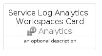
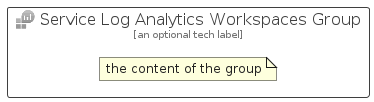

# ServiceLogAnalyticsWorkspaces


```text
azure-20/Item/Analytics/ServiceLogAnalyticsWorkspaces
```

```text
include('azure-20/Item/Analytics/ServiceLogAnalyticsWorkspaces')
```


| Illustration | ServiceLogAnalyticsWorkspaces | ServiceLogAnalyticsWorkspacesCard | ServiceLogAnalyticsWorkspacesGroup |
| :---: | :---: | :---: | :---: |
|  |  |  |  |


## Sprites
The item provides the following sriptes:

- `<$ServiceLogAnalyticsWorkspacesXs>`
- `<$ServiceLogAnalyticsWorkspacesSm>`
- `<$ServiceLogAnalyticsWorkspacesMd>`
- `<$ServiceLogAnalyticsWorkspacesLg>`


## ServiceLogAnalyticsWorkspaces

### Load remotely
```plantuml
@startuml
' configures the library
!global $LIB_BASE_LOCATION="https://raw.githubusercontent.com/tmorin/plantuml-libs/master/distribution"

' loads the library's bootstrap
!include $LIB_BASE_LOCATION/bootstrap.puml

' loads the package bootstrap
include('azure-20/bootstrap')

' loads the Item which embeds the element ServiceLogAnalyticsWorkspaces
include('azure-20/Item/Analytics/ServiceLogAnalyticsWorkspaces')

' renders the element
ServiceLogAnalyticsWorkspaces('ServiceLogAnalyticsWorkspaces', 'Service Log Analytics Workspaces', 'an optional tech label', 'an optional description')
@enduml
```

### Load locally
```plantuml
@startuml
' configures the library
!global $INCLUSION_MODE="local"
!global $LIB_BASE_LOCATION="../../.."

' loads the library's bootstrap
!include $LIB_BASE_LOCATION/bootstrap.puml

' loads the package bootstrap
include('azure-20/bootstrap')

' loads the Item which embeds the element ServiceLogAnalyticsWorkspaces
include('azure-20/Item/Analytics/ServiceLogAnalyticsWorkspaces')

' renders the element
ServiceLogAnalyticsWorkspaces('ServiceLogAnalyticsWorkspaces', 'Service Log Analytics Workspaces', 'an optional tech label', 'an optional description')
@enduml
```

## ServiceLogAnalyticsWorkspacesCard

### Load remotely
```plantuml
@startuml
' configures the library
!global $LIB_BASE_LOCATION="https://raw.githubusercontent.com/tmorin/plantuml-libs/master/distribution"

' loads the library's bootstrap
!include $LIB_BASE_LOCATION/bootstrap.puml

' loads the package bootstrap
include('azure-20/bootstrap')

' loads the Item which embeds the element ServiceLogAnalyticsWorkspacesCard
include('azure-20/Item/Analytics/ServiceLogAnalyticsWorkspaces')

' renders the element
ServiceLogAnalyticsWorkspacesCard('ServiceLogAnalyticsWorkspacesCard', 'Service Log Analytics Workspaces Card', 'an optional description')
@enduml
```

### Load locally
```plantuml
@startuml
' configures the library
!global $INCLUSION_MODE="local"
!global $LIB_BASE_LOCATION="../../.."

' loads the library's bootstrap
!include $LIB_BASE_LOCATION/bootstrap.puml

' loads the package bootstrap
include('azure-20/bootstrap')

' loads the Item which embeds the element ServiceLogAnalyticsWorkspacesCard
include('azure-20/Item/Analytics/ServiceLogAnalyticsWorkspaces')

' renders the element
ServiceLogAnalyticsWorkspacesCard('ServiceLogAnalyticsWorkspacesCard', 'Service Log Analytics Workspaces Card', 'an optional description')
@enduml
```

## ServiceLogAnalyticsWorkspacesGroup

### Load remotely
```plantuml
@startuml
' configures the library
!global $LIB_BASE_LOCATION="https://raw.githubusercontent.com/tmorin/plantuml-libs/master/distribution"

' loads the library's bootstrap
!include $LIB_BASE_LOCATION/bootstrap.puml

' loads the package bootstrap
include('azure-20/bootstrap')

' loads the Item which embeds the element ServiceLogAnalyticsWorkspacesGroup
include('azure-20/Item/Analytics/ServiceLogAnalyticsWorkspaces')

' renders the element
ServiceLogAnalyticsWorkspacesGroup('ServiceLogAnalyticsWorkspacesGroup', 'Service Log Analytics Workspaces Group', 'an optional tech label') {
    note as note
        the content of the group
    end note
}
@enduml
```

### Load locally
```plantuml
@startuml
' configures the library
!global $INCLUSION_MODE="local"
!global $LIB_BASE_LOCATION="../../.."

' loads the library's bootstrap
!include $LIB_BASE_LOCATION/bootstrap.puml

' loads the package bootstrap
include('azure-20/bootstrap')

' loads the Item which embeds the element ServiceLogAnalyticsWorkspacesGroup
include('azure-20/Item/Analytics/ServiceLogAnalyticsWorkspaces')

' renders the element
ServiceLogAnalyticsWorkspacesGroup('ServiceLogAnalyticsWorkspacesGroup', 'Service Log Analytics Workspaces Group', 'an optional tech label') {
    note as note
        the content of the group
    end note
}
@enduml
```

