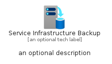
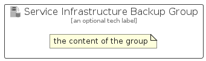

# ServiceInfrastructureBackup


```text
azure-20/Item/AzureStack/ServiceInfrastructureBackup
```

```text
include('azure-20/Item/AzureStack/ServiceInfrastructureBackup')
```


| Illustration | ServiceInfrastructureBackup | ServiceInfrastructureBackupCard | ServiceInfrastructureBackupGroup |
| :---: | :---: | :---: | :---: |
|  |  |  |  |


## Sprites
The item provides the following sriptes:

- `<$ServiceInfrastructureBackupXs>`
- `<$ServiceInfrastructureBackupSm>`
- `<$ServiceInfrastructureBackupMd>`
- `<$ServiceInfrastructureBackupLg>`


## ServiceInfrastructureBackup

### Load remotely
```plantuml
@startuml
' configures the library
!global $LIB_BASE_LOCATION="https://raw.githubusercontent.com/tmorin/plantuml-libs/master/distribution"

' loads the library's bootstrap
!include $LIB_BASE_LOCATION/bootstrap.puml

' loads the package bootstrap
include('azure-20/bootstrap')

' loads the Item which embeds the element ServiceInfrastructureBackup
include('azure-20/Item/AzureStack/ServiceInfrastructureBackup')

' renders the element
ServiceInfrastructureBackup('ServiceInfrastructureBackup', 'Service Infrastructure Backup', 'an optional tech label', 'an optional description')
@enduml
```

### Load locally
```plantuml
@startuml
' configures the library
!global $INCLUSION_MODE="local"
!global $LIB_BASE_LOCATION="../../.."

' loads the library's bootstrap
!include $LIB_BASE_LOCATION/bootstrap.puml

' loads the package bootstrap
include('azure-20/bootstrap')

' loads the Item which embeds the element ServiceInfrastructureBackup
include('azure-20/Item/AzureStack/ServiceInfrastructureBackup')

' renders the element
ServiceInfrastructureBackup('ServiceInfrastructureBackup', 'Service Infrastructure Backup', 'an optional tech label', 'an optional description')
@enduml
```

## ServiceInfrastructureBackupCard

### Load remotely
```plantuml
@startuml
' configures the library
!global $LIB_BASE_LOCATION="https://raw.githubusercontent.com/tmorin/plantuml-libs/master/distribution"

' loads the library's bootstrap
!include $LIB_BASE_LOCATION/bootstrap.puml

' loads the package bootstrap
include('azure-20/bootstrap')

' loads the Item which embeds the element ServiceInfrastructureBackupCard
include('azure-20/Item/AzureStack/ServiceInfrastructureBackup')

' renders the element
ServiceInfrastructureBackupCard('ServiceInfrastructureBackupCard', 'Service Infrastructure Backup Card', 'an optional description')
@enduml
```

### Load locally
```plantuml
@startuml
' configures the library
!global $INCLUSION_MODE="local"
!global $LIB_BASE_LOCATION="../../.."

' loads the library's bootstrap
!include $LIB_BASE_LOCATION/bootstrap.puml

' loads the package bootstrap
include('azure-20/bootstrap')

' loads the Item which embeds the element ServiceInfrastructureBackupCard
include('azure-20/Item/AzureStack/ServiceInfrastructureBackup')

' renders the element
ServiceInfrastructureBackupCard('ServiceInfrastructureBackupCard', 'Service Infrastructure Backup Card', 'an optional description')
@enduml
```

## ServiceInfrastructureBackupGroup

### Load remotely
```plantuml
@startuml
' configures the library
!global $LIB_BASE_LOCATION="https://raw.githubusercontent.com/tmorin/plantuml-libs/master/distribution"

' loads the library's bootstrap
!include $LIB_BASE_LOCATION/bootstrap.puml

' loads the package bootstrap
include('azure-20/bootstrap')

' loads the Item which embeds the element ServiceInfrastructureBackupGroup
include('azure-20/Item/AzureStack/ServiceInfrastructureBackup')

' renders the element
ServiceInfrastructureBackupGroup('ServiceInfrastructureBackupGroup', 'Service Infrastructure Backup Group', 'an optional tech label') {
    note as note
        the content of the group
    end note
}
@enduml
```

### Load locally
```plantuml
@startuml
' configures the library
!global $INCLUSION_MODE="local"
!global $LIB_BASE_LOCATION="../../.."

' loads the library's bootstrap
!include $LIB_BASE_LOCATION/bootstrap.puml

' loads the package bootstrap
include('azure-20/bootstrap')

' loads the Item which embeds the element ServiceInfrastructureBackupGroup
include('azure-20/Item/AzureStack/ServiceInfrastructureBackup')

' renders the element
ServiceInfrastructureBackupGroup('ServiceInfrastructureBackupGroup', 'Service Infrastructure Backup Group', 'an optional tech label') {
    note as note
        the content of the group
    end note
}
@enduml
```

