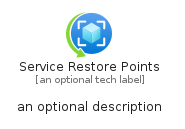
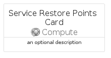

# ServiceRestorePoints


```text
azure-20/Item/Compute/ServiceRestorePoints
```

```text
include('azure-20/Item/Compute/ServiceRestorePoints')
```


| Illustration | ServiceRestorePoints | ServiceRestorePointsCard | ServiceRestorePointsGroup |
| :---: | :---: | :---: | :---: |
|  |  |  |  |


## Sprites
The item provides the following sriptes:

- `<$ServiceRestorePointsXs>`
- `<$ServiceRestorePointsSm>`
- `<$ServiceRestorePointsMd>`
- `<$ServiceRestorePointsLg>`


## ServiceRestorePoints

### Load remotely
```plantuml
@startuml
' configures the library
!global $LIB_BASE_LOCATION="https://raw.githubusercontent.com/tmorin/plantuml-libs/master/distribution"

' loads the library's bootstrap
!include $LIB_BASE_LOCATION/bootstrap.puml

' loads the package bootstrap
include('azure-20/bootstrap')

' loads the Item which embeds the element ServiceRestorePoints
include('azure-20/Item/Compute/ServiceRestorePoints')

' renders the element
ServiceRestorePoints('ServiceRestorePoints', 'Service Restore Points', 'an optional tech label', 'an optional description')
@enduml
```

### Load locally
```plantuml
@startuml
' configures the library
!global $INCLUSION_MODE="local"
!global $LIB_BASE_LOCATION="../../.."

' loads the library's bootstrap
!include $LIB_BASE_LOCATION/bootstrap.puml

' loads the package bootstrap
include('azure-20/bootstrap')

' loads the Item which embeds the element ServiceRestorePoints
include('azure-20/Item/Compute/ServiceRestorePoints')

' renders the element
ServiceRestorePoints('ServiceRestorePoints', 'Service Restore Points', 'an optional tech label', 'an optional description')
@enduml
```

## ServiceRestorePointsCard

### Load remotely
```plantuml
@startuml
' configures the library
!global $LIB_BASE_LOCATION="https://raw.githubusercontent.com/tmorin/plantuml-libs/master/distribution"

' loads the library's bootstrap
!include $LIB_BASE_LOCATION/bootstrap.puml

' loads the package bootstrap
include('azure-20/bootstrap')

' loads the Item which embeds the element ServiceRestorePointsCard
include('azure-20/Item/Compute/ServiceRestorePoints')

' renders the element
ServiceRestorePointsCard('ServiceRestorePointsCard', 'Service Restore Points Card', 'an optional description')
@enduml
```

### Load locally
```plantuml
@startuml
' configures the library
!global $INCLUSION_MODE="local"
!global $LIB_BASE_LOCATION="../../.."

' loads the library's bootstrap
!include $LIB_BASE_LOCATION/bootstrap.puml

' loads the package bootstrap
include('azure-20/bootstrap')

' loads the Item which embeds the element ServiceRestorePointsCard
include('azure-20/Item/Compute/ServiceRestorePoints')

' renders the element
ServiceRestorePointsCard('ServiceRestorePointsCard', 'Service Restore Points Card', 'an optional description')
@enduml
```

## ServiceRestorePointsGroup

### Load remotely
```plantuml
@startuml
' configures the library
!global $LIB_BASE_LOCATION="https://raw.githubusercontent.com/tmorin/plantuml-libs/master/distribution"

' loads the library's bootstrap
!include $LIB_BASE_LOCATION/bootstrap.puml

' loads the package bootstrap
include('azure-20/bootstrap')

' loads the Item which embeds the element ServiceRestorePointsGroup
include('azure-20/Item/Compute/ServiceRestorePoints')

' renders the element
ServiceRestorePointsGroup('ServiceRestorePointsGroup', 'Service Restore Points Group', 'an optional tech label') {
    note as note
        the content of the group
    end note
}
@enduml
```

### Load locally
```plantuml
@startuml
' configures the library
!global $INCLUSION_MODE="local"
!global $LIB_BASE_LOCATION="../../.."

' loads the library's bootstrap
!include $LIB_BASE_LOCATION/bootstrap.puml

' loads the package bootstrap
include('azure-20/bootstrap')

' loads the Item which embeds the element ServiceRestorePointsGroup
include('azure-20/Item/Compute/ServiceRestorePoints')

' renders the element
ServiceRestorePointsGroup('ServiceRestorePointsGroup', 'Service Restore Points Group', 'an optional tech label') {
    note as note
        the content of the group
    end note
}
@enduml
```

