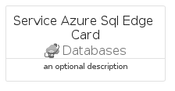
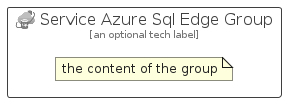

# ServiceAzureSqlEdge


```text
azure-20/Item/Databases/ServiceAzureSqlEdge
```

```text
include('azure-20/Item/Databases/ServiceAzureSqlEdge')
```


| Illustration | ServiceAzureSqlEdge | ServiceAzureSqlEdgeCard | ServiceAzureSqlEdgeGroup |
| :---: | :---: | :---: | :---: |
|  |  |  |  |


## Sprites
The item provides the following sriptes:

- `<$ServiceAzureSqlEdgeXs>`
- `<$ServiceAzureSqlEdgeSm>`
- `<$ServiceAzureSqlEdgeMd>`
- `<$ServiceAzureSqlEdgeLg>`


## ServiceAzureSqlEdge

### Load remotely
```plantuml
@startuml
' configures the library
!global $LIB_BASE_LOCATION="https://raw.githubusercontent.com/tmorin/plantuml-libs/master/distribution"

' loads the library's bootstrap
!include $LIB_BASE_LOCATION/bootstrap.puml

' loads the package bootstrap
include('azure-20/bootstrap')

' loads the Item which embeds the element ServiceAzureSqlEdge
include('azure-20/Item/Databases/ServiceAzureSqlEdge')

' renders the element
ServiceAzureSqlEdge('ServiceAzureSqlEdge', 'Service Azure Sql Edge', 'an optional tech label', 'an optional description')
@enduml
```

### Load locally
```plantuml
@startuml
' configures the library
!global $INCLUSION_MODE="local"
!global $LIB_BASE_LOCATION="../../.."

' loads the library's bootstrap
!include $LIB_BASE_LOCATION/bootstrap.puml

' loads the package bootstrap
include('azure-20/bootstrap')

' loads the Item which embeds the element ServiceAzureSqlEdge
include('azure-20/Item/Databases/ServiceAzureSqlEdge')

' renders the element
ServiceAzureSqlEdge('ServiceAzureSqlEdge', 'Service Azure Sql Edge', 'an optional tech label', 'an optional description')
@enduml
```

## ServiceAzureSqlEdgeCard

### Load remotely
```plantuml
@startuml
' configures the library
!global $LIB_BASE_LOCATION="https://raw.githubusercontent.com/tmorin/plantuml-libs/master/distribution"

' loads the library's bootstrap
!include $LIB_BASE_LOCATION/bootstrap.puml

' loads the package bootstrap
include('azure-20/bootstrap')

' loads the Item which embeds the element ServiceAzureSqlEdgeCard
include('azure-20/Item/Databases/ServiceAzureSqlEdge')

' renders the element
ServiceAzureSqlEdgeCard('ServiceAzureSqlEdgeCard', 'Service Azure Sql Edge Card', 'an optional description')
@enduml
```

### Load locally
```plantuml
@startuml
' configures the library
!global $INCLUSION_MODE="local"
!global $LIB_BASE_LOCATION="../../.."

' loads the library's bootstrap
!include $LIB_BASE_LOCATION/bootstrap.puml

' loads the package bootstrap
include('azure-20/bootstrap')

' loads the Item which embeds the element ServiceAzureSqlEdgeCard
include('azure-20/Item/Databases/ServiceAzureSqlEdge')

' renders the element
ServiceAzureSqlEdgeCard('ServiceAzureSqlEdgeCard', 'Service Azure Sql Edge Card', 'an optional description')
@enduml
```

## ServiceAzureSqlEdgeGroup

### Load remotely
```plantuml
@startuml
' configures the library
!global $LIB_BASE_LOCATION="https://raw.githubusercontent.com/tmorin/plantuml-libs/master/distribution"

' loads the library's bootstrap
!include $LIB_BASE_LOCATION/bootstrap.puml

' loads the package bootstrap
include('azure-20/bootstrap')

' loads the Item which embeds the element ServiceAzureSqlEdgeGroup
include('azure-20/Item/Databases/ServiceAzureSqlEdge')

' renders the element
ServiceAzureSqlEdgeGroup('ServiceAzureSqlEdgeGroup', 'Service Azure Sql Edge Group', 'an optional tech label') {
    note as note
        the content of the group
    end note
}
@enduml
```

### Load locally
```plantuml
@startuml
' configures the library
!global $INCLUSION_MODE="local"
!global $LIB_BASE_LOCATION="../../.."

' loads the library's bootstrap
!include $LIB_BASE_LOCATION/bootstrap.puml

' loads the package bootstrap
include('azure-20/bootstrap')

' loads the Item which embeds the element ServiceAzureSqlEdgeGroup
include('azure-20/Item/Databases/ServiceAzureSqlEdge')

' renders the element
ServiceAzureSqlEdgeGroup('ServiceAzureSqlEdgeGroup', 'Service Azure Sql Edge Group', 'an optional tech label') {
    note as note
        the content of the group
    end note
}
@enduml
```

