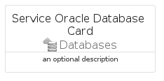

# ServiceOracleDatabase


```text
azure-20/Item/Databases/ServiceOracleDatabase
```

```text
include('azure-20/Item/Databases/ServiceOracleDatabase')
```


| Illustration | ServiceOracleDatabase | ServiceOracleDatabaseCard | ServiceOracleDatabaseGroup |
| :---: | :---: | :---: | :---: |
|  |  |  |  |


## Sprites
The item provides the following sriptes:

- `<$ServiceOracleDatabaseXs>`
- `<$ServiceOracleDatabaseSm>`
- `<$ServiceOracleDatabaseMd>`
- `<$ServiceOracleDatabaseLg>`


## ServiceOracleDatabase

### Load remotely
```plantuml
@startuml
' configures the library
!global $LIB_BASE_LOCATION="https://raw.githubusercontent.com/tmorin/plantuml-libs/master/distribution"

' loads the library's bootstrap
!include $LIB_BASE_LOCATION/bootstrap.puml

' loads the package bootstrap
include('azure-20/bootstrap')

' loads the Item which embeds the element ServiceOracleDatabase
include('azure-20/Item/Databases/ServiceOracleDatabase')

' renders the element
ServiceOracleDatabase('ServiceOracleDatabase', 'Service Oracle Database', 'an optional tech label', 'an optional description')
@enduml
```

### Load locally
```plantuml
@startuml
' configures the library
!global $INCLUSION_MODE="local"
!global $LIB_BASE_LOCATION="../../.."

' loads the library's bootstrap
!include $LIB_BASE_LOCATION/bootstrap.puml

' loads the package bootstrap
include('azure-20/bootstrap')

' loads the Item which embeds the element ServiceOracleDatabase
include('azure-20/Item/Databases/ServiceOracleDatabase')

' renders the element
ServiceOracleDatabase('ServiceOracleDatabase', 'Service Oracle Database', 'an optional tech label', 'an optional description')
@enduml
```

## ServiceOracleDatabaseCard

### Load remotely
```plantuml
@startuml
' configures the library
!global $LIB_BASE_LOCATION="https://raw.githubusercontent.com/tmorin/plantuml-libs/master/distribution"

' loads the library's bootstrap
!include $LIB_BASE_LOCATION/bootstrap.puml

' loads the package bootstrap
include('azure-20/bootstrap')

' loads the Item which embeds the element ServiceOracleDatabaseCard
include('azure-20/Item/Databases/ServiceOracleDatabase')

' renders the element
ServiceOracleDatabaseCard('ServiceOracleDatabaseCard', 'Service Oracle Database Card', 'an optional description')
@enduml
```

### Load locally
```plantuml
@startuml
' configures the library
!global $INCLUSION_MODE="local"
!global $LIB_BASE_LOCATION="../../.."

' loads the library's bootstrap
!include $LIB_BASE_LOCATION/bootstrap.puml

' loads the package bootstrap
include('azure-20/bootstrap')

' loads the Item which embeds the element ServiceOracleDatabaseCard
include('azure-20/Item/Databases/ServiceOracleDatabase')

' renders the element
ServiceOracleDatabaseCard('ServiceOracleDatabaseCard', 'Service Oracle Database Card', 'an optional description')
@enduml
```

## ServiceOracleDatabaseGroup

### Load remotely
```plantuml
@startuml
' configures the library
!global $LIB_BASE_LOCATION="https://raw.githubusercontent.com/tmorin/plantuml-libs/master/distribution"

' loads the library's bootstrap
!include $LIB_BASE_LOCATION/bootstrap.puml

' loads the package bootstrap
include('azure-20/bootstrap')

' loads the Item which embeds the element ServiceOracleDatabaseGroup
include('azure-20/Item/Databases/ServiceOracleDatabase')

' renders the element
ServiceOracleDatabaseGroup('ServiceOracleDatabaseGroup', 'Service Oracle Database Group', 'an optional tech label') {
    note as note
        the content of the group
    end note
}
@enduml
```

### Load locally
```plantuml
@startuml
' configures the library
!global $INCLUSION_MODE="local"
!global $LIB_BASE_LOCATION="../../.."

' loads the library's bootstrap
!include $LIB_BASE_LOCATION/bootstrap.puml

' loads the package bootstrap
include('azure-20/bootstrap')

' loads the Item which embeds the element ServiceOracleDatabaseGroup
include('azure-20/Item/Databases/ServiceOracleDatabase')

' renders the element
ServiceOracleDatabaseGroup('ServiceOracleDatabaseGroup', 'Service Oracle Database Group', 'an optional tech label') {
    note as note
        the content of the group
    end note
}
@enduml
```

