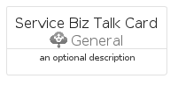

# ServiceBizTalk


```text
azure-20/Item/General/ServiceBizTalk
```

```text
include('azure-20/Item/General/ServiceBizTalk')
```


| Illustration | ServiceBizTalk | ServiceBizTalkCard | ServiceBizTalkGroup |
| :---: | :---: | :---: | :---: |
|  |  |  |  |


## Sprites
The item provides the following sriptes:

- `<$ServiceBizTalkXs>`
- `<$ServiceBizTalkSm>`
- `<$ServiceBizTalkMd>`
- `<$ServiceBizTalkLg>`


## ServiceBizTalk

### Load remotely
```plantuml
@startuml
' configures the library
!global $LIB_BASE_LOCATION="https://raw.githubusercontent.com/tmorin/plantuml-libs/master/distribution"

' loads the library's bootstrap
!include $LIB_BASE_LOCATION/bootstrap.puml

' loads the package bootstrap
include('azure-20/bootstrap')

' loads the Item which embeds the element ServiceBizTalk
include('azure-20/Item/General/ServiceBizTalk')

' renders the element
ServiceBizTalk('ServiceBizTalk', 'Service Biz Talk', 'an optional tech label', 'an optional description')
@enduml
```

### Load locally
```plantuml
@startuml
' configures the library
!global $INCLUSION_MODE="local"
!global $LIB_BASE_LOCATION="../../.."

' loads the library's bootstrap
!include $LIB_BASE_LOCATION/bootstrap.puml

' loads the package bootstrap
include('azure-20/bootstrap')

' loads the Item which embeds the element ServiceBizTalk
include('azure-20/Item/General/ServiceBizTalk')

' renders the element
ServiceBizTalk('ServiceBizTalk', 'Service Biz Talk', 'an optional tech label', 'an optional description')
@enduml
```

## ServiceBizTalkCard

### Load remotely
```plantuml
@startuml
' configures the library
!global $LIB_BASE_LOCATION="https://raw.githubusercontent.com/tmorin/plantuml-libs/master/distribution"

' loads the library's bootstrap
!include $LIB_BASE_LOCATION/bootstrap.puml

' loads the package bootstrap
include('azure-20/bootstrap')

' loads the Item which embeds the element ServiceBizTalkCard
include('azure-20/Item/General/ServiceBizTalk')

' renders the element
ServiceBizTalkCard('ServiceBizTalkCard', 'Service Biz Talk Card', 'an optional description')
@enduml
```

### Load locally
```plantuml
@startuml
' configures the library
!global $INCLUSION_MODE="local"
!global $LIB_BASE_LOCATION="../../.."

' loads the library's bootstrap
!include $LIB_BASE_LOCATION/bootstrap.puml

' loads the package bootstrap
include('azure-20/bootstrap')

' loads the Item which embeds the element ServiceBizTalkCard
include('azure-20/Item/General/ServiceBizTalk')

' renders the element
ServiceBizTalkCard('ServiceBizTalkCard', 'Service Biz Talk Card', 'an optional description')
@enduml
```

## ServiceBizTalkGroup

### Load remotely
```plantuml
@startuml
' configures the library
!global $LIB_BASE_LOCATION="https://raw.githubusercontent.com/tmorin/plantuml-libs/master/distribution"

' loads the library's bootstrap
!include $LIB_BASE_LOCATION/bootstrap.puml

' loads the package bootstrap
include('azure-20/bootstrap')

' loads the Item which embeds the element ServiceBizTalkGroup
include('azure-20/Item/General/ServiceBizTalk')

' renders the element
ServiceBizTalkGroup('ServiceBizTalkGroup', 'Service Biz Talk Group', 'an optional tech label') {
    note as note
        the content of the group
    end note
}
@enduml
```

### Load locally
```plantuml
@startuml
' configures the library
!global $INCLUSION_MODE="local"
!global $LIB_BASE_LOCATION="../../.."

' loads the library's bootstrap
!include $LIB_BASE_LOCATION/bootstrap.puml

' loads the package bootstrap
include('azure-20/bootstrap')

' loads the Item which embeds the element ServiceBizTalkGroup
include('azure-20/Item/General/ServiceBizTalk')

' renders the element
ServiceBizTalkGroup('ServiceBizTalkGroup', 'Service Biz Talk Group', 'an optional tech label') {
    note as note
        the content of the group
    end note
}
@enduml
```

