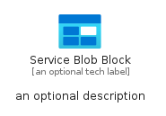

# ServiceBlobBlock


```text
azure-20/Item/General/ServiceBlobBlock
```

```text
include('azure-20/Item/General/ServiceBlobBlock')
```


| Illustration | ServiceBlobBlock | ServiceBlobBlockCard | ServiceBlobBlockGroup |
| :---: | :---: | :---: | :---: |
|  |  |  |  |


## Sprites
The item provides the following sriptes:

- `<$ServiceBlobBlockXs>`
- `<$ServiceBlobBlockSm>`
- `<$ServiceBlobBlockMd>`
- `<$ServiceBlobBlockLg>`


## ServiceBlobBlock

### Load remotely
```plantuml
@startuml
' configures the library
!global $LIB_BASE_LOCATION="https://raw.githubusercontent.com/tmorin/plantuml-libs/master/distribution"

' loads the library's bootstrap
!include $LIB_BASE_LOCATION/bootstrap.puml

' loads the package bootstrap
include('azure-20/bootstrap')

' loads the Item which embeds the element ServiceBlobBlock
include('azure-20/Item/General/ServiceBlobBlock')

' renders the element
ServiceBlobBlock('ServiceBlobBlock', 'Service Blob Block', 'an optional tech label', 'an optional description')
@enduml
```

### Load locally
```plantuml
@startuml
' configures the library
!global $INCLUSION_MODE="local"
!global $LIB_BASE_LOCATION="../../.."

' loads the library's bootstrap
!include $LIB_BASE_LOCATION/bootstrap.puml

' loads the package bootstrap
include('azure-20/bootstrap')

' loads the Item which embeds the element ServiceBlobBlock
include('azure-20/Item/General/ServiceBlobBlock')

' renders the element
ServiceBlobBlock('ServiceBlobBlock', 'Service Blob Block', 'an optional tech label', 'an optional description')
@enduml
```

## ServiceBlobBlockCard

### Load remotely
```plantuml
@startuml
' configures the library
!global $LIB_BASE_LOCATION="https://raw.githubusercontent.com/tmorin/plantuml-libs/master/distribution"

' loads the library's bootstrap
!include $LIB_BASE_LOCATION/bootstrap.puml

' loads the package bootstrap
include('azure-20/bootstrap')

' loads the Item which embeds the element ServiceBlobBlockCard
include('azure-20/Item/General/ServiceBlobBlock')

' renders the element
ServiceBlobBlockCard('ServiceBlobBlockCard', 'Service Blob Block Card', 'an optional description')
@enduml
```

### Load locally
```plantuml
@startuml
' configures the library
!global $INCLUSION_MODE="local"
!global $LIB_BASE_LOCATION="../../.."

' loads the library's bootstrap
!include $LIB_BASE_LOCATION/bootstrap.puml

' loads the package bootstrap
include('azure-20/bootstrap')

' loads the Item which embeds the element ServiceBlobBlockCard
include('azure-20/Item/General/ServiceBlobBlock')

' renders the element
ServiceBlobBlockCard('ServiceBlobBlockCard', 'Service Blob Block Card', 'an optional description')
@enduml
```

## ServiceBlobBlockGroup

### Load remotely
```plantuml
@startuml
' configures the library
!global $LIB_BASE_LOCATION="https://raw.githubusercontent.com/tmorin/plantuml-libs/master/distribution"

' loads the library's bootstrap
!include $LIB_BASE_LOCATION/bootstrap.puml

' loads the package bootstrap
include('azure-20/bootstrap')

' loads the Item which embeds the element ServiceBlobBlockGroup
include('azure-20/Item/General/ServiceBlobBlock')

' renders the element
ServiceBlobBlockGroup('ServiceBlobBlockGroup', 'Service Blob Block Group', 'an optional tech label') {
    note as note
        the content of the group
    end note
}
@enduml
```

### Load locally
```plantuml
@startuml
' configures the library
!global $INCLUSION_MODE="local"
!global $LIB_BASE_LOCATION="../../.."

' loads the library's bootstrap
!include $LIB_BASE_LOCATION/bootstrap.puml

' loads the package bootstrap
include('azure-20/bootstrap')

' loads the Item which embeds the element ServiceBlobBlockGroup
include('azure-20/Item/General/ServiceBlobBlock')

' renders the element
ServiceBlobBlockGroup('ServiceBlobBlockGroup', 'Service Blob Block Group', 'an optional tech label') {
    note as note
        the content of the group
    end note
}
@enduml
```

