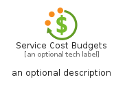
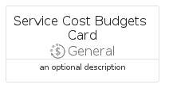

# ServiceCostBudgets


```text
azure-20/Item/General/ServiceCostBudgets
```

```text
include('azure-20/Item/General/ServiceCostBudgets')
```


| Illustration | ServiceCostBudgets | ServiceCostBudgetsCard | ServiceCostBudgetsGroup |
| :---: | :---: | :---: | :---: |
|  |  |  |  |


## Sprites
The item provides the following sriptes:

- `<$ServiceCostBudgetsXs>`
- `<$ServiceCostBudgetsSm>`
- `<$ServiceCostBudgetsMd>`
- `<$ServiceCostBudgetsLg>`


## ServiceCostBudgets

### Load remotely
```plantuml
@startuml
' configures the library
!global $LIB_BASE_LOCATION="https://raw.githubusercontent.com/tmorin/plantuml-libs/master/distribution"

' loads the library's bootstrap
!include $LIB_BASE_LOCATION/bootstrap.puml

' loads the package bootstrap
include('azure-20/bootstrap')

' loads the Item which embeds the element ServiceCostBudgets
include('azure-20/Item/General/ServiceCostBudgets')

' renders the element
ServiceCostBudgets('ServiceCostBudgets', 'Service Cost Budgets', 'an optional tech label', 'an optional description')
@enduml
```

### Load locally
```plantuml
@startuml
' configures the library
!global $INCLUSION_MODE="local"
!global $LIB_BASE_LOCATION="../../.."

' loads the library's bootstrap
!include $LIB_BASE_LOCATION/bootstrap.puml

' loads the package bootstrap
include('azure-20/bootstrap')

' loads the Item which embeds the element ServiceCostBudgets
include('azure-20/Item/General/ServiceCostBudgets')

' renders the element
ServiceCostBudgets('ServiceCostBudgets', 'Service Cost Budgets', 'an optional tech label', 'an optional description')
@enduml
```

## ServiceCostBudgetsCard

### Load remotely
```plantuml
@startuml
' configures the library
!global $LIB_BASE_LOCATION="https://raw.githubusercontent.com/tmorin/plantuml-libs/master/distribution"

' loads the library's bootstrap
!include $LIB_BASE_LOCATION/bootstrap.puml

' loads the package bootstrap
include('azure-20/bootstrap')

' loads the Item which embeds the element ServiceCostBudgetsCard
include('azure-20/Item/General/ServiceCostBudgets')

' renders the element
ServiceCostBudgetsCard('ServiceCostBudgetsCard', 'Service Cost Budgets Card', 'an optional description')
@enduml
```

### Load locally
```plantuml
@startuml
' configures the library
!global $INCLUSION_MODE="local"
!global $LIB_BASE_LOCATION="../../.."

' loads the library's bootstrap
!include $LIB_BASE_LOCATION/bootstrap.puml

' loads the package bootstrap
include('azure-20/bootstrap')

' loads the Item which embeds the element ServiceCostBudgetsCard
include('azure-20/Item/General/ServiceCostBudgets')

' renders the element
ServiceCostBudgetsCard('ServiceCostBudgetsCard', 'Service Cost Budgets Card', 'an optional description')
@enduml
```

## ServiceCostBudgetsGroup

### Load remotely
```plantuml
@startuml
' configures the library
!global $LIB_BASE_LOCATION="https://raw.githubusercontent.com/tmorin/plantuml-libs/master/distribution"

' loads the library's bootstrap
!include $LIB_BASE_LOCATION/bootstrap.puml

' loads the package bootstrap
include('azure-20/bootstrap')

' loads the Item which embeds the element ServiceCostBudgetsGroup
include('azure-20/Item/General/ServiceCostBudgets')

' renders the element
ServiceCostBudgetsGroup('ServiceCostBudgetsGroup', 'Service Cost Budgets Group', 'an optional tech label') {
    note as note
        the content of the group
    end note
}
@enduml
```

### Load locally
```plantuml
@startuml
' configures the library
!global $INCLUSION_MODE="local"
!global $LIB_BASE_LOCATION="../../.."

' loads the library's bootstrap
!include $LIB_BASE_LOCATION/bootstrap.puml

' loads the package bootstrap
include('azure-20/bootstrap')

' loads the Item which embeds the element ServiceCostBudgetsGroup
include('azure-20/Item/General/ServiceCostBudgets')

' renders the element
ServiceCostBudgetsGroup('ServiceCostBudgetsGroup', 'Service Cost Budgets Group', 'an optional tech label') {
    note as note
        the content of the group
    end note
}
@enduml
```

