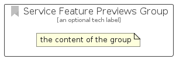

# ServiceFeaturePreviews


```text
azure-20/Item/General/ServiceFeaturePreviews
```

```text
include('azure-20/Item/General/ServiceFeaturePreviews')
```


| Illustration | ServiceFeaturePreviews | ServiceFeaturePreviewsCard | ServiceFeaturePreviewsGroup |
| :---: | :---: | :---: | :---: |
|  |  |  |  |


## Sprites
The item provides the following sriptes:

- `<$ServiceFeaturePreviewsXs>`
- `<$ServiceFeaturePreviewsSm>`
- `<$ServiceFeaturePreviewsMd>`
- `<$ServiceFeaturePreviewsLg>`


## ServiceFeaturePreviews

### Load remotely
```plantuml
@startuml
' configures the library
!global $LIB_BASE_LOCATION="https://raw.githubusercontent.com/tmorin/plantuml-libs/master/distribution"

' loads the library's bootstrap
!include $LIB_BASE_LOCATION/bootstrap.puml

' loads the package bootstrap
include('azure-20/bootstrap')

' loads the Item which embeds the element ServiceFeaturePreviews
include('azure-20/Item/General/ServiceFeaturePreviews')

' renders the element
ServiceFeaturePreviews('ServiceFeaturePreviews', 'Service Feature Previews', 'an optional tech label', 'an optional description')
@enduml
```

### Load locally
```plantuml
@startuml
' configures the library
!global $INCLUSION_MODE="local"
!global $LIB_BASE_LOCATION="../../.."

' loads the library's bootstrap
!include $LIB_BASE_LOCATION/bootstrap.puml

' loads the package bootstrap
include('azure-20/bootstrap')

' loads the Item which embeds the element ServiceFeaturePreviews
include('azure-20/Item/General/ServiceFeaturePreviews')

' renders the element
ServiceFeaturePreviews('ServiceFeaturePreviews', 'Service Feature Previews', 'an optional tech label', 'an optional description')
@enduml
```

## ServiceFeaturePreviewsCard

### Load remotely
```plantuml
@startuml
' configures the library
!global $LIB_BASE_LOCATION="https://raw.githubusercontent.com/tmorin/plantuml-libs/master/distribution"

' loads the library's bootstrap
!include $LIB_BASE_LOCATION/bootstrap.puml

' loads the package bootstrap
include('azure-20/bootstrap')

' loads the Item which embeds the element ServiceFeaturePreviewsCard
include('azure-20/Item/General/ServiceFeaturePreviews')

' renders the element
ServiceFeaturePreviewsCard('ServiceFeaturePreviewsCard', 'Service Feature Previews Card', 'an optional description')
@enduml
```

### Load locally
```plantuml
@startuml
' configures the library
!global $INCLUSION_MODE="local"
!global $LIB_BASE_LOCATION="../../.."

' loads the library's bootstrap
!include $LIB_BASE_LOCATION/bootstrap.puml

' loads the package bootstrap
include('azure-20/bootstrap')

' loads the Item which embeds the element ServiceFeaturePreviewsCard
include('azure-20/Item/General/ServiceFeaturePreviews')

' renders the element
ServiceFeaturePreviewsCard('ServiceFeaturePreviewsCard', 'Service Feature Previews Card', 'an optional description')
@enduml
```

## ServiceFeaturePreviewsGroup

### Load remotely
```plantuml
@startuml
' configures the library
!global $LIB_BASE_LOCATION="https://raw.githubusercontent.com/tmorin/plantuml-libs/master/distribution"

' loads the library's bootstrap
!include $LIB_BASE_LOCATION/bootstrap.puml

' loads the package bootstrap
include('azure-20/bootstrap')

' loads the Item which embeds the element ServiceFeaturePreviewsGroup
include('azure-20/Item/General/ServiceFeaturePreviews')

' renders the element
ServiceFeaturePreviewsGroup('ServiceFeaturePreviewsGroup', 'Service Feature Previews Group', 'an optional tech label') {
    note as note
        the content of the group
    end note
}
@enduml
```

### Load locally
```plantuml
@startuml
' configures the library
!global $INCLUSION_MODE="local"
!global $LIB_BASE_LOCATION="../../.."

' loads the library's bootstrap
!include $LIB_BASE_LOCATION/bootstrap.puml

' loads the package bootstrap
include('azure-20/bootstrap')

' loads the Item which embeds the element ServiceFeaturePreviewsGroup
include('azure-20/Item/General/ServiceFeaturePreviews')

' renders the element
ServiceFeaturePreviewsGroup('ServiceFeaturePreviewsGroup', 'Service Feature Previews Group', 'an optional tech label') {
    note as note
        the content of the group
    end note
}
@enduml
```

