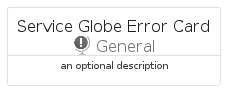

# ServiceGlobeError


```text
azure-20/Item/General/ServiceGlobeError
```

```text
include('azure-20/Item/General/ServiceGlobeError')
```


| Illustration | ServiceGlobeError | ServiceGlobeErrorCard | ServiceGlobeErrorGroup |
| :---: | :---: | :---: | :---: |
|  |  |  |  |


## Sprites
The item provides the following sriptes:

- `<$ServiceGlobeErrorXs>`
- `<$ServiceGlobeErrorSm>`
- `<$ServiceGlobeErrorMd>`
- `<$ServiceGlobeErrorLg>`


## ServiceGlobeError

### Load remotely
```plantuml
@startuml
' configures the library
!global $LIB_BASE_LOCATION="https://raw.githubusercontent.com/tmorin/plantuml-libs/master/distribution"

' loads the library's bootstrap
!include $LIB_BASE_LOCATION/bootstrap.puml

' loads the package bootstrap
include('azure-20/bootstrap')

' loads the Item which embeds the element ServiceGlobeError
include('azure-20/Item/General/ServiceGlobeError')

' renders the element
ServiceGlobeError('ServiceGlobeError', 'Service Globe Error', 'an optional tech label', 'an optional description')
@enduml
```

### Load locally
```plantuml
@startuml
' configures the library
!global $INCLUSION_MODE="local"
!global $LIB_BASE_LOCATION="../../.."

' loads the library's bootstrap
!include $LIB_BASE_LOCATION/bootstrap.puml

' loads the package bootstrap
include('azure-20/bootstrap')

' loads the Item which embeds the element ServiceGlobeError
include('azure-20/Item/General/ServiceGlobeError')

' renders the element
ServiceGlobeError('ServiceGlobeError', 'Service Globe Error', 'an optional tech label', 'an optional description')
@enduml
```

## ServiceGlobeErrorCard

### Load remotely
```plantuml
@startuml
' configures the library
!global $LIB_BASE_LOCATION="https://raw.githubusercontent.com/tmorin/plantuml-libs/master/distribution"

' loads the library's bootstrap
!include $LIB_BASE_LOCATION/bootstrap.puml

' loads the package bootstrap
include('azure-20/bootstrap')

' loads the Item which embeds the element ServiceGlobeErrorCard
include('azure-20/Item/General/ServiceGlobeError')

' renders the element
ServiceGlobeErrorCard('ServiceGlobeErrorCard', 'Service Globe Error Card', 'an optional description')
@enduml
```

### Load locally
```plantuml
@startuml
' configures the library
!global $INCLUSION_MODE="local"
!global $LIB_BASE_LOCATION="../../.."

' loads the library's bootstrap
!include $LIB_BASE_LOCATION/bootstrap.puml

' loads the package bootstrap
include('azure-20/bootstrap')

' loads the Item which embeds the element ServiceGlobeErrorCard
include('azure-20/Item/General/ServiceGlobeError')

' renders the element
ServiceGlobeErrorCard('ServiceGlobeErrorCard', 'Service Globe Error Card', 'an optional description')
@enduml
```

## ServiceGlobeErrorGroup

### Load remotely
```plantuml
@startuml
' configures the library
!global $LIB_BASE_LOCATION="https://raw.githubusercontent.com/tmorin/plantuml-libs/master/distribution"

' loads the library's bootstrap
!include $LIB_BASE_LOCATION/bootstrap.puml

' loads the package bootstrap
include('azure-20/bootstrap')

' loads the Item which embeds the element ServiceGlobeErrorGroup
include('azure-20/Item/General/ServiceGlobeError')

' renders the element
ServiceGlobeErrorGroup('ServiceGlobeErrorGroup', 'Service Globe Error Group', 'an optional tech label') {
    note as note
        the content of the group
    end note
}
@enduml
```

### Load locally
```plantuml
@startuml
' configures the library
!global $INCLUSION_MODE="local"
!global $LIB_BASE_LOCATION="../../.."

' loads the library's bootstrap
!include $LIB_BASE_LOCATION/bootstrap.puml

' loads the package bootstrap
include('azure-20/bootstrap')

' loads the Item which embeds the element ServiceGlobeErrorGroup
include('azure-20/Item/General/ServiceGlobeError')

' renders the element
ServiceGlobeErrorGroup('ServiceGlobeErrorGroup', 'Service Globe Error Group', 'an optional tech label') {
    note as note
        the content of the group
    end note
}
@enduml
```

