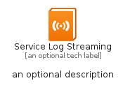
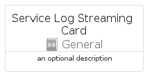

# ServiceLogStreaming


```text
azure-20/Item/General/ServiceLogStreaming
```

```text
include('azure-20/Item/General/ServiceLogStreaming')
```


| Illustration | ServiceLogStreaming | ServiceLogStreamingCard | ServiceLogStreamingGroup |
| :---: | :---: | :---: | :---: |
|  |  |  |  |


## Sprites
The item provides the following sriptes:

- `<$ServiceLogStreamingXs>`
- `<$ServiceLogStreamingSm>`
- `<$ServiceLogStreamingMd>`
- `<$ServiceLogStreamingLg>`


## ServiceLogStreaming

### Load remotely
```plantuml
@startuml
' configures the library
!global $LIB_BASE_LOCATION="https://raw.githubusercontent.com/tmorin/plantuml-libs/master/distribution"

' loads the library's bootstrap
!include $LIB_BASE_LOCATION/bootstrap.puml

' loads the package bootstrap
include('azure-20/bootstrap')

' loads the Item which embeds the element ServiceLogStreaming
include('azure-20/Item/General/ServiceLogStreaming')

' renders the element
ServiceLogStreaming('ServiceLogStreaming', 'Service Log Streaming', 'an optional tech label', 'an optional description')
@enduml
```

### Load locally
```plantuml
@startuml
' configures the library
!global $INCLUSION_MODE="local"
!global $LIB_BASE_LOCATION="../../.."

' loads the library's bootstrap
!include $LIB_BASE_LOCATION/bootstrap.puml

' loads the package bootstrap
include('azure-20/bootstrap')

' loads the Item which embeds the element ServiceLogStreaming
include('azure-20/Item/General/ServiceLogStreaming')

' renders the element
ServiceLogStreaming('ServiceLogStreaming', 'Service Log Streaming', 'an optional tech label', 'an optional description')
@enduml
```

## ServiceLogStreamingCard

### Load remotely
```plantuml
@startuml
' configures the library
!global $LIB_BASE_LOCATION="https://raw.githubusercontent.com/tmorin/plantuml-libs/master/distribution"

' loads the library's bootstrap
!include $LIB_BASE_LOCATION/bootstrap.puml

' loads the package bootstrap
include('azure-20/bootstrap')

' loads the Item which embeds the element ServiceLogStreamingCard
include('azure-20/Item/General/ServiceLogStreaming')

' renders the element
ServiceLogStreamingCard('ServiceLogStreamingCard', 'Service Log Streaming Card', 'an optional description')
@enduml
```

### Load locally
```plantuml
@startuml
' configures the library
!global $INCLUSION_MODE="local"
!global $LIB_BASE_LOCATION="../../.."

' loads the library's bootstrap
!include $LIB_BASE_LOCATION/bootstrap.puml

' loads the package bootstrap
include('azure-20/bootstrap')

' loads the Item which embeds the element ServiceLogStreamingCard
include('azure-20/Item/General/ServiceLogStreaming')

' renders the element
ServiceLogStreamingCard('ServiceLogStreamingCard', 'Service Log Streaming Card', 'an optional description')
@enduml
```

## ServiceLogStreamingGroup

### Load remotely
```plantuml
@startuml
' configures the library
!global $LIB_BASE_LOCATION="https://raw.githubusercontent.com/tmorin/plantuml-libs/master/distribution"

' loads the library's bootstrap
!include $LIB_BASE_LOCATION/bootstrap.puml

' loads the package bootstrap
include('azure-20/bootstrap')

' loads the Item which embeds the element ServiceLogStreamingGroup
include('azure-20/Item/General/ServiceLogStreaming')

' renders the element
ServiceLogStreamingGroup('ServiceLogStreamingGroup', 'Service Log Streaming Group', 'an optional tech label') {
    note as note
        the content of the group
    end note
}
@enduml
```

### Load locally
```plantuml
@startuml
' configures the library
!global $INCLUSION_MODE="local"
!global $LIB_BASE_LOCATION="../../.."

' loads the library's bootstrap
!include $LIB_BASE_LOCATION/bootstrap.puml

' loads the package bootstrap
include('azure-20/bootstrap')

' loads the Item which embeds the element ServiceLogStreamingGroup
include('azure-20/Item/General/ServiceLogStreaming')

' renders the element
ServiceLogStreamingGroup('ServiceLogStreamingGroup', 'Service Log Streaming Group', 'an optional tech label') {
    note as note
        the content of the group
    end note
}
@enduml
```

