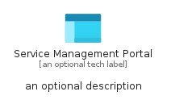
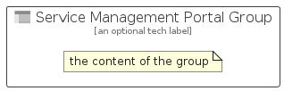

# ServiceManagementPortal


```text
azure-20/Item/General/ServiceManagementPortal
```

```text
include('azure-20/Item/General/ServiceManagementPortal')
```


| Illustration | ServiceManagementPortal | ServiceManagementPortalCard | ServiceManagementPortalGroup |
| :---: | :---: | :---: | :---: |
|  |  |  |  |


## Sprites
The item provides the following sriptes:

- `<$ServiceManagementPortalXs>`
- `<$ServiceManagementPortalSm>`
- `<$ServiceManagementPortalMd>`
- `<$ServiceManagementPortalLg>`


## ServiceManagementPortal

### Load remotely
```plantuml
@startuml
' configures the library
!global $LIB_BASE_LOCATION="https://raw.githubusercontent.com/tmorin/plantuml-libs/master/distribution"

' loads the library's bootstrap
!include $LIB_BASE_LOCATION/bootstrap.puml

' loads the package bootstrap
include('azure-20/bootstrap')

' loads the Item which embeds the element ServiceManagementPortal
include('azure-20/Item/General/ServiceManagementPortal')

' renders the element
ServiceManagementPortal('ServiceManagementPortal', 'Service Management Portal', 'an optional tech label', 'an optional description')
@enduml
```

### Load locally
```plantuml
@startuml
' configures the library
!global $INCLUSION_MODE="local"
!global $LIB_BASE_LOCATION="../../.."

' loads the library's bootstrap
!include $LIB_BASE_LOCATION/bootstrap.puml

' loads the package bootstrap
include('azure-20/bootstrap')

' loads the Item which embeds the element ServiceManagementPortal
include('azure-20/Item/General/ServiceManagementPortal')

' renders the element
ServiceManagementPortal('ServiceManagementPortal', 'Service Management Portal', 'an optional tech label', 'an optional description')
@enduml
```

## ServiceManagementPortalCard

### Load remotely
```plantuml
@startuml
' configures the library
!global $LIB_BASE_LOCATION="https://raw.githubusercontent.com/tmorin/plantuml-libs/master/distribution"

' loads the library's bootstrap
!include $LIB_BASE_LOCATION/bootstrap.puml

' loads the package bootstrap
include('azure-20/bootstrap')

' loads the Item which embeds the element ServiceManagementPortalCard
include('azure-20/Item/General/ServiceManagementPortal')

' renders the element
ServiceManagementPortalCard('ServiceManagementPortalCard', 'Service Management Portal Card', 'an optional description')
@enduml
```

### Load locally
```plantuml
@startuml
' configures the library
!global $INCLUSION_MODE="local"
!global $LIB_BASE_LOCATION="../../.."

' loads the library's bootstrap
!include $LIB_BASE_LOCATION/bootstrap.puml

' loads the package bootstrap
include('azure-20/bootstrap')

' loads the Item which embeds the element ServiceManagementPortalCard
include('azure-20/Item/General/ServiceManagementPortal')

' renders the element
ServiceManagementPortalCard('ServiceManagementPortalCard', 'Service Management Portal Card', 'an optional description')
@enduml
```

## ServiceManagementPortalGroup

### Load remotely
```plantuml
@startuml
' configures the library
!global $LIB_BASE_LOCATION="https://raw.githubusercontent.com/tmorin/plantuml-libs/master/distribution"

' loads the library's bootstrap
!include $LIB_BASE_LOCATION/bootstrap.puml

' loads the package bootstrap
include('azure-20/bootstrap')

' loads the Item which embeds the element ServiceManagementPortalGroup
include('azure-20/Item/General/ServiceManagementPortal')

' renders the element
ServiceManagementPortalGroup('ServiceManagementPortalGroup', 'Service Management Portal Group', 'an optional tech label') {
    note as note
        the content of the group
    end note
}
@enduml
```

### Load locally
```plantuml
@startuml
' configures the library
!global $INCLUSION_MODE="local"
!global $LIB_BASE_LOCATION="../../.."

' loads the library's bootstrap
!include $LIB_BASE_LOCATION/bootstrap.puml

' loads the package bootstrap
include('azure-20/bootstrap')

' loads the Item which embeds the element ServiceManagementPortalGroup
include('azure-20/Item/General/ServiceManagementPortal')

' renders the element
ServiceManagementPortalGroup('ServiceManagementPortalGroup', 'Service Management Portal Group', 'an optional tech label') {
    note as note
        the content of the group
    end note
}
@enduml
```

