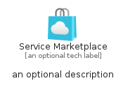
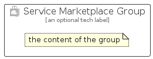

# ServiceMarketplace


```text
azure-20/Item/General/ServiceMarketplace
```

```text
include('azure-20/Item/General/ServiceMarketplace')
```


| Illustration | ServiceMarketplace | ServiceMarketplaceCard | ServiceMarketplaceGroup |
| :---: | :---: | :---: | :---: |
|  |  |  |  |


## Sprites
The item provides the following sriptes:

- `<$ServiceMarketplaceXs>`
- `<$ServiceMarketplaceSm>`
- `<$ServiceMarketplaceMd>`
- `<$ServiceMarketplaceLg>`


## ServiceMarketplace

### Load remotely
```plantuml
@startuml
' configures the library
!global $LIB_BASE_LOCATION="https://raw.githubusercontent.com/tmorin/plantuml-libs/master/distribution"

' loads the library's bootstrap
!include $LIB_BASE_LOCATION/bootstrap.puml

' loads the package bootstrap
include('azure-20/bootstrap')

' loads the Item which embeds the element ServiceMarketplace
include('azure-20/Item/General/ServiceMarketplace')

' renders the element
ServiceMarketplace('ServiceMarketplace', 'Service Marketplace', 'an optional tech label', 'an optional description')
@enduml
```

### Load locally
```plantuml
@startuml
' configures the library
!global $INCLUSION_MODE="local"
!global $LIB_BASE_LOCATION="../../.."

' loads the library's bootstrap
!include $LIB_BASE_LOCATION/bootstrap.puml

' loads the package bootstrap
include('azure-20/bootstrap')

' loads the Item which embeds the element ServiceMarketplace
include('azure-20/Item/General/ServiceMarketplace')

' renders the element
ServiceMarketplace('ServiceMarketplace', 'Service Marketplace', 'an optional tech label', 'an optional description')
@enduml
```

## ServiceMarketplaceCard

### Load remotely
```plantuml
@startuml
' configures the library
!global $LIB_BASE_LOCATION="https://raw.githubusercontent.com/tmorin/plantuml-libs/master/distribution"

' loads the library's bootstrap
!include $LIB_BASE_LOCATION/bootstrap.puml

' loads the package bootstrap
include('azure-20/bootstrap')

' loads the Item which embeds the element ServiceMarketplaceCard
include('azure-20/Item/General/ServiceMarketplace')

' renders the element
ServiceMarketplaceCard('ServiceMarketplaceCard', 'Service Marketplace Card', 'an optional description')
@enduml
```

### Load locally
```plantuml
@startuml
' configures the library
!global $INCLUSION_MODE="local"
!global $LIB_BASE_LOCATION="../../.."

' loads the library's bootstrap
!include $LIB_BASE_LOCATION/bootstrap.puml

' loads the package bootstrap
include('azure-20/bootstrap')

' loads the Item which embeds the element ServiceMarketplaceCard
include('azure-20/Item/General/ServiceMarketplace')

' renders the element
ServiceMarketplaceCard('ServiceMarketplaceCard', 'Service Marketplace Card', 'an optional description')
@enduml
```

## ServiceMarketplaceGroup

### Load remotely
```plantuml
@startuml
' configures the library
!global $LIB_BASE_LOCATION="https://raw.githubusercontent.com/tmorin/plantuml-libs/master/distribution"

' loads the library's bootstrap
!include $LIB_BASE_LOCATION/bootstrap.puml

' loads the package bootstrap
include('azure-20/bootstrap')

' loads the Item which embeds the element ServiceMarketplaceGroup
include('azure-20/Item/General/ServiceMarketplace')

' renders the element
ServiceMarketplaceGroup('ServiceMarketplaceGroup', 'Service Marketplace Group', 'an optional tech label') {
    note as note
        the content of the group
    end note
}
@enduml
```

### Load locally
```plantuml
@startuml
' configures the library
!global $INCLUSION_MODE="local"
!global $LIB_BASE_LOCATION="../../.."

' loads the library's bootstrap
!include $LIB_BASE_LOCATION/bootstrap.puml

' loads the package bootstrap
include('azure-20/bootstrap')

' loads the Item which embeds the element ServiceMarketplaceGroup
include('azure-20/Item/General/ServiceMarketplace')

' renders the element
ServiceMarketplaceGroup('ServiceMarketplaceGroup', 'Service Marketplace Group', 'an optional tech label') {
    note as note
        the content of the group
    end note
}
@enduml
```

