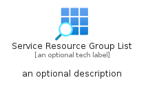
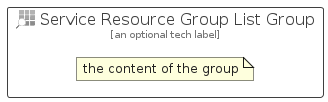

# ServiceResourceGroupList


```text
azure-20/Item/General/ServiceResourceGroupList
```

```text
include('azure-20/Item/General/ServiceResourceGroupList')
```


| Illustration | ServiceResourceGroupList | ServiceResourceGroupListCard | ServiceResourceGroupListGroup |
| :---: | :---: | :---: | :---: |
|  |  |  |  |


## Sprites
The item provides the following sriptes:

- `<$ServiceResourceGroupListXs>`
- `<$ServiceResourceGroupListSm>`
- `<$ServiceResourceGroupListMd>`
- `<$ServiceResourceGroupListLg>`


## ServiceResourceGroupList

### Load remotely
```plantuml
@startuml
' configures the library
!global $LIB_BASE_LOCATION="https://raw.githubusercontent.com/tmorin/plantuml-libs/master/distribution"

' loads the library's bootstrap
!include $LIB_BASE_LOCATION/bootstrap.puml

' loads the package bootstrap
include('azure-20/bootstrap')

' loads the Item which embeds the element ServiceResourceGroupList
include('azure-20/Item/General/ServiceResourceGroupList')

' renders the element
ServiceResourceGroupList('ServiceResourceGroupList', 'Service Resource Group List', 'an optional tech label', 'an optional description')
@enduml
```

### Load locally
```plantuml
@startuml
' configures the library
!global $INCLUSION_MODE="local"
!global $LIB_BASE_LOCATION="../../.."

' loads the library's bootstrap
!include $LIB_BASE_LOCATION/bootstrap.puml

' loads the package bootstrap
include('azure-20/bootstrap')

' loads the Item which embeds the element ServiceResourceGroupList
include('azure-20/Item/General/ServiceResourceGroupList')

' renders the element
ServiceResourceGroupList('ServiceResourceGroupList', 'Service Resource Group List', 'an optional tech label', 'an optional description')
@enduml
```

## ServiceResourceGroupListCard

### Load remotely
```plantuml
@startuml
' configures the library
!global $LIB_BASE_LOCATION="https://raw.githubusercontent.com/tmorin/plantuml-libs/master/distribution"

' loads the library's bootstrap
!include $LIB_BASE_LOCATION/bootstrap.puml

' loads the package bootstrap
include('azure-20/bootstrap')

' loads the Item which embeds the element ServiceResourceGroupListCard
include('azure-20/Item/General/ServiceResourceGroupList')

' renders the element
ServiceResourceGroupListCard('ServiceResourceGroupListCard', 'Service Resource Group List Card', 'an optional description')
@enduml
```

### Load locally
```plantuml
@startuml
' configures the library
!global $INCLUSION_MODE="local"
!global $LIB_BASE_LOCATION="../../.."

' loads the library's bootstrap
!include $LIB_BASE_LOCATION/bootstrap.puml

' loads the package bootstrap
include('azure-20/bootstrap')

' loads the Item which embeds the element ServiceResourceGroupListCard
include('azure-20/Item/General/ServiceResourceGroupList')

' renders the element
ServiceResourceGroupListCard('ServiceResourceGroupListCard', 'Service Resource Group List Card', 'an optional description')
@enduml
```

## ServiceResourceGroupListGroup

### Load remotely
```plantuml
@startuml
' configures the library
!global $LIB_BASE_LOCATION="https://raw.githubusercontent.com/tmorin/plantuml-libs/master/distribution"

' loads the library's bootstrap
!include $LIB_BASE_LOCATION/bootstrap.puml

' loads the package bootstrap
include('azure-20/bootstrap')

' loads the Item which embeds the element ServiceResourceGroupListGroup
include('azure-20/Item/General/ServiceResourceGroupList')

' renders the element
ServiceResourceGroupListGroup('ServiceResourceGroupListGroup', 'Service Resource Group List Group', 'an optional tech label') {
    note as note
        the content of the group
    end note
}
@enduml
```

### Load locally
```plantuml
@startuml
' configures the library
!global $INCLUSION_MODE="local"
!global $LIB_BASE_LOCATION="../../.."

' loads the library's bootstrap
!include $LIB_BASE_LOCATION/bootstrap.puml

' loads the package bootstrap
include('azure-20/bootstrap')

' loads the Item which embeds the element ServiceResourceGroupListGroup
include('azure-20/Item/General/ServiceResourceGroupList')

' renders the element
ServiceResourceGroupListGroup('ServiceResourceGroupListGroup', 'Service Resource Group List Group', 'an optional tech label') {
    note as note
        the content of the group
    end note
}
@enduml
```

