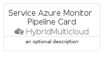

# ServiceAzureMonitorPipeline


```text
azure-20/Item/HybridMulticloud/ServiceAzureMonitorPipeline
```

```text
include('azure-20/Item/HybridMulticloud/ServiceAzureMonitorPipeline')
```


| Illustration | ServiceAzureMonitorPipeline | ServiceAzureMonitorPipelineCard | ServiceAzureMonitorPipelineGroup |
| :---: | :---: | :---: | :---: |
|  |  |  |  |


## Sprites
The item provides the following sriptes:

- `<$ServiceAzureMonitorPipelineXs>`
- `<$ServiceAzureMonitorPipelineSm>`
- `<$ServiceAzureMonitorPipelineMd>`
- `<$ServiceAzureMonitorPipelineLg>`


## ServiceAzureMonitorPipeline

### Load remotely
```plantuml
@startuml
' configures the library
!global $LIB_BASE_LOCATION="https://raw.githubusercontent.com/tmorin/plantuml-libs/master/distribution"

' loads the library's bootstrap
!include $LIB_BASE_LOCATION/bootstrap.puml

' loads the package bootstrap
include('azure-20/bootstrap')

' loads the Item which embeds the element ServiceAzureMonitorPipeline
include('azure-20/Item/HybridMulticloud/ServiceAzureMonitorPipeline')

' renders the element
ServiceAzureMonitorPipeline('ServiceAzureMonitorPipeline', 'Service Azure Monitor Pipeline', 'an optional tech label', 'an optional description')
@enduml
```

### Load locally
```plantuml
@startuml
' configures the library
!global $INCLUSION_MODE="local"
!global $LIB_BASE_LOCATION="../../.."

' loads the library's bootstrap
!include $LIB_BASE_LOCATION/bootstrap.puml

' loads the package bootstrap
include('azure-20/bootstrap')

' loads the Item which embeds the element ServiceAzureMonitorPipeline
include('azure-20/Item/HybridMulticloud/ServiceAzureMonitorPipeline')

' renders the element
ServiceAzureMonitorPipeline('ServiceAzureMonitorPipeline', 'Service Azure Monitor Pipeline', 'an optional tech label', 'an optional description')
@enduml
```

## ServiceAzureMonitorPipelineCard

### Load remotely
```plantuml
@startuml
' configures the library
!global $LIB_BASE_LOCATION="https://raw.githubusercontent.com/tmorin/plantuml-libs/master/distribution"

' loads the library's bootstrap
!include $LIB_BASE_LOCATION/bootstrap.puml

' loads the package bootstrap
include('azure-20/bootstrap')

' loads the Item which embeds the element ServiceAzureMonitorPipelineCard
include('azure-20/Item/HybridMulticloud/ServiceAzureMonitorPipeline')

' renders the element
ServiceAzureMonitorPipelineCard('ServiceAzureMonitorPipelineCard', 'Service Azure Monitor Pipeline Card', 'an optional description')
@enduml
```

### Load locally
```plantuml
@startuml
' configures the library
!global $INCLUSION_MODE="local"
!global $LIB_BASE_LOCATION="../../.."

' loads the library's bootstrap
!include $LIB_BASE_LOCATION/bootstrap.puml

' loads the package bootstrap
include('azure-20/bootstrap')

' loads the Item which embeds the element ServiceAzureMonitorPipelineCard
include('azure-20/Item/HybridMulticloud/ServiceAzureMonitorPipeline')

' renders the element
ServiceAzureMonitorPipelineCard('ServiceAzureMonitorPipelineCard', 'Service Azure Monitor Pipeline Card', 'an optional description')
@enduml
```

## ServiceAzureMonitorPipelineGroup

### Load remotely
```plantuml
@startuml
' configures the library
!global $LIB_BASE_LOCATION="https://raw.githubusercontent.com/tmorin/plantuml-libs/master/distribution"

' loads the library's bootstrap
!include $LIB_BASE_LOCATION/bootstrap.puml

' loads the package bootstrap
include('azure-20/bootstrap')

' loads the Item which embeds the element ServiceAzureMonitorPipelineGroup
include('azure-20/Item/HybridMulticloud/ServiceAzureMonitorPipeline')

' renders the element
ServiceAzureMonitorPipelineGroup('ServiceAzureMonitorPipelineGroup', 'Service Azure Monitor Pipeline Group', 'an optional tech label') {
    note as note
        the content of the group
    end note
}
@enduml
```

### Load locally
```plantuml
@startuml
' configures the library
!global $INCLUSION_MODE="local"
!global $LIB_BASE_LOCATION="../../.."

' loads the library's bootstrap
!include $LIB_BASE_LOCATION/bootstrap.puml

' loads the package bootstrap
include('azure-20/bootstrap')

' loads the Item which embeds the element ServiceAzureMonitorPipelineGroup
include('azure-20/Item/HybridMulticloud/ServiceAzureMonitorPipeline')

' renders the element
ServiceAzureMonitorPipelineGroup('ServiceAzureMonitorPipelineGroup', 'Service Azure Monitor Pipeline Group', 'an optional tech label') {
    note as note
        the content of the group
    end note
}
@enduml
```

