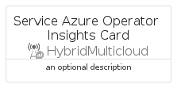
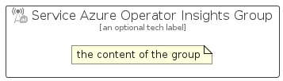

# ServiceAzureOperatorInsights


```text
azure-20/Item/HybridMulticloud/ServiceAzureOperatorInsights
```

```text
include('azure-20/Item/HybridMulticloud/ServiceAzureOperatorInsights')
```


| Illustration | ServiceAzureOperatorInsights | ServiceAzureOperatorInsightsCard | ServiceAzureOperatorInsightsGroup |
| :---: | :---: | :---: | :---: |
|  |  |  |  |


## Sprites
The item provides the following sriptes:

- `<$ServiceAzureOperatorInsightsXs>`
- `<$ServiceAzureOperatorInsightsSm>`
- `<$ServiceAzureOperatorInsightsMd>`
- `<$ServiceAzureOperatorInsightsLg>`


## ServiceAzureOperatorInsights

### Load remotely
```plantuml
@startuml
' configures the library
!global $LIB_BASE_LOCATION="https://raw.githubusercontent.com/tmorin/plantuml-libs/master/distribution"

' loads the library's bootstrap
!include $LIB_BASE_LOCATION/bootstrap.puml

' loads the package bootstrap
include('azure-20/bootstrap')

' loads the Item which embeds the element ServiceAzureOperatorInsights
include('azure-20/Item/HybridMulticloud/ServiceAzureOperatorInsights')

' renders the element
ServiceAzureOperatorInsights('ServiceAzureOperatorInsights', 'Service Azure Operator Insights', 'an optional tech label', 'an optional description')
@enduml
```

### Load locally
```plantuml
@startuml
' configures the library
!global $INCLUSION_MODE="local"
!global $LIB_BASE_LOCATION="../../.."

' loads the library's bootstrap
!include $LIB_BASE_LOCATION/bootstrap.puml

' loads the package bootstrap
include('azure-20/bootstrap')

' loads the Item which embeds the element ServiceAzureOperatorInsights
include('azure-20/Item/HybridMulticloud/ServiceAzureOperatorInsights')

' renders the element
ServiceAzureOperatorInsights('ServiceAzureOperatorInsights', 'Service Azure Operator Insights', 'an optional tech label', 'an optional description')
@enduml
```

## ServiceAzureOperatorInsightsCard

### Load remotely
```plantuml
@startuml
' configures the library
!global $LIB_BASE_LOCATION="https://raw.githubusercontent.com/tmorin/plantuml-libs/master/distribution"

' loads the library's bootstrap
!include $LIB_BASE_LOCATION/bootstrap.puml

' loads the package bootstrap
include('azure-20/bootstrap')

' loads the Item which embeds the element ServiceAzureOperatorInsightsCard
include('azure-20/Item/HybridMulticloud/ServiceAzureOperatorInsights')

' renders the element
ServiceAzureOperatorInsightsCard('ServiceAzureOperatorInsightsCard', 'Service Azure Operator Insights Card', 'an optional description')
@enduml
```

### Load locally
```plantuml
@startuml
' configures the library
!global $INCLUSION_MODE="local"
!global $LIB_BASE_LOCATION="../../.."

' loads the library's bootstrap
!include $LIB_BASE_LOCATION/bootstrap.puml

' loads the package bootstrap
include('azure-20/bootstrap')

' loads the Item which embeds the element ServiceAzureOperatorInsightsCard
include('azure-20/Item/HybridMulticloud/ServiceAzureOperatorInsights')

' renders the element
ServiceAzureOperatorInsightsCard('ServiceAzureOperatorInsightsCard', 'Service Azure Operator Insights Card', 'an optional description')
@enduml
```

## ServiceAzureOperatorInsightsGroup

### Load remotely
```plantuml
@startuml
' configures the library
!global $LIB_BASE_LOCATION="https://raw.githubusercontent.com/tmorin/plantuml-libs/master/distribution"

' loads the library's bootstrap
!include $LIB_BASE_LOCATION/bootstrap.puml

' loads the package bootstrap
include('azure-20/bootstrap')

' loads the Item which embeds the element ServiceAzureOperatorInsightsGroup
include('azure-20/Item/HybridMulticloud/ServiceAzureOperatorInsights')

' renders the element
ServiceAzureOperatorInsightsGroup('ServiceAzureOperatorInsightsGroup', 'Service Azure Operator Insights Group', 'an optional tech label') {
    note as note
        the content of the group
    end note
}
@enduml
```

### Load locally
```plantuml
@startuml
' configures the library
!global $INCLUSION_MODE="local"
!global $LIB_BASE_LOCATION="../../.."

' loads the library's bootstrap
!include $LIB_BASE_LOCATION/bootstrap.puml

' loads the package bootstrap
include('azure-20/bootstrap')

' loads the Item which embeds the element ServiceAzureOperatorInsightsGroup
include('azure-20/Item/HybridMulticloud/ServiceAzureOperatorInsights')

' renders the element
ServiceAzureOperatorInsightsGroup('ServiceAzureOperatorInsightsGroup', 'Service Azure Operator Insights Group', 'an optional tech label') {
    note as note
        the content of the group
    end note
}
@enduml
```

