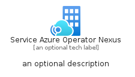

# ServiceAzureOperatorNexus


```text
azure-20/Item/HybridMulticloud/ServiceAzureOperatorNexus
```

```text
include('azure-20/Item/HybridMulticloud/ServiceAzureOperatorNexus')
```


| Illustration | ServiceAzureOperatorNexus | ServiceAzureOperatorNexusCard | ServiceAzureOperatorNexusGroup |
| :---: | :---: | :---: | :---: |
|  |  |  |  |


## Sprites
The item provides the following sriptes:

- `<$ServiceAzureOperatorNexusXs>`
- `<$ServiceAzureOperatorNexusSm>`
- `<$ServiceAzureOperatorNexusMd>`
- `<$ServiceAzureOperatorNexusLg>`


## ServiceAzureOperatorNexus

### Load remotely
```plantuml
@startuml
' configures the library
!global $LIB_BASE_LOCATION="https://raw.githubusercontent.com/tmorin/plantuml-libs/master/distribution"

' loads the library's bootstrap
!include $LIB_BASE_LOCATION/bootstrap.puml

' loads the package bootstrap
include('azure-20/bootstrap')

' loads the Item which embeds the element ServiceAzureOperatorNexus
include('azure-20/Item/HybridMulticloud/ServiceAzureOperatorNexus')

' renders the element
ServiceAzureOperatorNexus('ServiceAzureOperatorNexus', 'Service Azure Operator Nexus', 'an optional tech label', 'an optional description')
@enduml
```

### Load locally
```plantuml
@startuml
' configures the library
!global $INCLUSION_MODE="local"
!global $LIB_BASE_LOCATION="../../.."

' loads the library's bootstrap
!include $LIB_BASE_LOCATION/bootstrap.puml

' loads the package bootstrap
include('azure-20/bootstrap')

' loads the Item which embeds the element ServiceAzureOperatorNexus
include('azure-20/Item/HybridMulticloud/ServiceAzureOperatorNexus')

' renders the element
ServiceAzureOperatorNexus('ServiceAzureOperatorNexus', 'Service Azure Operator Nexus', 'an optional tech label', 'an optional description')
@enduml
```

## ServiceAzureOperatorNexusCard

### Load remotely
```plantuml
@startuml
' configures the library
!global $LIB_BASE_LOCATION="https://raw.githubusercontent.com/tmorin/plantuml-libs/master/distribution"

' loads the library's bootstrap
!include $LIB_BASE_LOCATION/bootstrap.puml

' loads the package bootstrap
include('azure-20/bootstrap')

' loads the Item which embeds the element ServiceAzureOperatorNexusCard
include('azure-20/Item/HybridMulticloud/ServiceAzureOperatorNexus')

' renders the element
ServiceAzureOperatorNexusCard('ServiceAzureOperatorNexusCard', 'Service Azure Operator Nexus Card', 'an optional description')
@enduml
```

### Load locally
```plantuml
@startuml
' configures the library
!global $INCLUSION_MODE="local"
!global $LIB_BASE_LOCATION="../../.."

' loads the library's bootstrap
!include $LIB_BASE_LOCATION/bootstrap.puml

' loads the package bootstrap
include('azure-20/bootstrap')

' loads the Item which embeds the element ServiceAzureOperatorNexusCard
include('azure-20/Item/HybridMulticloud/ServiceAzureOperatorNexus')

' renders the element
ServiceAzureOperatorNexusCard('ServiceAzureOperatorNexusCard', 'Service Azure Operator Nexus Card', 'an optional description')
@enduml
```

## ServiceAzureOperatorNexusGroup

### Load remotely
```plantuml
@startuml
' configures the library
!global $LIB_BASE_LOCATION="https://raw.githubusercontent.com/tmorin/plantuml-libs/master/distribution"

' loads the library's bootstrap
!include $LIB_BASE_LOCATION/bootstrap.puml

' loads the package bootstrap
include('azure-20/bootstrap')

' loads the Item which embeds the element ServiceAzureOperatorNexusGroup
include('azure-20/Item/HybridMulticloud/ServiceAzureOperatorNexus')

' renders the element
ServiceAzureOperatorNexusGroup('ServiceAzureOperatorNexusGroup', 'Service Azure Operator Nexus Group', 'an optional tech label') {
    note as note
        the content of the group
    end note
}
@enduml
```

### Load locally
```plantuml
@startuml
' configures the library
!global $INCLUSION_MODE="local"
!global $LIB_BASE_LOCATION="../../.."

' loads the library's bootstrap
!include $LIB_BASE_LOCATION/bootstrap.puml

' loads the package bootstrap
include('azure-20/bootstrap')

' loads the Item which embeds the element ServiceAzureOperatorNexusGroup
include('azure-20/Item/HybridMulticloud/ServiceAzureOperatorNexus')

' renders the element
ServiceAzureOperatorNexusGroup('ServiceAzureOperatorNexusGroup', 'Service Azure Operator Nexus Group', 'an optional tech label') {
    note as note
        the content of the group
    end note
}
@enduml
```

