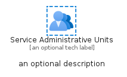
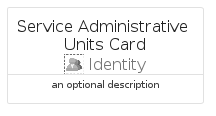
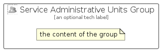

# ServiceAdministrativeUnits


```text
azure-20/Item/Identity/ServiceAdministrativeUnits
```

```text
include('azure-20/Item/Identity/ServiceAdministrativeUnits')
```


| Illustration | ServiceAdministrativeUnits | ServiceAdministrativeUnitsCard | ServiceAdministrativeUnitsGroup |
| :---: | :---: | :---: | :---: |
|  |  |  |  |


## Sprites
The item provides the following sriptes:

- `<$ServiceAdministrativeUnitsXs>`
- `<$ServiceAdministrativeUnitsSm>`
- `<$ServiceAdministrativeUnitsMd>`
- `<$ServiceAdministrativeUnitsLg>`


## ServiceAdministrativeUnits

### Load remotely
```plantuml
@startuml
' configures the library
!global $LIB_BASE_LOCATION="https://raw.githubusercontent.com/tmorin/plantuml-libs/master/distribution"

' loads the library's bootstrap
!include $LIB_BASE_LOCATION/bootstrap.puml

' loads the package bootstrap
include('azure-20/bootstrap')

' loads the Item which embeds the element ServiceAdministrativeUnits
include('azure-20/Item/Identity/ServiceAdministrativeUnits')

' renders the element
ServiceAdministrativeUnits('ServiceAdministrativeUnits', 'Service Administrative Units', 'an optional tech label', 'an optional description')
@enduml
```

### Load locally
```plantuml
@startuml
' configures the library
!global $INCLUSION_MODE="local"
!global $LIB_BASE_LOCATION="../../.."

' loads the library's bootstrap
!include $LIB_BASE_LOCATION/bootstrap.puml

' loads the package bootstrap
include('azure-20/bootstrap')

' loads the Item which embeds the element ServiceAdministrativeUnits
include('azure-20/Item/Identity/ServiceAdministrativeUnits')

' renders the element
ServiceAdministrativeUnits('ServiceAdministrativeUnits', 'Service Administrative Units', 'an optional tech label', 'an optional description')
@enduml
```

## ServiceAdministrativeUnitsCard

### Load remotely
```plantuml
@startuml
' configures the library
!global $LIB_BASE_LOCATION="https://raw.githubusercontent.com/tmorin/plantuml-libs/master/distribution"

' loads the library's bootstrap
!include $LIB_BASE_LOCATION/bootstrap.puml

' loads the package bootstrap
include('azure-20/bootstrap')

' loads the Item which embeds the element ServiceAdministrativeUnitsCard
include('azure-20/Item/Identity/ServiceAdministrativeUnits')

' renders the element
ServiceAdministrativeUnitsCard('ServiceAdministrativeUnitsCard', 'Service Administrative Units Card', 'an optional description')
@enduml
```

### Load locally
```plantuml
@startuml
' configures the library
!global $INCLUSION_MODE="local"
!global $LIB_BASE_LOCATION="../../.."

' loads the library's bootstrap
!include $LIB_BASE_LOCATION/bootstrap.puml

' loads the package bootstrap
include('azure-20/bootstrap')

' loads the Item which embeds the element ServiceAdministrativeUnitsCard
include('azure-20/Item/Identity/ServiceAdministrativeUnits')

' renders the element
ServiceAdministrativeUnitsCard('ServiceAdministrativeUnitsCard', 'Service Administrative Units Card', 'an optional description')
@enduml
```

## ServiceAdministrativeUnitsGroup

### Load remotely
```plantuml
@startuml
' configures the library
!global $LIB_BASE_LOCATION="https://raw.githubusercontent.com/tmorin/plantuml-libs/master/distribution"

' loads the library's bootstrap
!include $LIB_BASE_LOCATION/bootstrap.puml

' loads the package bootstrap
include('azure-20/bootstrap')

' loads the Item which embeds the element ServiceAdministrativeUnitsGroup
include('azure-20/Item/Identity/ServiceAdministrativeUnits')

' renders the element
ServiceAdministrativeUnitsGroup('ServiceAdministrativeUnitsGroup', 'Service Administrative Units Group', 'an optional tech label') {
    note as note
        the content of the group
    end note
}
@enduml
```

### Load locally
```plantuml
@startuml
' configures the library
!global $INCLUSION_MODE="local"
!global $LIB_BASE_LOCATION="../../.."

' loads the library's bootstrap
!include $LIB_BASE_LOCATION/bootstrap.puml

' loads the package bootstrap
include('azure-20/bootstrap')

' loads the Item which embeds the element ServiceAdministrativeUnitsGroup
include('azure-20/Item/Identity/ServiceAdministrativeUnits')

' renders the element
ServiceAdministrativeUnitsGroup('ServiceAdministrativeUnitsGroup', 'Service Administrative Units Group', 'an optional tech label') {
    note as note
        the content of the group
    end note
}
@enduml
```

