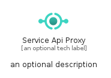
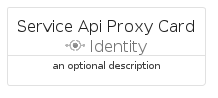

# ServiceApiProxy


```text
azure-20/Item/Identity/ServiceApiProxy
```

```text
include('azure-20/Item/Identity/ServiceApiProxy')
```


| Illustration | ServiceApiProxy | ServiceApiProxyCard | ServiceApiProxyGroup |
| :---: | :---: | :---: | :---: |
|  |  |  |  |


## Sprites
The item provides the following sriptes:

- `<$ServiceApiProxyXs>`
- `<$ServiceApiProxySm>`
- `<$ServiceApiProxyMd>`
- `<$ServiceApiProxyLg>`


## ServiceApiProxy

### Load remotely
```plantuml
@startuml
' configures the library
!global $LIB_BASE_LOCATION="https://raw.githubusercontent.com/tmorin/plantuml-libs/master/distribution"

' loads the library's bootstrap
!include $LIB_BASE_LOCATION/bootstrap.puml

' loads the package bootstrap
include('azure-20/bootstrap')

' loads the Item which embeds the element ServiceApiProxy
include('azure-20/Item/Identity/ServiceApiProxy')

' renders the element
ServiceApiProxy('ServiceApiProxy', 'Service Api Proxy', 'an optional tech label', 'an optional description')
@enduml
```

### Load locally
```plantuml
@startuml
' configures the library
!global $INCLUSION_MODE="local"
!global $LIB_BASE_LOCATION="../../.."

' loads the library's bootstrap
!include $LIB_BASE_LOCATION/bootstrap.puml

' loads the package bootstrap
include('azure-20/bootstrap')

' loads the Item which embeds the element ServiceApiProxy
include('azure-20/Item/Identity/ServiceApiProxy')

' renders the element
ServiceApiProxy('ServiceApiProxy', 'Service Api Proxy', 'an optional tech label', 'an optional description')
@enduml
```

## ServiceApiProxyCard

### Load remotely
```plantuml
@startuml
' configures the library
!global $LIB_BASE_LOCATION="https://raw.githubusercontent.com/tmorin/plantuml-libs/master/distribution"

' loads the library's bootstrap
!include $LIB_BASE_LOCATION/bootstrap.puml

' loads the package bootstrap
include('azure-20/bootstrap')

' loads the Item which embeds the element ServiceApiProxyCard
include('azure-20/Item/Identity/ServiceApiProxy')

' renders the element
ServiceApiProxyCard('ServiceApiProxyCard', 'Service Api Proxy Card', 'an optional description')
@enduml
```

### Load locally
```plantuml
@startuml
' configures the library
!global $INCLUSION_MODE="local"
!global $LIB_BASE_LOCATION="../../.."

' loads the library's bootstrap
!include $LIB_BASE_LOCATION/bootstrap.puml

' loads the package bootstrap
include('azure-20/bootstrap')

' loads the Item which embeds the element ServiceApiProxyCard
include('azure-20/Item/Identity/ServiceApiProxy')

' renders the element
ServiceApiProxyCard('ServiceApiProxyCard', 'Service Api Proxy Card', 'an optional description')
@enduml
```

## ServiceApiProxyGroup

### Load remotely
```plantuml
@startuml
' configures the library
!global $LIB_BASE_LOCATION="https://raw.githubusercontent.com/tmorin/plantuml-libs/master/distribution"

' loads the library's bootstrap
!include $LIB_BASE_LOCATION/bootstrap.puml

' loads the package bootstrap
include('azure-20/bootstrap')

' loads the Item which embeds the element ServiceApiProxyGroup
include('azure-20/Item/Identity/ServiceApiProxy')

' renders the element
ServiceApiProxyGroup('ServiceApiProxyGroup', 'Service Api Proxy Group', 'an optional tech label') {
    note as note
        the content of the group
    end note
}
@enduml
```

### Load locally
```plantuml
@startuml
' configures the library
!global $INCLUSION_MODE="local"
!global $LIB_BASE_LOCATION="../../.."

' loads the library's bootstrap
!include $LIB_BASE_LOCATION/bootstrap.puml

' loads the package bootstrap
include('azure-20/bootstrap')

' loads the Item which embeds the element ServiceApiProxyGroup
include('azure-20/Item/Identity/ServiceApiProxy')

' renders the element
ServiceApiProxyGroup('ServiceApiProxyGroup', 'Service Api Proxy Group', 'an optional tech label') {
    note as note
        the content of the group
    end note
}
@enduml
```

