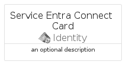

# ServiceEntraConnect


```text
azure-20/Item/Identity/ServiceEntraConnect
```

```text
include('azure-20/Item/Identity/ServiceEntraConnect')
```


| Illustration | ServiceEntraConnect | ServiceEntraConnectCard | ServiceEntraConnectGroup |
| :---: | :---: | :---: | :---: |
|  |  |  |  |


## Sprites
The item provides the following sriptes:

- `<$ServiceEntraConnectXs>`
- `<$ServiceEntraConnectSm>`
- `<$ServiceEntraConnectMd>`
- `<$ServiceEntraConnectLg>`


## ServiceEntraConnect

### Load remotely
```plantuml
@startuml
' configures the library
!global $LIB_BASE_LOCATION="https://raw.githubusercontent.com/tmorin/plantuml-libs/master/distribution"

' loads the library's bootstrap
!include $LIB_BASE_LOCATION/bootstrap.puml

' loads the package bootstrap
include('azure-20/bootstrap')

' loads the Item which embeds the element ServiceEntraConnect
include('azure-20/Item/Identity/ServiceEntraConnect')

' renders the element
ServiceEntraConnect('ServiceEntraConnect', 'Service Entra Connect', 'an optional tech label', 'an optional description')
@enduml
```

### Load locally
```plantuml
@startuml
' configures the library
!global $INCLUSION_MODE="local"
!global $LIB_BASE_LOCATION="../../.."

' loads the library's bootstrap
!include $LIB_BASE_LOCATION/bootstrap.puml

' loads the package bootstrap
include('azure-20/bootstrap')

' loads the Item which embeds the element ServiceEntraConnect
include('azure-20/Item/Identity/ServiceEntraConnect')

' renders the element
ServiceEntraConnect('ServiceEntraConnect', 'Service Entra Connect', 'an optional tech label', 'an optional description')
@enduml
```

## ServiceEntraConnectCard

### Load remotely
```plantuml
@startuml
' configures the library
!global $LIB_BASE_LOCATION="https://raw.githubusercontent.com/tmorin/plantuml-libs/master/distribution"

' loads the library's bootstrap
!include $LIB_BASE_LOCATION/bootstrap.puml

' loads the package bootstrap
include('azure-20/bootstrap')

' loads the Item which embeds the element ServiceEntraConnectCard
include('azure-20/Item/Identity/ServiceEntraConnect')

' renders the element
ServiceEntraConnectCard('ServiceEntraConnectCard', 'Service Entra Connect Card', 'an optional description')
@enduml
```

### Load locally
```plantuml
@startuml
' configures the library
!global $INCLUSION_MODE="local"
!global $LIB_BASE_LOCATION="../../.."

' loads the library's bootstrap
!include $LIB_BASE_LOCATION/bootstrap.puml

' loads the package bootstrap
include('azure-20/bootstrap')

' loads the Item which embeds the element ServiceEntraConnectCard
include('azure-20/Item/Identity/ServiceEntraConnect')

' renders the element
ServiceEntraConnectCard('ServiceEntraConnectCard', 'Service Entra Connect Card', 'an optional description')
@enduml
```

## ServiceEntraConnectGroup

### Load remotely
```plantuml
@startuml
' configures the library
!global $LIB_BASE_LOCATION="https://raw.githubusercontent.com/tmorin/plantuml-libs/master/distribution"

' loads the library's bootstrap
!include $LIB_BASE_LOCATION/bootstrap.puml

' loads the package bootstrap
include('azure-20/bootstrap')

' loads the Item which embeds the element ServiceEntraConnectGroup
include('azure-20/Item/Identity/ServiceEntraConnect')

' renders the element
ServiceEntraConnectGroup('ServiceEntraConnectGroup', 'Service Entra Connect Group', 'an optional tech label') {
    note as note
        the content of the group
    end note
}
@enduml
```

### Load locally
```plantuml
@startuml
' configures the library
!global $INCLUSION_MODE="local"
!global $LIB_BASE_LOCATION="../../.."

' loads the library's bootstrap
!include $LIB_BASE_LOCATION/bootstrap.puml

' loads the package bootstrap
include('azure-20/bootstrap')

' loads the Item which embeds the element ServiceEntraConnectGroup
include('azure-20/Item/Identity/ServiceEntraConnect')

' renders the element
ServiceEntraConnectGroup('ServiceEntraConnectGroup', 'Service Entra Connect Group', 'an optional tech label') {
    note as note
        the content of the group
    end note
}
@enduml
```

