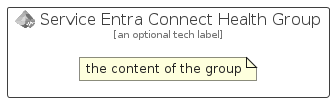

# ServiceEntraConnectHealth


```text
azure-20/Item/Identity/ServiceEntraConnectHealth
```

```text
include('azure-20/Item/Identity/ServiceEntraConnectHealth')
```


| Illustration | ServiceEntraConnectHealth | ServiceEntraConnectHealthCard | ServiceEntraConnectHealthGroup |
| :---: | :---: | :---: | :---: |
|  |  |  |  |


## Sprites
The item provides the following sriptes:

- `<$ServiceEntraConnectHealthXs>`
- `<$ServiceEntraConnectHealthSm>`
- `<$ServiceEntraConnectHealthMd>`
- `<$ServiceEntraConnectHealthLg>`


## ServiceEntraConnectHealth

### Load remotely
```plantuml
@startuml
' configures the library
!global $LIB_BASE_LOCATION="https://raw.githubusercontent.com/tmorin/plantuml-libs/master/distribution"

' loads the library's bootstrap
!include $LIB_BASE_LOCATION/bootstrap.puml

' loads the package bootstrap
include('azure-20/bootstrap')

' loads the Item which embeds the element ServiceEntraConnectHealth
include('azure-20/Item/Identity/ServiceEntraConnectHealth')

' renders the element
ServiceEntraConnectHealth('ServiceEntraConnectHealth', 'Service Entra Connect Health', 'an optional tech label', 'an optional description')
@enduml
```

### Load locally
```plantuml
@startuml
' configures the library
!global $INCLUSION_MODE="local"
!global $LIB_BASE_LOCATION="../../.."

' loads the library's bootstrap
!include $LIB_BASE_LOCATION/bootstrap.puml

' loads the package bootstrap
include('azure-20/bootstrap')

' loads the Item which embeds the element ServiceEntraConnectHealth
include('azure-20/Item/Identity/ServiceEntraConnectHealth')

' renders the element
ServiceEntraConnectHealth('ServiceEntraConnectHealth', 'Service Entra Connect Health', 'an optional tech label', 'an optional description')
@enduml
```

## ServiceEntraConnectHealthCard

### Load remotely
```plantuml
@startuml
' configures the library
!global $LIB_BASE_LOCATION="https://raw.githubusercontent.com/tmorin/plantuml-libs/master/distribution"

' loads the library's bootstrap
!include $LIB_BASE_LOCATION/bootstrap.puml

' loads the package bootstrap
include('azure-20/bootstrap')

' loads the Item which embeds the element ServiceEntraConnectHealthCard
include('azure-20/Item/Identity/ServiceEntraConnectHealth')

' renders the element
ServiceEntraConnectHealthCard('ServiceEntraConnectHealthCard', 'Service Entra Connect Health Card', 'an optional description')
@enduml
```

### Load locally
```plantuml
@startuml
' configures the library
!global $INCLUSION_MODE="local"
!global $LIB_BASE_LOCATION="../../.."

' loads the library's bootstrap
!include $LIB_BASE_LOCATION/bootstrap.puml

' loads the package bootstrap
include('azure-20/bootstrap')

' loads the Item which embeds the element ServiceEntraConnectHealthCard
include('azure-20/Item/Identity/ServiceEntraConnectHealth')

' renders the element
ServiceEntraConnectHealthCard('ServiceEntraConnectHealthCard', 'Service Entra Connect Health Card', 'an optional description')
@enduml
```

## ServiceEntraConnectHealthGroup

### Load remotely
```plantuml
@startuml
' configures the library
!global $LIB_BASE_LOCATION="https://raw.githubusercontent.com/tmorin/plantuml-libs/master/distribution"

' loads the library's bootstrap
!include $LIB_BASE_LOCATION/bootstrap.puml

' loads the package bootstrap
include('azure-20/bootstrap')

' loads the Item which embeds the element ServiceEntraConnectHealthGroup
include('azure-20/Item/Identity/ServiceEntraConnectHealth')

' renders the element
ServiceEntraConnectHealthGroup('ServiceEntraConnectHealthGroup', 'Service Entra Connect Health Group', 'an optional tech label') {
    note as note
        the content of the group
    end note
}
@enduml
```

### Load locally
```plantuml
@startuml
' configures the library
!global $INCLUSION_MODE="local"
!global $LIB_BASE_LOCATION="../../.."

' loads the library's bootstrap
!include $LIB_BASE_LOCATION/bootstrap.puml

' loads the package bootstrap
include('azure-20/bootstrap')

' loads the Item which embeds the element ServiceEntraConnectHealthGroup
include('azure-20/Item/Identity/ServiceEntraConnectHealth')

' renders the element
ServiceEntraConnectHealthGroup('ServiceEntraConnectHealthGroup', 'Service Entra Connect Health Group', 'an optional tech label') {
    note as note
        the content of the group
    end note
}
@enduml
```

