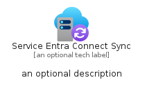

# ServiceEntraConnectSync


```text
azure-20/Item/Identity/ServiceEntraConnectSync
```

```text
include('azure-20/Item/Identity/ServiceEntraConnectSync')
```


| Illustration | ServiceEntraConnectSync | ServiceEntraConnectSyncCard | ServiceEntraConnectSyncGroup |
| :---: | :---: | :---: | :---: |
|  |  |  |  |


## Sprites
The item provides the following sriptes:

- `<$ServiceEntraConnectSyncXs>`
- `<$ServiceEntraConnectSyncSm>`
- `<$ServiceEntraConnectSyncMd>`
- `<$ServiceEntraConnectSyncLg>`


## ServiceEntraConnectSync

### Load remotely
```plantuml
@startuml
' configures the library
!global $LIB_BASE_LOCATION="https://raw.githubusercontent.com/tmorin/plantuml-libs/master/distribution"

' loads the library's bootstrap
!include $LIB_BASE_LOCATION/bootstrap.puml

' loads the package bootstrap
include('azure-20/bootstrap')

' loads the Item which embeds the element ServiceEntraConnectSync
include('azure-20/Item/Identity/ServiceEntraConnectSync')

' renders the element
ServiceEntraConnectSync('ServiceEntraConnectSync', 'Service Entra Connect Sync', 'an optional tech label', 'an optional description')
@enduml
```

### Load locally
```plantuml
@startuml
' configures the library
!global $INCLUSION_MODE="local"
!global $LIB_BASE_LOCATION="../../.."

' loads the library's bootstrap
!include $LIB_BASE_LOCATION/bootstrap.puml

' loads the package bootstrap
include('azure-20/bootstrap')

' loads the Item which embeds the element ServiceEntraConnectSync
include('azure-20/Item/Identity/ServiceEntraConnectSync')

' renders the element
ServiceEntraConnectSync('ServiceEntraConnectSync', 'Service Entra Connect Sync', 'an optional tech label', 'an optional description')
@enduml
```

## ServiceEntraConnectSyncCard

### Load remotely
```plantuml
@startuml
' configures the library
!global $LIB_BASE_LOCATION="https://raw.githubusercontent.com/tmorin/plantuml-libs/master/distribution"

' loads the library's bootstrap
!include $LIB_BASE_LOCATION/bootstrap.puml

' loads the package bootstrap
include('azure-20/bootstrap')

' loads the Item which embeds the element ServiceEntraConnectSyncCard
include('azure-20/Item/Identity/ServiceEntraConnectSync')

' renders the element
ServiceEntraConnectSyncCard('ServiceEntraConnectSyncCard', 'Service Entra Connect Sync Card', 'an optional description')
@enduml
```

### Load locally
```plantuml
@startuml
' configures the library
!global $INCLUSION_MODE="local"
!global $LIB_BASE_LOCATION="../../.."

' loads the library's bootstrap
!include $LIB_BASE_LOCATION/bootstrap.puml

' loads the package bootstrap
include('azure-20/bootstrap')

' loads the Item which embeds the element ServiceEntraConnectSyncCard
include('azure-20/Item/Identity/ServiceEntraConnectSync')

' renders the element
ServiceEntraConnectSyncCard('ServiceEntraConnectSyncCard', 'Service Entra Connect Sync Card', 'an optional description')
@enduml
```

## ServiceEntraConnectSyncGroup

### Load remotely
```plantuml
@startuml
' configures the library
!global $LIB_BASE_LOCATION="https://raw.githubusercontent.com/tmorin/plantuml-libs/master/distribution"

' loads the library's bootstrap
!include $LIB_BASE_LOCATION/bootstrap.puml

' loads the package bootstrap
include('azure-20/bootstrap')

' loads the Item which embeds the element ServiceEntraConnectSyncGroup
include('azure-20/Item/Identity/ServiceEntraConnectSync')

' renders the element
ServiceEntraConnectSyncGroup('ServiceEntraConnectSyncGroup', 'Service Entra Connect Sync Group', 'an optional tech label') {
    note as note
        the content of the group
    end note
}
@enduml
```

### Load locally
```plantuml
@startuml
' configures the library
!global $INCLUSION_MODE="local"
!global $LIB_BASE_LOCATION="../../.."

' loads the library's bootstrap
!include $LIB_BASE_LOCATION/bootstrap.puml

' loads the package bootstrap
include('azure-20/bootstrap')

' loads the Item which embeds the element ServiceEntraConnectSyncGroup
include('azure-20/Item/Identity/ServiceEntraConnectSync')

' renders the element
ServiceEntraConnectSyncGroup('ServiceEntraConnectSyncGroup', 'Service Entra Connect Sync Group', 'an optional tech label') {
    note as note
        the content of the group
    end note
}
@enduml
```

