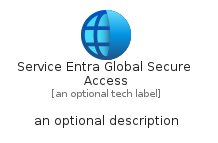
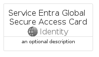
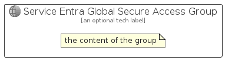

# ServiceEntraGlobalSecureAccess


```text
azure-20/Item/Identity/ServiceEntraGlobalSecureAccess
```

```text
include('azure-20/Item/Identity/ServiceEntraGlobalSecureAccess')
```


| Illustration | ServiceEntraGlobalSecureAccess | ServiceEntraGlobalSecureAccessCard | ServiceEntraGlobalSecureAccessGroup |
| :---: | :---: | :---: | :---: |
|  |  |  |  |


## Sprites
The item provides the following sriptes:

- `<$ServiceEntraGlobalSecureAccessXs>`
- `<$ServiceEntraGlobalSecureAccessSm>`
- `<$ServiceEntraGlobalSecureAccessMd>`
- `<$ServiceEntraGlobalSecureAccessLg>`


## ServiceEntraGlobalSecureAccess

### Load remotely
```plantuml
@startuml
' configures the library
!global $LIB_BASE_LOCATION="https://raw.githubusercontent.com/tmorin/plantuml-libs/master/distribution"

' loads the library's bootstrap
!include $LIB_BASE_LOCATION/bootstrap.puml

' loads the package bootstrap
include('azure-20/bootstrap')

' loads the Item which embeds the element ServiceEntraGlobalSecureAccess
include('azure-20/Item/Identity/ServiceEntraGlobalSecureAccess')

' renders the element
ServiceEntraGlobalSecureAccess('ServiceEntraGlobalSecureAccess', 'Service Entra Global Secure Access', 'an optional tech label', 'an optional description')
@enduml
```

### Load locally
```plantuml
@startuml
' configures the library
!global $INCLUSION_MODE="local"
!global $LIB_BASE_LOCATION="../../.."

' loads the library's bootstrap
!include $LIB_BASE_LOCATION/bootstrap.puml

' loads the package bootstrap
include('azure-20/bootstrap')

' loads the Item which embeds the element ServiceEntraGlobalSecureAccess
include('azure-20/Item/Identity/ServiceEntraGlobalSecureAccess')

' renders the element
ServiceEntraGlobalSecureAccess('ServiceEntraGlobalSecureAccess', 'Service Entra Global Secure Access', 'an optional tech label', 'an optional description')
@enduml
```

## ServiceEntraGlobalSecureAccessCard

### Load remotely
```plantuml
@startuml
' configures the library
!global $LIB_BASE_LOCATION="https://raw.githubusercontent.com/tmorin/plantuml-libs/master/distribution"

' loads the library's bootstrap
!include $LIB_BASE_LOCATION/bootstrap.puml

' loads the package bootstrap
include('azure-20/bootstrap')

' loads the Item which embeds the element ServiceEntraGlobalSecureAccessCard
include('azure-20/Item/Identity/ServiceEntraGlobalSecureAccess')

' renders the element
ServiceEntraGlobalSecureAccessCard('ServiceEntraGlobalSecureAccessCard', 'Service Entra Global Secure Access Card', 'an optional description')
@enduml
```

### Load locally
```plantuml
@startuml
' configures the library
!global $INCLUSION_MODE="local"
!global $LIB_BASE_LOCATION="../../.."

' loads the library's bootstrap
!include $LIB_BASE_LOCATION/bootstrap.puml

' loads the package bootstrap
include('azure-20/bootstrap')

' loads the Item which embeds the element ServiceEntraGlobalSecureAccessCard
include('azure-20/Item/Identity/ServiceEntraGlobalSecureAccess')

' renders the element
ServiceEntraGlobalSecureAccessCard('ServiceEntraGlobalSecureAccessCard', 'Service Entra Global Secure Access Card', 'an optional description')
@enduml
```

## ServiceEntraGlobalSecureAccessGroup

### Load remotely
```plantuml
@startuml
' configures the library
!global $LIB_BASE_LOCATION="https://raw.githubusercontent.com/tmorin/plantuml-libs/master/distribution"

' loads the library's bootstrap
!include $LIB_BASE_LOCATION/bootstrap.puml

' loads the package bootstrap
include('azure-20/bootstrap')

' loads the Item which embeds the element ServiceEntraGlobalSecureAccessGroup
include('azure-20/Item/Identity/ServiceEntraGlobalSecureAccess')

' renders the element
ServiceEntraGlobalSecureAccessGroup('ServiceEntraGlobalSecureAccessGroup', 'Service Entra Global Secure Access Group', 'an optional tech label') {
    note as note
        the content of the group
    end note
}
@enduml
```

### Load locally
```plantuml
@startuml
' configures the library
!global $INCLUSION_MODE="local"
!global $LIB_BASE_LOCATION="../../.."

' loads the library's bootstrap
!include $LIB_BASE_LOCATION/bootstrap.puml

' loads the package bootstrap
include('azure-20/bootstrap')

' loads the Item which embeds the element ServiceEntraGlobalSecureAccessGroup
include('azure-20/Item/Identity/ServiceEntraGlobalSecureAccess')

' renders the element
ServiceEntraGlobalSecureAccessGroup('ServiceEntraGlobalSecureAccessGroup', 'Service Entra Global Secure Access Group', 'an optional tech label') {
    note as note
        the content of the group
    end note
}
@enduml
```

