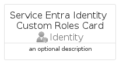

# ServiceEntraIdentityCustomRoles


```text
azure-20/Item/Identity/ServiceEntraIdentityCustomRoles
```

```text
include('azure-20/Item/Identity/ServiceEntraIdentityCustomRoles')
```


| Illustration | ServiceEntraIdentityCustomRoles | ServiceEntraIdentityCustomRolesCard | ServiceEntraIdentityCustomRolesGroup |
| :---: | :---: | :---: | :---: |
|  |  |  |  |


## Sprites
The item provides the following sriptes:

- `<$ServiceEntraIdentityCustomRolesXs>`
- `<$ServiceEntraIdentityCustomRolesSm>`
- `<$ServiceEntraIdentityCustomRolesMd>`
- `<$ServiceEntraIdentityCustomRolesLg>`


## ServiceEntraIdentityCustomRoles

### Load remotely
```plantuml
@startuml
' configures the library
!global $LIB_BASE_LOCATION="https://raw.githubusercontent.com/tmorin/plantuml-libs/master/distribution"

' loads the library's bootstrap
!include $LIB_BASE_LOCATION/bootstrap.puml

' loads the package bootstrap
include('azure-20/bootstrap')

' loads the Item which embeds the element ServiceEntraIdentityCustomRoles
include('azure-20/Item/Identity/ServiceEntraIdentityCustomRoles')

' renders the element
ServiceEntraIdentityCustomRoles('ServiceEntraIdentityCustomRoles', 'Service Entra Identity Custom Roles', 'an optional tech label', 'an optional description')
@enduml
```

### Load locally
```plantuml
@startuml
' configures the library
!global $INCLUSION_MODE="local"
!global $LIB_BASE_LOCATION="../../.."

' loads the library's bootstrap
!include $LIB_BASE_LOCATION/bootstrap.puml

' loads the package bootstrap
include('azure-20/bootstrap')

' loads the Item which embeds the element ServiceEntraIdentityCustomRoles
include('azure-20/Item/Identity/ServiceEntraIdentityCustomRoles')

' renders the element
ServiceEntraIdentityCustomRoles('ServiceEntraIdentityCustomRoles', 'Service Entra Identity Custom Roles', 'an optional tech label', 'an optional description')
@enduml
```

## ServiceEntraIdentityCustomRolesCard

### Load remotely
```plantuml
@startuml
' configures the library
!global $LIB_BASE_LOCATION="https://raw.githubusercontent.com/tmorin/plantuml-libs/master/distribution"

' loads the library's bootstrap
!include $LIB_BASE_LOCATION/bootstrap.puml

' loads the package bootstrap
include('azure-20/bootstrap')

' loads the Item which embeds the element ServiceEntraIdentityCustomRolesCard
include('azure-20/Item/Identity/ServiceEntraIdentityCustomRoles')

' renders the element
ServiceEntraIdentityCustomRolesCard('ServiceEntraIdentityCustomRolesCard', 'Service Entra Identity Custom Roles Card', 'an optional description')
@enduml
```

### Load locally
```plantuml
@startuml
' configures the library
!global $INCLUSION_MODE="local"
!global $LIB_BASE_LOCATION="../../.."

' loads the library's bootstrap
!include $LIB_BASE_LOCATION/bootstrap.puml

' loads the package bootstrap
include('azure-20/bootstrap')

' loads the Item which embeds the element ServiceEntraIdentityCustomRolesCard
include('azure-20/Item/Identity/ServiceEntraIdentityCustomRoles')

' renders the element
ServiceEntraIdentityCustomRolesCard('ServiceEntraIdentityCustomRolesCard', 'Service Entra Identity Custom Roles Card', 'an optional description')
@enduml
```

## ServiceEntraIdentityCustomRolesGroup

### Load remotely
```plantuml
@startuml
' configures the library
!global $LIB_BASE_LOCATION="https://raw.githubusercontent.com/tmorin/plantuml-libs/master/distribution"

' loads the library's bootstrap
!include $LIB_BASE_LOCATION/bootstrap.puml

' loads the package bootstrap
include('azure-20/bootstrap')

' loads the Item which embeds the element ServiceEntraIdentityCustomRolesGroup
include('azure-20/Item/Identity/ServiceEntraIdentityCustomRoles')

' renders the element
ServiceEntraIdentityCustomRolesGroup('ServiceEntraIdentityCustomRolesGroup', 'Service Entra Identity Custom Roles Group', 'an optional tech label') {
    note as note
        the content of the group
    end note
}
@enduml
```

### Load locally
```plantuml
@startuml
' configures the library
!global $INCLUSION_MODE="local"
!global $LIB_BASE_LOCATION="../../.."

' loads the library's bootstrap
!include $LIB_BASE_LOCATION/bootstrap.puml

' loads the package bootstrap
include('azure-20/bootstrap')

' loads the Item which embeds the element ServiceEntraIdentityCustomRolesGroup
include('azure-20/Item/Identity/ServiceEntraIdentityCustomRoles')

' renders the element
ServiceEntraIdentityCustomRolesGroup('ServiceEntraIdentityCustomRolesGroup', 'Service Entra Identity Custom Roles Group', 'an optional tech label') {
    note as note
        the content of the group
    end note
}
@enduml
```

