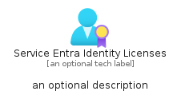
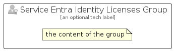

# ServiceEntraIdentityLicenses


```text
azure-20/Item/Identity/ServiceEntraIdentityLicenses
```

```text
include('azure-20/Item/Identity/ServiceEntraIdentityLicenses')
```


| Illustration | ServiceEntraIdentityLicenses | ServiceEntraIdentityLicensesCard | ServiceEntraIdentityLicensesGroup |
| :---: | :---: | :---: | :---: |
|  |  |  |  |


## Sprites
The item provides the following sriptes:

- `<$ServiceEntraIdentityLicensesXs>`
- `<$ServiceEntraIdentityLicensesSm>`
- `<$ServiceEntraIdentityLicensesMd>`
- `<$ServiceEntraIdentityLicensesLg>`


## ServiceEntraIdentityLicenses

### Load remotely
```plantuml
@startuml
' configures the library
!global $LIB_BASE_LOCATION="https://raw.githubusercontent.com/tmorin/plantuml-libs/master/distribution"

' loads the library's bootstrap
!include $LIB_BASE_LOCATION/bootstrap.puml

' loads the package bootstrap
include('azure-20/bootstrap')

' loads the Item which embeds the element ServiceEntraIdentityLicenses
include('azure-20/Item/Identity/ServiceEntraIdentityLicenses')

' renders the element
ServiceEntraIdentityLicenses('ServiceEntraIdentityLicenses', 'Service Entra Identity Licenses', 'an optional tech label', 'an optional description')
@enduml
```

### Load locally
```plantuml
@startuml
' configures the library
!global $INCLUSION_MODE="local"
!global $LIB_BASE_LOCATION="../../.."

' loads the library's bootstrap
!include $LIB_BASE_LOCATION/bootstrap.puml

' loads the package bootstrap
include('azure-20/bootstrap')

' loads the Item which embeds the element ServiceEntraIdentityLicenses
include('azure-20/Item/Identity/ServiceEntraIdentityLicenses')

' renders the element
ServiceEntraIdentityLicenses('ServiceEntraIdentityLicenses', 'Service Entra Identity Licenses', 'an optional tech label', 'an optional description')
@enduml
```

## ServiceEntraIdentityLicensesCard

### Load remotely
```plantuml
@startuml
' configures the library
!global $LIB_BASE_LOCATION="https://raw.githubusercontent.com/tmorin/plantuml-libs/master/distribution"

' loads the library's bootstrap
!include $LIB_BASE_LOCATION/bootstrap.puml

' loads the package bootstrap
include('azure-20/bootstrap')

' loads the Item which embeds the element ServiceEntraIdentityLicensesCard
include('azure-20/Item/Identity/ServiceEntraIdentityLicenses')

' renders the element
ServiceEntraIdentityLicensesCard('ServiceEntraIdentityLicensesCard', 'Service Entra Identity Licenses Card', 'an optional description')
@enduml
```

### Load locally
```plantuml
@startuml
' configures the library
!global $INCLUSION_MODE="local"
!global $LIB_BASE_LOCATION="../../.."

' loads the library's bootstrap
!include $LIB_BASE_LOCATION/bootstrap.puml

' loads the package bootstrap
include('azure-20/bootstrap')

' loads the Item which embeds the element ServiceEntraIdentityLicensesCard
include('azure-20/Item/Identity/ServiceEntraIdentityLicenses')

' renders the element
ServiceEntraIdentityLicensesCard('ServiceEntraIdentityLicensesCard', 'Service Entra Identity Licenses Card', 'an optional description')
@enduml
```

## ServiceEntraIdentityLicensesGroup

### Load remotely
```plantuml
@startuml
' configures the library
!global $LIB_BASE_LOCATION="https://raw.githubusercontent.com/tmorin/plantuml-libs/master/distribution"

' loads the library's bootstrap
!include $LIB_BASE_LOCATION/bootstrap.puml

' loads the package bootstrap
include('azure-20/bootstrap')

' loads the Item which embeds the element ServiceEntraIdentityLicensesGroup
include('azure-20/Item/Identity/ServiceEntraIdentityLicenses')

' renders the element
ServiceEntraIdentityLicensesGroup('ServiceEntraIdentityLicensesGroup', 'Service Entra Identity Licenses Group', 'an optional tech label') {
    note as note
        the content of the group
    end note
}
@enduml
```

### Load locally
```plantuml
@startuml
' configures the library
!global $INCLUSION_MODE="local"
!global $LIB_BASE_LOCATION="../../.."

' loads the library's bootstrap
!include $LIB_BASE_LOCATION/bootstrap.puml

' loads the package bootstrap
include('azure-20/bootstrap')

' loads the Item which embeds the element ServiceEntraIdentityLicensesGroup
include('azure-20/Item/Identity/ServiceEntraIdentityLicenses')

' renders the element
ServiceEntraIdentityLicensesGroup('ServiceEntraIdentityLicensesGroup', 'Service Entra Identity Licenses Group', 'an optional tech label') {
    note as note
        the content of the group
    end note
}
@enduml
```

