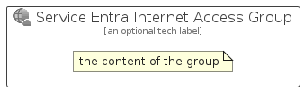

# ServiceEntraInternetAccess


```text
azure-20/Item/Identity/ServiceEntraInternetAccess
```

```text
include('azure-20/Item/Identity/ServiceEntraInternetAccess')
```


| Illustration | ServiceEntraInternetAccess | ServiceEntraInternetAccessCard | ServiceEntraInternetAccessGroup |
| :---: | :---: | :---: | :---: |
|  |  |  |  |


## Sprites
The item provides the following sriptes:

- `<$ServiceEntraInternetAccessXs>`
- `<$ServiceEntraInternetAccessSm>`
- `<$ServiceEntraInternetAccessMd>`
- `<$ServiceEntraInternetAccessLg>`


## ServiceEntraInternetAccess

### Load remotely
```plantuml
@startuml
' configures the library
!global $LIB_BASE_LOCATION="https://raw.githubusercontent.com/tmorin/plantuml-libs/master/distribution"

' loads the library's bootstrap
!include $LIB_BASE_LOCATION/bootstrap.puml

' loads the package bootstrap
include('azure-20/bootstrap')

' loads the Item which embeds the element ServiceEntraInternetAccess
include('azure-20/Item/Identity/ServiceEntraInternetAccess')

' renders the element
ServiceEntraInternetAccess('ServiceEntraInternetAccess', 'Service Entra Internet Access', 'an optional tech label', 'an optional description')
@enduml
```

### Load locally
```plantuml
@startuml
' configures the library
!global $INCLUSION_MODE="local"
!global $LIB_BASE_LOCATION="../../.."

' loads the library's bootstrap
!include $LIB_BASE_LOCATION/bootstrap.puml

' loads the package bootstrap
include('azure-20/bootstrap')

' loads the Item which embeds the element ServiceEntraInternetAccess
include('azure-20/Item/Identity/ServiceEntraInternetAccess')

' renders the element
ServiceEntraInternetAccess('ServiceEntraInternetAccess', 'Service Entra Internet Access', 'an optional tech label', 'an optional description')
@enduml
```

## ServiceEntraInternetAccessCard

### Load remotely
```plantuml
@startuml
' configures the library
!global $LIB_BASE_LOCATION="https://raw.githubusercontent.com/tmorin/plantuml-libs/master/distribution"

' loads the library's bootstrap
!include $LIB_BASE_LOCATION/bootstrap.puml

' loads the package bootstrap
include('azure-20/bootstrap')

' loads the Item which embeds the element ServiceEntraInternetAccessCard
include('azure-20/Item/Identity/ServiceEntraInternetAccess')

' renders the element
ServiceEntraInternetAccessCard('ServiceEntraInternetAccessCard', 'Service Entra Internet Access Card', 'an optional description')
@enduml
```

### Load locally
```plantuml
@startuml
' configures the library
!global $INCLUSION_MODE="local"
!global $LIB_BASE_LOCATION="../../.."

' loads the library's bootstrap
!include $LIB_BASE_LOCATION/bootstrap.puml

' loads the package bootstrap
include('azure-20/bootstrap')

' loads the Item which embeds the element ServiceEntraInternetAccessCard
include('azure-20/Item/Identity/ServiceEntraInternetAccess')

' renders the element
ServiceEntraInternetAccessCard('ServiceEntraInternetAccessCard', 'Service Entra Internet Access Card', 'an optional description')
@enduml
```

## ServiceEntraInternetAccessGroup

### Load remotely
```plantuml
@startuml
' configures the library
!global $LIB_BASE_LOCATION="https://raw.githubusercontent.com/tmorin/plantuml-libs/master/distribution"

' loads the library's bootstrap
!include $LIB_BASE_LOCATION/bootstrap.puml

' loads the package bootstrap
include('azure-20/bootstrap')

' loads the Item which embeds the element ServiceEntraInternetAccessGroup
include('azure-20/Item/Identity/ServiceEntraInternetAccess')

' renders the element
ServiceEntraInternetAccessGroup('ServiceEntraInternetAccessGroup', 'Service Entra Internet Access Group', 'an optional tech label') {
    note as note
        the content of the group
    end note
}
@enduml
```

### Load locally
```plantuml
@startuml
' configures the library
!global $INCLUSION_MODE="local"
!global $LIB_BASE_LOCATION="../../.."

' loads the library's bootstrap
!include $LIB_BASE_LOCATION/bootstrap.puml

' loads the package bootstrap
include('azure-20/bootstrap')

' loads the Item which embeds the element ServiceEntraInternetAccessGroup
include('azure-20/Item/Identity/ServiceEntraInternetAccess')

' renders the element
ServiceEntraInternetAccessGroup('ServiceEntraInternetAccessGroup', 'Service Entra Internet Access Group', 'an optional tech label') {
    note as note
        the content of the group
    end note
}
@enduml
```

