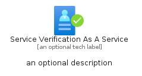

# ServiceVerificationAsAService


```text
azure-20/Item/Identity/ServiceVerificationAsAService
```

```text
include('azure-20/Item/Identity/ServiceVerificationAsAService')
```


| Illustration | ServiceVerificationAsAService | ServiceVerificationAsAServiceCard | ServiceVerificationAsAServiceGroup |
| :---: | :---: | :---: | :---: |
|  |  |  |  |


## Sprites
The item provides the following sriptes:

- `<$ServiceVerificationAsAServiceXs>`
- `<$ServiceVerificationAsAServiceSm>`
- `<$ServiceVerificationAsAServiceMd>`
- `<$ServiceVerificationAsAServiceLg>`


## ServiceVerificationAsAService

### Load remotely
```plantuml
@startuml
' configures the library
!global $LIB_BASE_LOCATION="https://raw.githubusercontent.com/tmorin/plantuml-libs/master/distribution"

' loads the library's bootstrap
!include $LIB_BASE_LOCATION/bootstrap.puml

' loads the package bootstrap
include('azure-20/bootstrap')

' loads the Item which embeds the element ServiceVerificationAsAService
include('azure-20/Item/Identity/ServiceVerificationAsAService')

' renders the element
ServiceVerificationAsAService('ServiceVerificationAsAService', 'Service Verification As A Service', 'an optional tech label', 'an optional description')
@enduml
```

### Load locally
```plantuml
@startuml
' configures the library
!global $INCLUSION_MODE="local"
!global $LIB_BASE_LOCATION="../../.."

' loads the library's bootstrap
!include $LIB_BASE_LOCATION/bootstrap.puml

' loads the package bootstrap
include('azure-20/bootstrap')

' loads the Item which embeds the element ServiceVerificationAsAService
include('azure-20/Item/Identity/ServiceVerificationAsAService')

' renders the element
ServiceVerificationAsAService('ServiceVerificationAsAService', 'Service Verification As A Service', 'an optional tech label', 'an optional description')
@enduml
```

## ServiceVerificationAsAServiceCard

### Load remotely
```plantuml
@startuml
' configures the library
!global $LIB_BASE_LOCATION="https://raw.githubusercontent.com/tmorin/plantuml-libs/master/distribution"

' loads the library's bootstrap
!include $LIB_BASE_LOCATION/bootstrap.puml

' loads the package bootstrap
include('azure-20/bootstrap')

' loads the Item which embeds the element ServiceVerificationAsAServiceCard
include('azure-20/Item/Identity/ServiceVerificationAsAService')

' renders the element
ServiceVerificationAsAServiceCard('ServiceVerificationAsAServiceCard', 'Service Verification As A Service Card', 'an optional description')
@enduml
```

### Load locally
```plantuml
@startuml
' configures the library
!global $INCLUSION_MODE="local"
!global $LIB_BASE_LOCATION="../../.."

' loads the library's bootstrap
!include $LIB_BASE_LOCATION/bootstrap.puml

' loads the package bootstrap
include('azure-20/bootstrap')

' loads the Item which embeds the element ServiceVerificationAsAServiceCard
include('azure-20/Item/Identity/ServiceVerificationAsAService')

' renders the element
ServiceVerificationAsAServiceCard('ServiceVerificationAsAServiceCard', 'Service Verification As A Service Card', 'an optional description')
@enduml
```

## ServiceVerificationAsAServiceGroup

### Load remotely
```plantuml
@startuml
' configures the library
!global $LIB_BASE_LOCATION="https://raw.githubusercontent.com/tmorin/plantuml-libs/master/distribution"

' loads the library's bootstrap
!include $LIB_BASE_LOCATION/bootstrap.puml

' loads the package bootstrap
include('azure-20/bootstrap')

' loads the Item which embeds the element ServiceVerificationAsAServiceGroup
include('azure-20/Item/Identity/ServiceVerificationAsAService')

' renders the element
ServiceVerificationAsAServiceGroup('ServiceVerificationAsAServiceGroup', 'Service Verification As A Service Group', 'an optional tech label') {
    note as note
        the content of the group
    end note
}
@enduml
```

### Load locally
```plantuml
@startuml
' configures the library
!global $INCLUSION_MODE="local"
!global $LIB_BASE_LOCATION="../../.."

' loads the library's bootstrap
!include $LIB_BASE_LOCATION/bootstrap.puml

' loads the package bootstrap
include('azure-20/bootstrap')

' loads the Item which embeds the element ServiceVerificationAsAServiceGroup
include('azure-20/Item/Identity/ServiceVerificationAsAService')

' renders the element
ServiceVerificationAsAServiceGroup('ServiceVerificationAsAServiceGroup', 'Service Verification As A Service Group', 'an optional tech label') {
    note as note
        the content of the group
    end note
}
@enduml
```

