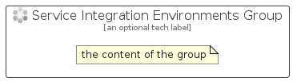

# ServiceIntegrationEnvironments


```text
azure-20/Item/Integration/ServiceIntegrationEnvironments
```

```text
include('azure-20/Item/Integration/ServiceIntegrationEnvironments')
```


| Illustration | ServiceIntegrationEnvironments | ServiceIntegrationEnvironmentsCard | ServiceIntegrationEnvironmentsGroup |
| :---: | :---: | :---: | :---: |
|  |  |  |  |


## Sprites
The item provides the following sriptes:

- `<$ServiceIntegrationEnvironmentsXs>`
- `<$ServiceIntegrationEnvironmentsSm>`
- `<$ServiceIntegrationEnvironmentsMd>`
- `<$ServiceIntegrationEnvironmentsLg>`


## ServiceIntegrationEnvironments

### Load remotely
```plantuml
@startuml
' configures the library
!global $LIB_BASE_LOCATION="https://raw.githubusercontent.com/tmorin/plantuml-libs/master/distribution"

' loads the library's bootstrap
!include $LIB_BASE_LOCATION/bootstrap.puml

' loads the package bootstrap
include('azure-20/bootstrap')

' loads the Item which embeds the element ServiceIntegrationEnvironments
include('azure-20/Item/Integration/ServiceIntegrationEnvironments')

' renders the element
ServiceIntegrationEnvironments('ServiceIntegrationEnvironments', 'Service Integration Environments', 'an optional tech label', 'an optional description')
@enduml
```

### Load locally
```plantuml
@startuml
' configures the library
!global $INCLUSION_MODE="local"
!global $LIB_BASE_LOCATION="../../.."

' loads the library's bootstrap
!include $LIB_BASE_LOCATION/bootstrap.puml

' loads the package bootstrap
include('azure-20/bootstrap')

' loads the Item which embeds the element ServiceIntegrationEnvironments
include('azure-20/Item/Integration/ServiceIntegrationEnvironments')

' renders the element
ServiceIntegrationEnvironments('ServiceIntegrationEnvironments', 'Service Integration Environments', 'an optional tech label', 'an optional description')
@enduml
```

## ServiceIntegrationEnvironmentsCard

### Load remotely
```plantuml
@startuml
' configures the library
!global $LIB_BASE_LOCATION="https://raw.githubusercontent.com/tmorin/plantuml-libs/master/distribution"

' loads the library's bootstrap
!include $LIB_BASE_LOCATION/bootstrap.puml

' loads the package bootstrap
include('azure-20/bootstrap')

' loads the Item which embeds the element ServiceIntegrationEnvironmentsCard
include('azure-20/Item/Integration/ServiceIntegrationEnvironments')

' renders the element
ServiceIntegrationEnvironmentsCard('ServiceIntegrationEnvironmentsCard', 'Service Integration Environments Card', 'an optional description')
@enduml
```

### Load locally
```plantuml
@startuml
' configures the library
!global $INCLUSION_MODE="local"
!global $LIB_BASE_LOCATION="../../.."

' loads the library's bootstrap
!include $LIB_BASE_LOCATION/bootstrap.puml

' loads the package bootstrap
include('azure-20/bootstrap')

' loads the Item which embeds the element ServiceIntegrationEnvironmentsCard
include('azure-20/Item/Integration/ServiceIntegrationEnvironments')

' renders the element
ServiceIntegrationEnvironmentsCard('ServiceIntegrationEnvironmentsCard', 'Service Integration Environments Card', 'an optional description')
@enduml
```

## ServiceIntegrationEnvironmentsGroup

### Load remotely
```plantuml
@startuml
' configures the library
!global $LIB_BASE_LOCATION="https://raw.githubusercontent.com/tmorin/plantuml-libs/master/distribution"

' loads the library's bootstrap
!include $LIB_BASE_LOCATION/bootstrap.puml

' loads the package bootstrap
include('azure-20/bootstrap')

' loads the Item which embeds the element ServiceIntegrationEnvironmentsGroup
include('azure-20/Item/Integration/ServiceIntegrationEnvironments')

' renders the element
ServiceIntegrationEnvironmentsGroup('ServiceIntegrationEnvironmentsGroup', 'Service Integration Environments Group', 'an optional tech label') {
    note as note
        the content of the group
    end note
}
@enduml
```

### Load locally
```plantuml
@startuml
' configures the library
!global $INCLUSION_MODE="local"
!global $LIB_BASE_LOCATION="../../.."

' loads the library's bootstrap
!include $LIB_BASE_LOCATION/bootstrap.puml

' loads the package bootstrap
include('azure-20/bootstrap')

' loads the Item which embeds the element ServiceIntegrationEnvironmentsGroup
include('azure-20/Item/Integration/ServiceIntegrationEnvironments')

' renders the element
ServiceIntegrationEnvironmentsGroup('ServiceIntegrationEnvironmentsGroup', 'Service Integration Environments Group', 'an optional tech label') {
    note as note
        the content of the group
    end note
}
@enduml
```

