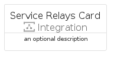
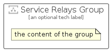

# ServiceRelays


```text
azure-20/Item/Integration/ServiceRelays
```

```text
include('azure-20/Item/Integration/ServiceRelays')
```


| Illustration | ServiceRelays | ServiceRelaysCard | ServiceRelaysGroup |
| :---: | :---: | :---: | :---: |
|  |  |  |  |


## Sprites
The item provides the following sriptes:

- `<$ServiceRelaysXs>`
- `<$ServiceRelaysSm>`
- `<$ServiceRelaysMd>`
- `<$ServiceRelaysLg>`


## ServiceRelays

### Load remotely
```plantuml
@startuml
' configures the library
!global $LIB_BASE_LOCATION="https://raw.githubusercontent.com/tmorin/plantuml-libs/master/distribution"

' loads the library's bootstrap
!include $LIB_BASE_LOCATION/bootstrap.puml

' loads the package bootstrap
include('azure-20/bootstrap')

' loads the Item which embeds the element ServiceRelays
include('azure-20/Item/Integration/ServiceRelays')

' renders the element
ServiceRelays('ServiceRelays', 'Service Relays', 'an optional tech label', 'an optional description')
@enduml
```

### Load locally
```plantuml
@startuml
' configures the library
!global $INCLUSION_MODE="local"
!global $LIB_BASE_LOCATION="../../.."

' loads the library's bootstrap
!include $LIB_BASE_LOCATION/bootstrap.puml

' loads the package bootstrap
include('azure-20/bootstrap')

' loads the Item which embeds the element ServiceRelays
include('azure-20/Item/Integration/ServiceRelays')

' renders the element
ServiceRelays('ServiceRelays', 'Service Relays', 'an optional tech label', 'an optional description')
@enduml
```

## ServiceRelaysCard

### Load remotely
```plantuml
@startuml
' configures the library
!global $LIB_BASE_LOCATION="https://raw.githubusercontent.com/tmorin/plantuml-libs/master/distribution"

' loads the library's bootstrap
!include $LIB_BASE_LOCATION/bootstrap.puml

' loads the package bootstrap
include('azure-20/bootstrap')

' loads the Item which embeds the element ServiceRelaysCard
include('azure-20/Item/Integration/ServiceRelays')

' renders the element
ServiceRelaysCard('ServiceRelaysCard', 'Service Relays Card', 'an optional description')
@enduml
```

### Load locally
```plantuml
@startuml
' configures the library
!global $INCLUSION_MODE="local"
!global $LIB_BASE_LOCATION="../../.."

' loads the library's bootstrap
!include $LIB_BASE_LOCATION/bootstrap.puml

' loads the package bootstrap
include('azure-20/bootstrap')

' loads the Item which embeds the element ServiceRelaysCard
include('azure-20/Item/Integration/ServiceRelays')

' renders the element
ServiceRelaysCard('ServiceRelaysCard', 'Service Relays Card', 'an optional description')
@enduml
```

## ServiceRelaysGroup

### Load remotely
```plantuml
@startuml
' configures the library
!global $LIB_BASE_LOCATION="https://raw.githubusercontent.com/tmorin/plantuml-libs/master/distribution"

' loads the library's bootstrap
!include $LIB_BASE_LOCATION/bootstrap.puml

' loads the package bootstrap
include('azure-20/bootstrap')

' loads the Item which embeds the element ServiceRelaysGroup
include('azure-20/Item/Integration/ServiceRelays')

' renders the element
ServiceRelaysGroup('ServiceRelaysGroup', 'Service Relays Group', 'an optional tech label') {
    note as note
        the content of the group
    end note
}
@enduml
```

### Load locally
```plantuml
@startuml
' configures the library
!global $INCLUSION_MODE="local"
!global $LIB_BASE_LOCATION="../../.."

' loads the library's bootstrap
!include $LIB_BASE_LOCATION/bootstrap.puml

' loads the package bootstrap
include('azure-20/bootstrap')

' loads the Item which embeds the element ServiceRelaysGroup
include('azure-20/Item/Integration/ServiceRelays')

' renders the element
ServiceRelaysGroup('ServiceRelaysGroup', 'Service Relays Group', 'an optional tech label') {
    note as note
        the content of the group
    end note
}
@enduml
```

