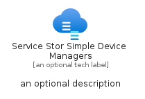

# ServiceStorSimpleDeviceManagers


```text
azure-20/Item/Integration/ServiceStorSimpleDeviceManagers
```

```text
include('azure-20/Item/Integration/ServiceStorSimpleDeviceManagers')
```


| Illustration | ServiceStorSimpleDeviceManagers | ServiceStorSimpleDeviceManagersCard | ServiceStorSimpleDeviceManagersGroup |
| :---: | :---: | :---: | :---: |
|  |  |  |  |


## Sprites
The item provides the following sriptes:

- `<$ServiceStorSimpleDeviceManagersXs>`
- `<$ServiceStorSimpleDeviceManagersSm>`
- `<$ServiceStorSimpleDeviceManagersMd>`
- `<$ServiceStorSimpleDeviceManagersLg>`


## ServiceStorSimpleDeviceManagers

### Load remotely
```plantuml
@startuml
' configures the library
!global $LIB_BASE_LOCATION="https://raw.githubusercontent.com/tmorin/plantuml-libs/master/distribution"

' loads the library's bootstrap
!include $LIB_BASE_LOCATION/bootstrap.puml

' loads the package bootstrap
include('azure-20/bootstrap')

' loads the Item which embeds the element ServiceStorSimpleDeviceManagers
include('azure-20/Item/Integration/ServiceStorSimpleDeviceManagers')

' renders the element
ServiceStorSimpleDeviceManagers('ServiceStorSimpleDeviceManagers', 'Service Stor Simple Device Managers', 'an optional tech label', 'an optional description')
@enduml
```

### Load locally
```plantuml
@startuml
' configures the library
!global $INCLUSION_MODE="local"
!global $LIB_BASE_LOCATION="../../.."

' loads the library's bootstrap
!include $LIB_BASE_LOCATION/bootstrap.puml

' loads the package bootstrap
include('azure-20/bootstrap')

' loads the Item which embeds the element ServiceStorSimpleDeviceManagers
include('azure-20/Item/Integration/ServiceStorSimpleDeviceManagers')

' renders the element
ServiceStorSimpleDeviceManagers('ServiceStorSimpleDeviceManagers', 'Service Stor Simple Device Managers', 'an optional tech label', 'an optional description')
@enduml
```

## ServiceStorSimpleDeviceManagersCard

### Load remotely
```plantuml
@startuml
' configures the library
!global $LIB_BASE_LOCATION="https://raw.githubusercontent.com/tmorin/plantuml-libs/master/distribution"

' loads the library's bootstrap
!include $LIB_BASE_LOCATION/bootstrap.puml

' loads the package bootstrap
include('azure-20/bootstrap')

' loads the Item which embeds the element ServiceStorSimpleDeviceManagersCard
include('azure-20/Item/Integration/ServiceStorSimpleDeviceManagers')

' renders the element
ServiceStorSimpleDeviceManagersCard('ServiceStorSimpleDeviceManagersCard', 'Service Stor Simple Device Managers Card', 'an optional description')
@enduml
```

### Load locally
```plantuml
@startuml
' configures the library
!global $INCLUSION_MODE="local"
!global $LIB_BASE_LOCATION="../../.."

' loads the library's bootstrap
!include $LIB_BASE_LOCATION/bootstrap.puml

' loads the package bootstrap
include('azure-20/bootstrap')

' loads the Item which embeds the element ServiceStorSimpleDeviceManagersCard
include('azure-20/Item/Integration/ServiceStorSimpleDeviceManagers')

' renders the element
ServiceStorSimpleDeviceManagersCard('ServiceStorSimpleDeviceManagersCard', 'Service Stor Simple Device Managers Card', 'an optional description')
@enduml
```

## ServiceStorSimpleDeviceManagersGroup

### Load remotely
```plantuml
@startuml
' configures the library
!global $LIB_BASE_LOCATION="https://raw.githubusercontent.com/tmorin/plantuml-libs/master/distribution"

' loads the library's bootstrap
!include $LIB_BASE_LOCATION/bootstrap.puml

' loads the package bootstrap
include('azure-20/bootstrap')

' loads the Item which embeds the element ServiceStorSimpleDeviceManagersGroup
include('azure-20/Item/Integration/ServiceStorSimpleDeviceManagers')

' renders the element
ServiceStorSimpleDeviceManagersGroup('ServiceStorSimpleDeviceManagersGroup', 'Service Stor Simple Device Managers Group', 'an optional tech label') {
    note as note
        the content of the group
    end note
}
@enduml
```

### Load locally
```plantuml
@startuml
' configures the library
!global $INCLUSION_MODE="local"
!global $LIB_BASE_LOCATION="../../.."

' loads the library's bootstrap
!include $LIB_BASE_LOCATION/bootstrap.puml

' loads the package bootstrap
include('azure-20/bootstrap')

' loads the Item which embeds the element ServiceStorSimpleDeviceManagersGroup
include('azure-20/Item/Integration/ServiceStorSimpleDeviceManagers')

' renders the element
ServiceStorSimpleDeviceManagersGroup('ServiceStorSimpleDeviceManagersGroup', 'Service Stor Simple Device Managers Group', 'an optional tech label') {
    note as note
        the content of the group
    end note
}
@enduml
```

