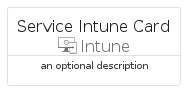
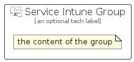

# ServiceIntune


```text
azure-20/Item/Intune/ServiceIntune
```

```text
include('azure-20/Item/Intune/ServiceIntune')
```


| Illustration | ServiceIntune | ServiceIntuneCard | ServiceIntuneGroup |
| :---: | :---: | :---: | :---: |
|  |  |  |  |


## Sprites
The item provides the following sriptes:

- `<$ServiceIntuneXs>`
- `<$ServiceIntuneSm>`
- `<$ServiceIntuneMd>`
- `<$ServiceIntuneLg>`


## ServiceIntune

### Load remotely
```plantuml
@startuml
' configures the library
!global $LIB_BASE_LOCATION="https://raw.githubusercontent.com/tmorin/plantuml-libs/master/distribution"

' loads the library's bootstrap
!include $LIB_BASE_LOCATION/bootstrap.puml

' loads the package bootstrap
include('azure-20/bootstrap')

' loads the Item which embeds the element ServiceIntune
include('azure-20/Item/Intune/ServiceIntune')

' renders the element
ServiceIntune('ServiceIntune', 'Service Intune', 'an optional tech label', 'an optional description')
@enduml
```

### Load locally
```plantuml
@startuml
' configures the library
!global $INCLUSION_MODE="local"
!global $LIB_BASE_LOCATION="../../.."

' loads the library's bootstrap
!include $LIB_BASE_LOCATION/bootstrap.puml

' loads the package bootstrap
include('azure-20/bootstrap')

' loads the Item which embeds the element ServiceIntune
include('azure-20/Item/Intune/ServiceIntune')

' renders the element
ServiceIntune('ServiceIntune', 'Service Intune', 'an optional tech label', 'an optional description')
@enduml
```

## ServiceIntuneCard

### Load remotely
```plantuml
@startuml
' configures the library
!global $LIB_BASE_LOCATION="https://raw.githubusercontent.com/tmorin/plantuml-libs/master/distribution"

' loads the library's bootstrap
!include $LIB_BASE_LOCATION/bootstrap.puml

' loads the package bootstrap
include('azure-20/bootstrap')

' loads the Item which embeds the element ServiceIntuneCard
include('azure-20/Item/Intune/ServiceIntune')

' renders the element
ServiceIntuneCard('ServiceIntuneCard', 'Service Intune Card', 'an optional description')
@enduml
```

### Load locally
```plantuml
@startuml
' configures the library
!global $INCLUSION_MODE="local"
!global $LIB_BASE_LOCATION="../../.."

' loads the library's bootstrap
!include $LIB_BASE_LOCATION/bootstrap.puml

' loads the package bootstrap
include('azure-20/bootstrap')

' loads the Item which embeds the element ServiceIntuneCard
include('azure-20/Item/Intune/ServiceIntune')

' renders the element
ServiceIntuneCard('ServiceIntuneCard', 'Service Intune Card', 'an optional description')
@enduml
```

## ServiceIntuneGroup

### Load remotely
```plantuml
@startuml
' configures the library
!global $LIB_BASE_LOCATION="https://raw.githubusercontent.com/tmorin/plantuml-libs/master/distribution"

' loads the library's bootstrap
!include $LIB_BASE_LOCATION/bootstrap.puml

' loads the package bootstrap
include('azure-20/bootstrap')

' loads the Item which embeds the element ServiceIntuneGroup
include('azure-20/Item/Intune/ServiceIntune')

' renders the element
ServiceIntuneGroup('ServiceIntuneGroup', 'Service Intune Group', 'an optional tech label') {
    note as note
        the content of the group
    end note
}
@enduml
```

### Load locally
```plantuml
@startuml
' configures the library
!global $INCLUSION_MODE="local"
!global $LIB_BASE_LOCATION="../../.."

' loads the library's bootstrap
!include $LIB_BASE_LOCATION/bootstrap.puml

' loads the package bootstrap
include('azure-20/bootstrap')

' loads the Item which embeds the element ServiceIntuneGroup
include('azure-20/Item/Intune/ServiceIntune')

' renders the element
ServiceIntuneGroup('ServiceIntuneGroup', 'Service Intune Group', 'an optional tech label') {
    note as note
        the content of the group
    end note
}
@enduml
```

