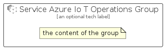

# ServiceAzureIoTOperations


```text
azure-20/Item/Iot/ServiceAzureIoTOperations
```

```text
include('azure-20/Item/Iot/ServiceAzureIoTOperations')
```


| Illustration | ServiceAzureIoTOperations | ServiceAzureIoTOperationsCard | ServiceAzureIoTOperationsGroup |
| :---: | :---: | :---: | :---: |
|  |  |  |  |


## Sprites
The item provides the following sriptes:

- `<$ServiceAzureIoTOperationsXs>`
- `<$ServiceAzureIoTOperationsSm>`
- `<$ServiceAzureIoTOperationsMd>`
- `<$ServiceAzureIoTOperationsLg>`


## ServiceAzureIoTOperations

### Load remotely
```plantuml
@startuml
' configures the library
!global $LIB_BASE_LOCATION="https://raw.githubusercontent.com/tmorin/plantuml-libs/master/distribution"

' loads the library's bootstrap
!include $LIB_BASE_LOCATION/bootstrap.puml

' loads the package bootstrap
include('azure-20/bootstrap')

' loads the Item which embeds the element ServiceAzureIoTOperations
include('azure-20/Item/Iot/ServiceAzureIoTOperations')

' renders the element
ServiceAzureIoTOperations('ServiceAzureIoTOperations', 'Service Azure Io T Operations', 'an optional tech label', 'an optional description')
@enduml
```

### Load locally
```plantuml
@startuml
' configures the library
!global $INCLUSION_MODE="local"
!global $LIB_BASE_LOCATION="../../.."

' loads the library's bootstrap
!include $LIB_BASE_LOCATION/bootstrap.puml

' loads the package bootstrap
include('azure-20/bootstrap')

' loads the Item which embeds the element ServiceAzureIoTOperations
include('azure-20/Item/Iot/ServiceAzureIoTOperations')

' renders the element
ServiceAzureIoTOperations('ServiceAzureIoTOperations', 'Service Azure Io T Operations', 'an optional tech label', 'an optional description')
@enduml
```

## ServiceAzureIoTOperationsCard

### Load remotely
```plantuml
@startuml
' configures the library
!global $LIB_BASE_LOCATION="https://raw.githubusercontent.com/tmorin/plantuml-libs/master/distribution"

' loads the library's bootstrap
!include $LIB_BASE_LOCATION/bootstrap.puml

' loads the package bootstrap
include('azure-20/bootstrap')

' loads the Item which embeds the element ServiceAzureIoTOperationsCard
include('azure-20/Item/Iot/ServiceAzureIoTOperations')

' renders the element
ServiceAzureIoTOperationsCard('ServiceAzureIoTOperationsCard', 'Service Azure Io T Operations Card', 'an optional description')
@enduml
```

### Load locally
```plantuml
@startuml
' configures the library
!global $INCLUSION_MODE="local"
!global $LIB_BASE_LOCATION="../../.."

' loads the library's bootstrap
!include $LIB_BASE_LOCATION/bootstrap.puml

' loads the package bootstrap
include('azure-20/bootstrap')

' loads the Item which embeds the element ServiceAzureIoTOperationsCard
include('azure-20/Item/Iot/ServiceAzureIoTOperations')

' renders the element
ServiceAzureIoTOperationsCard('ServiceAzureIoTOperationsCard', 'Service Azure Io T Operations Card', 'an optional description')
@enduml
```

## ServiceAzureIoTOperationsGroup

### Load remotely
```plantuml
@startuml
' configures the library
!global $LIB_BASE_LOCATION="https://raw.githubusercontent.com/tmorin/plantuml-libs/master/distribution"

' loads the library's bootstrap
!include $LIB_BASE_LOCATION/bootstrap.puml

' loads the package bootstrap
include('azure-20/bootstrap')

' loads the Item which embeds the element ServiceAzureIoTOperationsGroup
include('azure-20/Item/Iot/ServiceAzureIoTOperations')

' renders the element
ServiceAzureIoTOperationsGroup('ServiceAzureIoTOperationsGroup', 'Service Azure Io T Operations Group', 'an optional tech label') {
    note as note
        the content of the group
    end note
}
@enduml
```

### Load locally
```plantuml
@startuml
' configures the library
!global $INCLUSION_MODE="local"
!global $LIB_BASE_LOCATION="../../.."

' loads the library's bootstrap
!include $LIB_BASE_LOCATION/bootstrap.puml

' loads the package bootstrap
include('azure-20/bootstrap')

' loads the Item which embeds the element ServiceAzureIoTOperationsGroup
include('azure-20/Item/Iot/ServiceAzureIoTOperations')

' renders the element
ServiceAzureIoTOperationsGroup('ServiceAzureIoTOperationsGroup', 'Service Azure Io T Operations Group', 'an optional tech label') {
    note as note
        the content of the group
    end note
}
@enduml
```

