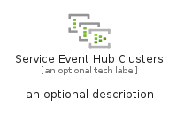

# ServiceEventHubClusters


```text
azure-20/Item/Iot/ServiceEventHubClusters
```

```text
include('azure-20/Item/Iot/ServiceEventHubClusters')
```


| Illustration | ServiceEventHubClusters | ServiceEventHubClustersCard | ServiceEventHubClustersGroup |
| :---: | :---: | :---: | :---: |
|  |  |  |  |


## Sprites
The item provides the following sriptes:

- `<$ServiceEventHubClustersXs>`
- `<$ServiceEventHubClustersSm>`
- `<$ServiceEventHubClustersMd>`
- `<$ServiceEventHubClustersLg>`


## ServiceEventHubClusters

### Load remotely
```plantuml
@startuml
' configures the library
!global $LIB_BASE_LOCATION="https://raw.githubusercontent.com/tmorin/plantuml-libs/master/distribution"

' loads the library's bootstrap
!include $LIB_BASE_LOCATION/bootstrap.puml

' loads the package bootstrap
include('azure-20/bootstrap')

' loads the Item which embeds the element ServiceEventHubClusters
include('azure-20/Item/Iot/ServiceEventHubClusters')

' renders the element
ServiceEventHubClusters('ServiceEventHubClusters', 'Service Event Hub Clusters', 'an optional tech label', 'an optional description')
@enduml
```

### Load locally
```plantuml
@startuml
' configures the library
!global $INCLUSION_MODE="local"
!global $LIB_BASE_LOCATION="../../.."

' loads the library's bootstrap
!include $LIB_BASE_LOCATION/bootstrap.puml

' loads the package bootstrap
include('azure-20/bootstrap')

' loads the Item which embeds the element ServiceEventHubClusters
include('azure-20/Item/Iot/ServiceEventHubClusters')

' renders the element
ServiceEventHubClusters('ServiceEventHubClusters', 'Service Event Hub Clusters', 'an optional tech label', 'an optional description')
@enduml
```

## ServiceEventHubClustersCard

### Load remotely
```plantuml
@startuml
' configures the library
!global $LIB_BASE_LOCATION="https://raw.githubusercontent.com/tmorin/plantuml-libs/master/distribution"

' loads the library's bootstrap
!include $LIB_BASE_LOCATION/bootstrap.puml

' loads the package bootstrap
include('azure-20/bootstrap')

' loads the Item which embeds the element ServiceEventHubClustersCard
include('azure-20/Item/Iot/ServiceEventHubClusters')

' renders the element
ServiceEventHubClustersCard('ServiceEventHubClustersCard', 'Service Event Hub Clusters Card', 'an optional description')
@enduml
```

### Load locally
```plantuml
@startuml
' configures the library
!global $INCLUSION_MODE="local"
!global $LIB_BASE_LOCATION="../../.."

' loads the library's bootstrap
!include $LIB_BASE_LOCATION/bootstrap.puml

' loads the package bootstrap
include('azure-20/bootstrap')

' loads the Item which embeds the element ServiceEventHubClustersCard
include('azure-20/Item/Iot/ServiceEventHubClusters')

' renders the element
ServiceEventHubClustersCard('ServiceEventHubClustersCard', 'Service Event Hub Clusters Card', 'an optional description')
@enduml
```

## ServiceEventHubClustersGroup

### Load remotely
```plantuml
@startuml
' configures the library
!global $LIB_BASE_LOCATION="https://raw.githubusercontent.com/tmorin/plantuml-libs/master/distribution"

' loads the library's bootstrap
!include $LIB_BASE_LOCATION/bootstrap.puml

' loads the package bootstrap
include('azure-20/bootstrap')

' loads the Item which embeds the element ServiceEventHubClustersGroup
include('azure-20/Item/Iot/ServiceEventHubClusters')

' renders the element
ServiceEventHubClustersGroup('ServiceEventHubClustersGroup', 'Service Event Hub Clusters Group', 'an optional tech label') {
    note as note
        the content of the group
    end note
}
@enduml
```

### Load locally
```plantuml
@startuml
' configures the library
!global $INCLUSION_MODE="local"
!global $LIB_BASE_LOCATION="../../.."

' loads the library's bootstrap
!include $LIB_BASE_LOCATION/bootstrap.puml

' loads the package bootstrap
include('azure-20/bootstrap')

' loads the Item which embeds the element ServiceEventHubClustersGroup
include('azure-20/Item/Iot/ServiceEventHubClusters')

' renders the element
ServiceEventHubClustersGroup('ServiceEventHubClustersGroup', 'Service Event Hub Clusters Group', 'an optional tech label') {
    note as note
        the content of the group
    end note
}
@enduml
```

