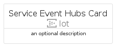
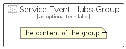

# ServiceEventHubs


```text
azure-20/Item/Iot/ServiceEventHubs
```

```text
include('azure-20/Item/Iot/ServiceEventHubs')
```


| Illustration | ServiceEventHubs | ServiceEventHubsCard | ServiceEventHubsGroup |
| :---: | :---: | :---: | :---: |
|  |  |  |  |


## Sprites
The item provides the following sriptes:

- `<$ServiceEventHubsXs>`
- `<$ServiceEventHubsSm>`
- `<$ServiceEventHubsMd>`
- `<$ServiceEventHubsLg>`


## ServiceEventHubs

### Load remotely
```plantuml
@startuml
' configures the library
!global $LIB_BASE_LOCATION="https://raw.githubusercontent.com/tmorin/plantuml-libs/master/distribution"

' loads the library's bootstrap
!include $LIB_BASE_LOCATION/bootstrap.puml

' loads the package bootstrap
include('azure-20/bootstrap')

' loads the Item which embeds the element ServiceEventHubs
include('azure-20/Item/Iot/ServiceEventHubs')

' renders the element
ServiceEventHubs('ServiceEventHubs', 'Service Event Hubs', 'an optional tech label', 'an optional description')
@enduml
```

### Load locally
```plantuml
@startuml
' configures the library
!global $INCLUSION_MODE="local"
!global $LIB_BASE_LOCATION="../../.."

' loads the library's bootstrap
!include $LIB_BASE_LOCATION/bootstrap.puml

' loads the package bootstrap
include('azure-20/bootstrap')

' loads the Item which embeds the element ServiceEventHubs
include('azure-20/Item/Iot/ServiceEventHubs')

' renders the element
ServiceEventHubs('ServiceEventHubs', 'Service Event Hubs', 'an optional tech label', 'an optional description')
@enduml
```

## ServiceEventHubsCard

### Load remotely
```plantuml
@startuml
' configures the library
!global $LIB_BASE_LOCATION="https://raw.githubusercontent.com/tmorin/plantuml-libs/master/distribution"

' loads the library's bootstrap
!include $LIB_BASE_LOCATION/bootstrap.puml

' loads the package bootstrap
include('azure-20/bootstrap')

' loads the Item which embeds the element ServiceEventHubsCard
include('azure-20/Item/Iot/ServiceEventHubs')

' renders the element
ServiceEventHubsCard('ServiceEventHubsCard', 'Service Event Hubs Card', 'an optional description')
@enduml
```

### Load locally
```plantuml
@startuml
' configures the library
!global $INCLUSION_MODE="local"
!global $LIB_BASE_LOCATION="../../.."

' loads the library's bootstrap
!include $LIB_BASE_LOCATION/bootstrap.puml

' loads the package bootstrap
include('azure-20/bootstrap')

' loads the Item which embeds the element ServiceEventHubsCard
include('azure-20/Item/Iot/ServiceEventHubs')

' renders the element
ServiceEventHubsCard('ServiceEventHubsCard', 'Service Event Hubs Card', 'an optional description')
@enduml
```

## ServiceEventHubsGroup

### Load remotely
```plantuml
@startuml
' configures the library
!global $LIB_BASE_LOCATION="https://raw.githubusercontent.com/tmorin/plantuml-libs/master/distribution"

' loads the library's bootstrap
!include $LIB_BASE_LOCATION/bootstrap.puml

' loads the package bootstrap
include('azure-20/bootstrap')

' loads the Item which embeds the element ServiceEventHubsGroup
include('azure-20/Item/Iot/ServiceEventHubs')

' renders the element
ServiceEventHubsGroup('ServiceEventHubsGroup', 'Service Event Hubs Group', 'an optional tech label') {
    note as note
        the content of the group
    end note
}
@enduml
```

### Load locally
```plantuml
@startuml
' configures the library
!global $INCLUSION_MODE="local"
!global $LIB_BASE_LOCATION="../../.."

' loads the library's bootstrap
!include $LIB_BASE_LOCATION/bootstrap.puml

' loads the package bootstrap
include('azure-20/bootstrap')

' loads the Item which embeds the element ServiceEventHubsGroup
include('azure-20/Item/Iot/ServiceEventHubs')

' renders the element
ServiceEventHubsGroup('ServiceEventHubsGroup', 'Service Event Hubs Group', 'an optional tech label') {
    note as note
        the content of the group
    end note
}
@enduml
```

